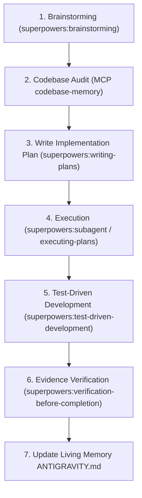
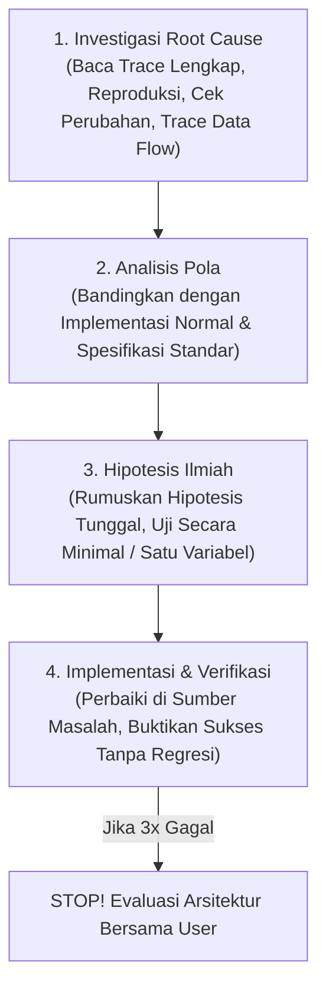
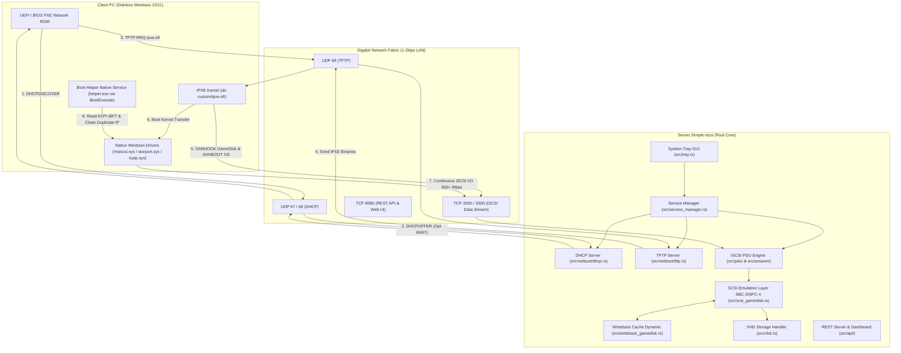
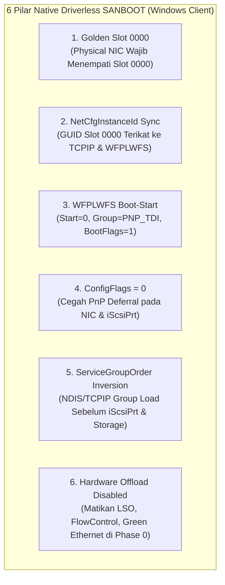

# ANTIGRAVITY.md — Simple-Iscsi Living Memory & AI Protocol

Dokumen ini adalah **Buku Catatan Hidup (Living Memory)**, pedoman kerja, dan protokol standar operasional (SOP) bagi setiap **AI Agent** maupun developer manusia yang berkontribusi pada proyek **Simple-Iscsi**.

> [!IMPORTANT]
> **Tujuan Dokumen:**
> 1. **Zero Hallucination & Token Efficient:** Memberikan ringkasan arsitektur instan sehingga AI Agent memahami seluruh konteks codebase tanpa perlu membaca puluhan file mentah secara berulang.
> 2. **Enforce MCP Codebase Memory:** Menjamin seluruh inspeksi, pemahaman kode, dan validasi dilakukan melalui penelusuran graf simbol yang akurat dengan sintaks perintah yang pasti.
> 3. **Enforce Plugin Superpowers:** Menjamin setiap perencanaan (*planning*) dan eksekusi mengikuti metodologi ketat `superpowers` (Brainstorming -> Writing Plans -> TDD -> Subagent/Executing Plans -> Verification).
> 4. **Living Continuity:** Setiap kali ada fitur baru, bugfix, atau perubahan arsitektur, catatan perubahan **WAJIB** diperbarui di dokumen ini sebelum sesi berakhir.

---

## 1. ATURAN WAJIB EKSEKUSI (MCP `codebase-memory`)

Setiap AI Agent yang bekerja di repositori ini **WAJIB** tunduk pada aturan operasional MCP `codebase-memory` berikut. Tidak ada pengecualian.

### 1.1 Prinsip Operasional Wajib
* **WAJIB menggunakan MCP `codebase-memory`.**
* **Jangan menebak** lokasi, isi, fungsi, atau relasi code.
* Cari dan baca code yang relevan menggunakan MCP sebelum melakukan perubahan.
* Jangan hanya mengandalkan nama file; telusuri symbol dan relasi fungsi.
* Pahami implementasi existing sebelum memodifikasi code.
* Jika perubahan menyentuh suatu function, cek caller/callee dan dependency-nya menggunakan `trace_path`.
* Jika index tidak tersedia atau tidak fresh, gunakan `index_repository`.
* Jika terdapat `parse_partial` atau `skipped`, jangan menganggap hasil graph lengkap. Gunakan fallback pencarian/read langsung pada bagian tersebut.
* Setelah implementasi selesai, gunakan MCP kembali untuk memeriksa perubahan, relasi, dan kemungkinan impact terhadap code lain.
* Eksekusi sesuai plan yang diberikan jika ini merupakan **eksekusi plan**.
* Jangan membuat perubahan di luar scope plan/task tanpa alasan teknis yang jelas.
* Jika menemukan masalah atau kebutuhan perubahan di luar scope yang dapat memengaruhi implementasi, jelaskan terlebih dahulu sebelum memperluas scope.

---

### 1.2 Daftar Lengkap Sintaks & Contoh Pemanggilan Tools MCP `codebase-memory`

Nama project default pada memory graph untuk repositori ini adalah:  
`"project": "C-Project-GIT-Simple-Iscsi"` (atau `"project_name": "C-Project-GIT-Simple-Iscsi"`).

#### 1. `index_status` — Cek Kesehatan & Status Coverage Index
Gunakan sebelum memulai task untuk memastikan graf up-to-date dan mengetahui file yang mengalami `parse_partial` atau `skipped`.
```json
{
  "ServerName": "codebase-memory",
  "ToolName": "index_status",
  "Arguments": {
    "project": "C-Project-GIT-Simple-Iscsi",
    "verbose": false
  }
}
```

#### 2. `index_repository` — Indexing / Re-indexing Repositori
Gunakan jika index belum dibuat atau jika ada perubahan file eksternal yang signifikan.
```json
{
  "ServerName": "codebase-memory",
  "ToolName": "index_repository",
  "Arguments": {
    "repo_path": "C:/Project GIT/Simple-Iscsi"
  }
}
```

#### 3. `get_architecture` — Pahami Struktur & Arsitektur Global
Melihat ringkasan komponen, boundary, hotspot beban, siklus dependensi, dan cluster logika.
```json
{
  "ServerName": "codebase-memory",
  "ToolName": "get_architecture",
  "Arguments": {
    "project": "C-Project-GIT-Simple-Iscsi",
    "aspects": ["all"]
  }
}
```
*Opsi aspects:* `["overview"]`, `["structure"]`, `["dependencies"]`, `["hotspots"]`, `["clusters"]`, `["cycles"]`, `["file_tree"]`.

#### 4. `search_graph` — Cari Simbol (Fungsi, Struct, Route, Enum)
Pencarian graf struktural. Mode: natural language query (BM25), regex pattern, atau vector semantic.
```json
// Contoh A: Natural Language Search (BM25)
{
  "ServerName": "codebase-memory",
  "ToolName": "search_graph",
  "Arguments": {
    "project": "C-Project-GIT-Simple-Iscsi",
    "query": "writeback cache client",
    "limit": 20
  }
}

// Contoh B: Exact Regex Name Pattern
{
  "ServerName": "codebase-memory",
  "ToolName": "search_graph",
  "Arguments": {
    "project": "C-Project-GIT-Simple-Iscsi",
    "name_pattern": ".*SessionContext.*",
    "format": "tree"
  }
}

// Contoh C: Vector Semantic Search
{
  "ServerName": "codebase-memory",
  "ToolName": "search_graph",
  "Arguments": {
    "project": "C-Project-GIT-Simple-Iscsi",
    "semantic_query": ["cache", "writeback", "flush"]
  }
}
```

#### 5. `search_code` — Pencarian Teks Teraugmentasi Graf
Pencarian pola teks / literal berbasis ripgrep yang diperkaya metadata node fungsi dan rangking struktur.
```json
{
  "ServerName": "codebase-memory",
  "ToolName": "search_code",
  "Arguments": {
    "project": "C-Project-GIT-Simple-Iscsi",
    "pattern": "CmdQue",
    "mode": "compact",
    "path_filter": "^src/",
    "limit": 10
  }
}
```
*Opsi mode:* `"compact"` (tanda tangan & metadata), `"full"` (60 baris source di sekitar match), `"files"` (daftar file saja).

#### 6. `get_code_snippet` — Baca Implementasi Simbol Secara Presisi
Gunakan setelah mendapatkan `qualified_name` dari `search_graph`. Ini adalah tool membaca kode berbasis node simbol tanpa mengotori context window.
```json
{
  "ServerName": "codebase-memory",
  "ToolName": "get_code_snippet",
  "Arguments": {
    "project": "C-Project-GIT-Simple-Iscsi",
    "qualified_name": "src.writeback_gamedisk.ClientCache.get_or_create",
    "include_neighbors": false
  }
}
```

#### 7. `trace_path` — Analisis Dampak (*Blast Radius*), Caller & Callee
Mendeteksi siapa yang memanggil fungsi target (*inbound/callers*), apa saja yang dipanggil fungsi target (*outbound/callees*), atau jalur data (*data_flow*).
```json
{
  "ServerName": "codebase-memory",
  "ToolName": "trace_path",
  "Arguments": {
    "project": "C-Project-GIT-Simple-Iscsi",
    "function_name": "handle_scsi_command",
    "direction": "both",
    "depth": 3,
    "mode": "calls",
    "risk_labels": true
  }
}
```
*Opsi direction:* `"inbound"` (siapa yang memanggil / dampak), `"outbound"` (dependensi ke bawah), `"both"` (dua arah).  
*Opsi mode:* `"calls"`, `"data_flow"`, `"cross_service"`.

#### 8. `query_graph` — Kueri Cypher Tingkat Lanjut & Analisis Bottleneck
Menjalankan kueri graf langsung, misalnya mencari fungsi dengan loop bersarang tinggi atau rekursi.
```json
{
  "ServerName": "codebase-memory",
  "ToolName": "query_graph",
  "Arguments": {
    "project": "C-Project-GIT-Simple-Iscsi",
    "query": "MATCH (f:Function) WHERE f.transitive_loop_depth >= 2 RETURN f.qualified_name, f.transitive_loop_depth ORDER BY f.transitive_loop_depth DESC LIMIT 20",
    "graph": "code"
  }
}
```

#### 9. `check_index_coverage` — Verifikasi File Tercover oleh Graf
Cek apakah file-file yang akan dimodifikasi sudah terindeks dengan benar tanpa ada konstruksi yang terlewat.
```json
{
  "ServerName": "codebase-memory",
  "ToolName": "check_index_coverage",
  "Arguments": {
    "project": "C-Project-GIT-Simple-Iscsi",
    "paths": ["src/session/mod.rs", "src/scsi_gamedisk.rs", "src/writeback_gamedisk.rs"]
  }
}
```

#### 10. `detect_changes` — Pemetaan Blast Radius Perubahan Git
Memetakan git diff ke himpunan dampak (*transitive impact set*) pemanggil secara otomatis sebelum commit.
```json
{
  "ServerName": "codebase-memory",
  "ToolName": "detect_changes",
  "Arguments": {
    "project": "C-Project-GIT-Simple-Iscsi",
    "scope": "impact",
    "direction": "inbound"
  }
}
```

---

## 2. CARA MEMBUAT PLANNING DENGAN PLUGIN `superpowers`

Setiap pekerjaan fitur baru, refactoring, atau modifikasi signifikan **WAJIB** direncanakan menggunakan metodologi plugin **`superpowers`** yang dikombinasikan dengan audit **MCP `codebase-memory`**.



### 2.1 Alur Planning Superpowers Langkah demi Langkah

#### Langkah 1: Brainstorming & Requirements (`superpowers:brainstorming`)
* Buka skill: [`SKILL.md`](file:///C:/Users/lannnn/.gemini/config/plugins/superpowers/skills/brainstorming/SKILL.md).
* Eksplorasi kebutuhan user secara mendalam, klarifikasi ambigu, tanyakan trade-offs arsitektural.
* Tentukan scope minimal (*YAGNI: You Aren't Gonna Need It*) dan pastikan tidak ada asumsi tersembunyi.

#### Langkah 2: Audit Codebase via MCP `codebase-memory`
Sebelum menyusun langkah di plan, lakukan audit terhadap basis kode yang disentuh:
1. Jalankan `index_status` untuk memastikan status index siap.
2. Jalankan `search_graph` untuk menemukan fungsi/struct terkait.
3. Jalankan `get_code_snippet` untuk membaca implementasi fungsi saat ini.
4. Jalankan `trace_path` (`direction: "inbound"`) untuk mengetahui siapa saja caller yang akan terkena efek perubahan.
5. Catat qualified name simbol, nomor baris, dan signature method asli.

#### Langkah 3: Penulisan Implementation Plan (`superpowers:writing-plans`)
* Buka skill: [`SKILL.md`](file:///C:/Users/lannnn/.gemini/config/plugins/superpowers/skills/writing-plans/SKILL.md).
* Buat file plan di: `docs/superpowers/plans/YYYY-MM-DD-<nama-fitur>.md` (atau simpan langsung jika task kecil).
* Rancang tugas dalam unit-unit kecil (*Bite-Sized Tasks*) berdurasi 2–5 menit per langkah.
* Setiap task harus memuat:
  * **Files:** Path file exact yang dibuat/dimodifikasi beserta barisnya.
  * **Interfaces Consumed & Produced:** Signature fungsi input dan output secara gamblang.
  * **TDD Steps:** Step 1 tulis failing test -> Step 2 jalankan tes (harus fail) -> Step 3 implementasi minimal -> Step 4 jalankan tes (harus pass) -> Step 5 commit.

#### Langkah 4: Eksekusi Plan (`superpowers:subagent-driven-development` / `superpowers:executing-plans`)
* Buka skill: [`SKILL.md`](file:///C:/Users/lannnn/.gemini/config/plugins/superpowers/skills/subagent-driven-development/SKILL.md) atau [`SKILL.md`](file:///C:/Users/lannnn/.gemini/config/plugins/superpowers/skills/executing-plans/SKILL.md).
* Eksekusi task satu per satu sesuai urutan checkbox `- [ ]`.
* Jangan melompat ke task berikutnya sebelum task aktif terverifikasi sepenuhnya.

#### Langkah 5: Verifikasi Sebelum Klaim Selesai (`superpowers:verification-before-completion`)
* Buka skill: [`SKILL.md`](file:///C:/Users/lannnn/.gemini/config/plugins/superpowers/skills/verification-before-completion/SKILL.md).
* **Prinsip Utama:** *Evidence before assertions*. Jangan pernah menyatakan sukses tanpa bukti empiris eksekusi tool.
* Jalankan `cargo check` atau `cargo test`.
* Jalankan `detect_changes` pada MCP untuk memeriksa apakah ada dampak yang terlewat.

#### Langkah 6: Wajib Catat ke Living Memory (`ANTIGRAVITY.md`)
* Setelah semua langkah terverifikasi, perbarui Bagian 8 ([Matriks Status Fitur](#8-matriks-status-fitur)) dan Bagian 9 ([Riwayat Pengerjaan & Change Log](#9-riwayat-pengerjaan--change-log)) di dokumen ini.

---

### 2.2 Template Dokumen Implementation Plan (Standar Superpowers)

Setiap file plan wajib menggunakan struktur berikut:

```markdown
# [Nama Fitur] Implementation Plan

> **For agentic workers:** REQUIRED SUB-SKILL: Use superpowers:subagent-driven-development (recommended) or superpowers:executing-plans to implement this plan task-by-task. Steps use checkbox (`- [ ]`) syntax for tracking.

**Goal:** [Satu kalimat lugas menjelaskan apa yang dibangun]

**Architecture:** [2-3 kalimat mengenai pendekatan teknis & integrasi modul]

**Tech Stack:** [Rust 2021, Tokio, Win32 C++, dll.]

**Codebase Audit (MCP):**
- Simbol diperiksa: `[Qualified Symbol Name dari search_graph]`
- Pemanggil / Blast Radius: `[Hasil trace_path]`
- Index Coverage: `[Hasil check_index_coverage]`

---

### Task 1: [Nama Komponen / Unit Pertama]

**Files:**
- Modify: `src/modul/target.rs:120-150`
- Test: `tests/test_target.rs`

**Interfaces:**
- Consumes: `pub fn existing_api(arg: &Type) -> Result<()>`
- Produces: `pub fn new_feature(client_ip: &str) -> Option<Output>`

- [ ] **Step 1: Buat failing unit test / assertion**
- [ ] **Step 2: Jalankan test untuk memverifikasi kegagalan awal** (`cargo test`)
- [ ] **Step 3: Implementasi logika minimal untuk meloloskan tes**
- [ ] **Step 4: Jalankan test kembali dan pastikan lulus** (`cargo test`)
- [ ] **Step 5: Validasi kompilasi global** (`cargo check`)

---

### Task 2: [Integrasi / Caller Update]
...

---

### Task N: Living Memory & Documentation Update
- [ ] **Step 1: Perbarui ANTIGRAVITY.md Change Log & Status Matriks**
- [ ] **Step 2: Jalankan codebase-memory index_repository jika ada file baru**
```

---

## 3. PROTOKOL SYSTEMATIC DEBUGGING (PLUGIN `superpowers:systematic-debugging`)

Setiap kali menghadapi bug, error panic, crash, test failure, port collision, atau perilaku tak terduga (*unexpected behavior*), AI Agent **DILARANG KERAS** langsung menebak-nebak perbaikan atau membuat perubahan kode acak.

> [!CAUTION]
> **HUKUM BESI DEBUGGING (THE IRON LAW):**
> ```
> TIDAK BOLEH MEMBUAT FIX TANPA INVESTIGASI ROOT CAUSE TERLEBIH DAHULU!
> (NO FIXES WITHOUT ROOT CAUSE INVESTIGATION FIRST)
> ```
> Memperbaiki gejala (*symptom fix*) tanpa memahami akar penyebab adalah kegagalan fatal.



### 3.1 Empat Fase Systematic Debugging

Setiap investigasi masalah **WAJIB** melalui 4 fase berikut secara berurutan:

#### Fase 1: Investigasi Root Cause (Investigasi Akar Masalah)
1. **Baca Pesan Error & Stack Trace Sampai Tuntas:**
   * Jangan melompati error atau sekadar membaca sekilas baris pertama.
   * Catat nomor baris exact, nama file, modul, dan kode status (contoh: error `1812`, `10048`, `0xc0000409`, `0x0000007B`).
2. **Reproduksi Masalah Secara Konsisten:**
   * Pastikan skenario pemicu (*trigger*) dapat diulang dengan langkah yang pasti. Jika belum bisa direproduksi, kumpulkan lebih banyak data log/trace, jangan menebak.
3. **Cek Perubahan Terakhir:**
   * Periksa `git diff` dan commit terbaru (`git status`, `git log -n 5`). Komponen apa yang baru saja disentuh?
4. **Kumpulkan Bukti pada Batas Komponen (Boundary Logging):**
   * Tambahkan instrumentasi diagnostik sementara pada perbatasan layer:
     * Antara Tokio runtime dan foreign thread (Win32 OS thread).
     * Antara layer network UDP/TCP dan parser biner PDU/DHCP.
     * Antara kernel registry dan storage driver Phase 0.
5. **Trace Data Flow ke Arah Belakang (*Backward Tracing*):**
   * Cari dari mana nilai/kondisi yang keliru pertama kali berasal. Perbaiki di sumbernya, bukan di tempat gejala muncul.

#### Fase 2: Analisis Pola (*Pattern Analysis*)
1. **Temukan Contoh yang Berfungsi (*Working Examples*):**
   * Cari kode serupa di codebase yang bekerja normal.
2. **Bandingkan dengan Referensi:**
   * Baca dokumentasi API atau standar RFC (RFC 2131/2132 untuk DHCP, RFC 7143 untuk iSCSI, dokumentasi MSDN untuk Win32).
3. **Identifikasi Perbedaan Sekecil Apa Pun:**
   * Jangan pernah berasumsi "perbedaan kecil ini pasti tidak berpengaruh".

#### Fase 3: Hipotesis dan Pengujian Minimal
1. **Rumuskan Satu Hipotesis Spesifik:**
   * Tuliskan pernyataan: *"Saya menduga X adalah akar masalah karena Y."*
2. **Uji Secara Minimal (Satu Variabel):**
   * Ubah seminimal mungkin kode untuk membuktikan atau mematahkan hipotesis. Jangan mengubah banyak modul sekaligus.
3. **Verifikasi Bukti:**
   * Jika hipotesis terbukti salah, batalkan perubahan dan rumuskan hipotesis baru. Jangan menumpuk dugaan di atas dugaan.

#### Fase 4: Implementasi dan Verifikasi
1. **Buat Test Case / Bukti Reproduksi:**
   * Pastikan ada cara menguji bahwa bug sudah hilang.
2. **Terapkan Single Fix:**
   * Perbaiki tepat di akar masalah. Jangan selipkan refactoring di luar konteks (*no bundled refactoring*).
3. **Buktikan Keberhasilan (*Evidence-Based*):**
   * Jalankan `cargo check`, `cargo build`, atau tes fungsional.
4. **Aturan 3x Gagal (Stop & Question Architecture):**
   * Jika sudah **3 kali mencoba perbaikan dan masih gagal**, **BERHENTI**. Ini menandakan masalah arsitektur fundamental, bukan sekadar bug sintaks. Diskusikan segera dengan user!

---

### 3.2 Playbook Debugging Kasus Nyata Proyek Simple-Iscsi

Berikut panduan pemecahan masalah untuk kasus-kasus kritis yang sering ditemui pada repositori ini:

#### 1. Panic Tokio Runtime pada Foreign Thread (Win32 Message Loop / System Tray)
* **Gejala / Error:**
  `panicked at src\tray.rs: there is no reactor running, must be called from the context of a Tokio 1.x runtime`
  `STATUS_STACK_BUFFER_OVERRUN (exit code: 0xc0000409)`
* **Akar Masalah:**
  Fungsi `tokio::spawn(...)` dipanggil langsung dari thread OS biasa (misalnya `std::thread` yang menjalankan Windows Message Pump `GetMessageW`). Karena callback `wnd_proc` bertipe `extern "system"`, panic tidak bisa unwind melintasi batas C FFI sehingga Windows langsung menghentikan proses (*abort*).
* **Solusi Baku:**
  Tangkap `tokio::runtime::Handle::current()` dari thread utama yang menjalankan Tokio runtime, lalu teruskan ke struct state tray. Gunakan `handle.spawn(async move { ... })` untuk mendispatch task async dari thread mana pun secara aman.

#### 2. Socket Port Collision / Reuse Error (UDP 67 DHCP & UDP 69 TFTP)
* **Gejala / Error:**
  `os error 10048 (WSAEADDRINUSE)` saat server DHCP atau TFTP di-restart dengan cepat.
* **Akar Masalah:**
  Kernel Windows masih menahan socket lama dalam antrean atau ada background task (seperti loop file watcher `clients.toml`) yang belum terhenti dan masih memegang handle socket UDP.
* **Solusi Baku:**
  1. Buat socket menggunakan `socket2::Socket` dengan flag `set_reuse_address(true)`.
  2. Sambungkan semua background watcher task dengan broadcast channel `shutdown_rx` sehingga langsung mati seketika saat sinyal shutdown dikirim.
  3. Diagnostik via PowerShell:
     ```powershell
     # Cek proses yang menahan port 67 / 69
     netstat -ano | findstr :67
     netstat -ano | findstr :69
     # Dapatkan nama proses berdasarkan PID
     Get-Process -Id <PID>
     ```

#### 3. Win32 Missing Icon Resource (Error 1812)
* **Gejala / Error:**
  `Error setting icon from resource: 1812` (`ERROR_RESOURCE_DATA_NOT_FOUND`).
* **Akar Masalah:**
  Crate tray pihak ketiga mencari embedded icon `.ico` pada resource section file PE binary yang belum dikompilasi dengan file `.rc`.
* **Solusi Baku:**
  Gunakan implementasi Pure Native Win32 API ([`src/tray.rs`](file:///c:/Project%20GIT/Simple-Iscsi/src/tray.rs)) dengan memanggil `win32::LoadIconW(0, win32::IDI_APPLICATION as *const u16)` dan `win32::Shell_NotifyIconW`. Ini bebas dependensi eksternal dan 100% selalu berhasil di semua edisi Windows.

#### 4. Client Diskless BSOD `0x0000007B` (INACCESSIBLE_BOOT_DEVICE)
* **Gejala / Error:**
  PC Client berhasil melewati iPXE, tetapi mengalami Blue Screen `0x7B` beberapa detik setelah logo Windows berputar.
* **Akar Masalah:**
  Pelanggaran pada salah satu dari 6 Pilar Native Driverless:
  - NIC fisik tidak terpasang di slot `0000`.
  - GUID `NetCfgInstanceId` pada driver NIC tidak sinkron dengan `TCPIP\Parameters\Interfaces`.
  - Service `WFPLWFS` tidak aktif di `Start = 0` (Boot-Start) atau `BootFlags != 1`.
  - Perangkat NIC atau iScsiPrt memiliki `ConfigFlags` selain `0x00000000` (mengakibatkan PnP deferral).
* **Solusi Baku & Diagnostik:**
  Jalankan audit hive SYSTEM menggunakan skrip bantu di direktori `scratch/`:
  ```powershell
  python scratch/check_class_0000.py
  python scratch/check_bootflags.py
  python scratch/check_services.py
  ```

#### 5. Menjalankan Diagnostik Trace & Verbose Logging
* **Server Logging:**
  Aktifkan backtrace lengkap dan filter log level detail:
  ```powershell
  $env:RUST_BACKTRACE="1"
  $env:RUST_LOG="rust_iscsi_server=debug,tokio=info"
  cargo run
  ```
* **Network Packet Capture (Wireshark):**
  - Filter DHCP/PXE: `bootp || udp.port == 67 || udp.port == 68`
  - Filter TFTP: `udp.port == 69 || tftp`
  - Filter iSCSI Data: `tcp.port == 3260 || iscsi`

#### 6. Double IP Address pada Windows Client Diskless (Master Image Static IP vs DHCP/iBFT IP)
* **Gejala / Error:**
  PC Client diskless memiliki dua alamat IPv4 aktif di `ipconfig` dan jendela GUI *Advanced TCP/IP Settings -> IP addresses* (misal IP master image super client `192.168.180.10` berada di baris 1 sebagai IP utama, dan IP DHCP/iBFT `192.168.180.2` berada di baris 2 sebagai IP sekunder).
* **Akar Masalah (Hasil Investigasi Empiris Mendalam):**
  1. **Phase 0 Kernel Boot-Start Binding (`tcpip.sys`):**
     Driver `tcpip.sys` merupakan *Boot-Start Driver* (`Start = 0`, `Group = "PNP_TDI"`, `BootFlags = 1`) yang dimuat oleh Windows Kernel pada **Phase 0** — jauh sebelum `smss.exe` dan `BootExecute` dieksekusi. Pada Phase 0, `tcpip.sys` membaca file SYSTEM hive dari disk VHD yang masih menyimpan konfigurasi static IP super client (`192.168.180.10`) dan mengikatnya ke kernel RAM.
  2. **iSCSI Miniport Dynamic Injection (`msiscsi.sys`):**
     Driver `msiscsi.sys` membaca tabel ACPI iBFT yang berisi IP baru dari DHCP (`192.168.180.2`), lalu secara otomatis menyuntikkan IP tersebut ke adapter sebagai IP sekunder agar koneksi socket TCP port 3260 ke target iSCSI tidak terputus saat booting disk berlangsung.
  3. **Limitasi Fase `BootExecute` (`smss.exe` Phase 1):**
     `helper.exe` berjalan di Phase 1 (`smss.exe`). Meskipun `helper.exe` berhasil menimpa registri di disk hive (`Tcpip\Parameters\Interfaces\{GUID}` dan `Services\{GUID}\Parameters\Tcpip`), driver `tcpip.sys` yang sudah terlanjur berjalan di kernel memory **tidak memuat ulang (*reload*) tabel IP aktifnya** hanya dari perubahan sel registri tanpa notifikasi antarmuka NSI/IP Helper. Selain itu, pemanggilan `NtFlushKey` pada fase ini mengembalikan status `0xC000014D` (`STATUS_REGISTRY_IO_FAILED`) karena volume file system masih dalam status proteksi I/O sebelum `autochk` tuntas.
  4. **Residu Layanan Diskless Pihak Ketiga (Legacy Third-Party Services):**
     Layanan residual warisan sistem diskless lama (`Start = 2`) pada master image yang berjalan di user-mode dapat berpotensi memaksakan restorasi konfigurasi super client jika tidak dinonaktifkan.
* **Solusi Baku (Arsitektur Dual-Stage Network Alignment):**
  Menggunakan pendekatan dua tahap (*Dual-Stage*) yang menyelaraskan registri di boot-time dan menyucikan memori kernel di user-time:
  1. **Stage 1 — Native Subsystem (`helper.exe` di `BootExecute`):**
     - Membaca parameter jaringan murni dari ACPI iBFT (HostName, Target IP, Mask, Gateway, DNS).
     - Menimpa serentak (*dual overwrite*) seluruh subkey `Tcpip\Parameters\Interfaces\{GUID}` dan `Services\{GUID}\Parameters\Tcpip` dengan format `REG_MULTI_SZ` tunggal (`<IP>\0\0`).
     - Menyinkronkan Hostname murni tanpa suffix ke 4 kunci registri sistem.
     - Menulis penanda konfigurasi bersih di `HKLM\SYSTEM\CurrentControlSet\Services\SimpleIscsiBoot` (`TargetIp`, `SubnetMask`, `GatewayIp`, `Hostname`, `PurgeNeeded = 1`).
     - Melucuti layanan pengacau: Mengubah `Start = 4` (Disabled) pada seluruh residu service diskless pihak ketiga/legacy.
  2. **Stage 2 — User-Mode Purge Companion (`helper-svc.exe` via Service / Run Key):**
     - Berjalan saat sistem masuk ke fase user-mode (`services.exe` atau Startup).
     - Menggunakan Windows IP Helper API resmi (`iphlpapi.dll`): Memanggil `GetUnicastIpAddressTable(AF_INET, ...)`.
     - Mendeteksi alamat IP yang tidak sesuai dengan target DHCP/iBFT (misal `192.168.180.10`).
     - Memanggil `DeleteUnicastIpAddressEntry()` secara terarah. Fungsi ini mengirimkan IOCTL ke `tcpip.sys` untuk segera mencabut `192.168.180.10` dari RAM kernel dan GUI Network Connections, **tanpa mengganggu sesi koneksi iSCSI** pada `192.168.180.2`.
     - Proses langsung exit setelah pembersihan tuntas (0% CPU, 0 MB overhead).

#### 7. Windows Batch Script Force Close / Syntax Crash (`&` Command Chaining & Nested Parentheses)
* **Gejala / Error:**
  Script batch (`install_client.bat`) langsung menutup jendela konsol seketika tanpa peringatan (*silent force close*) atau memunculkan pesan error singkat `'Startup' is not recognized as an internal or external command` dan `... was unexpected at this time`.
* **Akar Masalah:**
#### 9. VHD Mapping Form Validation & Backslash Escaping Bug (`\` Hilang saat Edit)
* **Gejala / Error:**
  - Saat menekan tombol **Edit** pada baris VHD Mapping di Web UI, seluruh karakter backslash (`\`) pada path fisik VHD mendadak hilang (misal `D:\Images\Win10.vhd` menjadi `D:ImagesWin10.vhd`), sehingga saat disimpan path menjadi rusak dan gagal diakses target iSCSI.
  - Form VHD Mapping mengizinkan penyimpanan input teks sembarang yang bukan berformat path valid.
* **Akar Masalah:**
  1. Pada fungsi `renderVhdTable()`, variabel `path` disuntikkan langsung ke inline HTML attribute string: `onclick="openVhdCrudModal('${key}', '${path}')"`. Parser JavaScript mengevaluasi string literal `'D:\Images\Win10.vhd'` di mana `\I` dan `\W` diperlakukan sebagai *escape sequence*, sehingga melenyapkan seluruh karakter backslash.
  2. Kurangnya validasi format path (`.vhd`/`.vhdx` dan direktori pemisah) pada frontend `saveVhdAction()`.
* **Solusi Baku:**
  1. **Direct Object State Lookup:** Fungsi `openVhdCrudModal(key)` hanya menerima parameter `key` (alias), lalu mengambil nilai `path` langsung dari objek JavaScript memori `configObj.image_manager[key]`. Tidak ada lagi interpolasi string raw path ke dalam attribute HTML.
  2. **Validasi Strict Path:** Memastikan input path wajib memiliki ekstensi `.vhd` / `.vhdx` dan format path direktori valid (contoh: `D:\Images\Win10.vhd`).

#### 10. VHD Snapshot Restore Indexing, Ukuran File, dan Async Merge Progress Lifecycle
* **Gejala / Error:**
  - Pada modal Riwayat Snapshot VHD, kolom *Ukuran* menampilkan angka `1` atau `#1` (nomor index) bukan ukuran file asli (contoh: `2.4 GB`).
  - Tombol **Restore Snapshot** gagal me-restore dan menampilkan pesan error `"Gagal me-restore snapshot"`.
  - Setelah commit Super Client berhasil di-trigger, status Super Client masih tampak aktif di Web UI karena merge berjalan asinkron di background tanpa live polling status tuntas.
* **Akar Masalah:**
  1. Frontend meletakkan variabel `snap.index` pada kolom tabel bertajuk *Ukuran*, sementara backend `get_vhd_backups` sebelumnya belum menghitung `metadata().len()` file backup VHD.
  2. `post_vhd_restore` di backend mengharapkan parameter `index: usize`, namun frontend mengirimkan `{ snapshot_name: ... }` tanpa `index`, serta backend mengembalikan response `"status": "success"` yang tidak cocok dengan evaluasi frontend `res.status === 'ok'`.
  3. Frontend memanggil `loadConfigJson()` seketika (100ms) setelah men-trigger commit sebelum merge VHD di backend selesai, sehingga UI me-reload data `config.toml` lama yang belum dibersihkan.
* **Solusi Baku:**
  1. **Rich Snapshot Metadata:** Backend `get_vhd_backups` mengembalikan objek lengkap: `index`, `name`, `path`, `size` (dalam bytes), dan `date`. Frontend memformat byte dengan `formatBytes(snap.size)` sehingga tampil rapi (misal `2.54 GB` atau `120 MB`).
  2. **Strict Restore Action & File Cleanup:** Frontend mengirim `{ image_key, index }` dan backend mengeksekusi restore BAT & truncate base VHD. Setelah restore sukses, backend memanggil `cleanup_backup_files()` untuk menghapus file snapshot `.meta` dan `.vhd` terkait (sehingga tidak ada residu snapshot usang), membersihkan differencing `.super.vhd`, me-reset konfigurasi Super Client, dan mengembalikan status 200 OK standar JSON `{ "status": "ok", "message": "..." }`.
  3. **Floating Async Merge Progress & Auto-Sync:**
     - Backend mengekspos endpoint live status `GET /api/vhd/merge_status` yang menghitung progress real-time per block (`allocated_blocks` dan `current_block`).
     - Frontend memunculkan floating widget progress bar elegan dan melakukan polling status berkala (750ms).
     - Saat merge selesai 100%, frontend otomatis memuat ulang `config.toml`, me-refresh tabel klien (menghilangkan badge Super Client seketika), dan menampilkan toast sukses tanpa mengganggu navigasi user.

#### 11. Super Client Online State Guard & Instant Differencing VHD Creation
* **Gejala / Kebutuhan:**
  - Menghindari pengaktifan Super Client pada PC yang sedang aktif/online, yang dapat memicu korupsi sesi writeback atau konflik file differencing.
  - File differencing `.super.vhd` wajib langsung terbentuk di disk seketika mode Super Client diaktifkan, sehingga siap digunakan sebelum PC klien dinyalakan.
  - **Commit / Discard saat klien masih online juga wajib diblokir**: operasi merge atau hapus file differencing VHD saat klien sedang menulis via iSCSI akan menyebabkan VHD corrupt dan tidak bisa di-boot.
* **Solusi Baku:**
  1. **Online State Guard (Enable):** Validasi ganda — Backend `post_superclient_set` via `stats.client_stats[ip].active_sessions > 0` dan Frontend `ctxToggleSuperClient` via `sessionInfo.active === true`. Jika PC online, request ditolak.
  2. **Online State Guard (Commit & Discard):** Validasi ganda juga diterapkan pada `post_superclient_commit` dan `post_superclient_discard` (backend). Frontend `openSuperClientDisableModal` memeriksa status online via `activeSessionsMap` sebelum membuka modal. Jika online, modal tidak terbuka dan toast error langsung ditampilkan.
  3. **Instant Differencing Creation:** Pada saat `post_superclient_set` dieksekusi dengan `action: enable`, backend memanggil `crate::writeback_super::init_super_vhd(&base_path, &super_path)` untuk langsung membuat differencing VHD di disk filesystem seketika.

#### 12. VHD Corrupt Setelah Commit — Root Cause & Standard-Compliant Fix
* **Gejala:** File `.vhd` master langsung corrupt (tidak bisa dibuka oleh Windows Disk Management, Hyper-V, atau di-boot oleh klien) setelah operasi Commit Super Client.
* **Akar Masalah (Root Cause):**
  1. **Trailing Footer Hilang / Tertimpa:** VHD dynamic disk (`type=3`) memiliki footer 512 byte di ujung file (`EOF - 512`). Menulis block di `SeekFrom::End(0)` menimpa footer asli dan meninggalkan data tanpa penutup footer yang valid di akhir file.
  2. **Hardcoded BAT Offset `1536`:** Pada VHD standar Windows / DiskPart / Hyper-V, BAT tabel (`table_offset`) bisa berada di offset `2048`, `4096`, dll. Kode yang meng-hardcode offset `1536` menimpa header/padding dan membiarkan BAT asli tidak terupdate.
  3. **Non-Contiguous BAT Index Miswrite:** Pembaruan BAT batch yang mengasumsikan sequential block index (`first_off += 4`) mengakibatkan index BAT yang lompat tertulis di slot blok yang salah.
  4. **Sector Bitmap 0x00 vs 0xFF:** Menulis bitmap all-zero membuat parser VHD menganggap semua sektor dalam blok 2MB unallocated / unwritten. Sektor valid harus memiliki bitmap byte `0xFF`.
  5. **Footer & Header Checksum Salah:** Checksum dihitung dengan menjumlahkan `u32` BE alih-alih `u8` (byte-by-byte sum) sesuai spesifikasi Microsoft VHD.
* **Solusi Baku (di `src/vhd.rs` & `src/vhd_merge.rs`):**
  1. **In-Place Overwrite & Appending:** Jika block sudah ada di parent (`parent.bat[block_idx] != 0xFFFFFFFF`), timpa langsung di offset parent yang lama tanpa memperbesar file. Jika block baru, tulis mulai `parent_eof - 512` (menimpa footer lama).
  2. **Dynamic `table_offset`:** Struktur `VhdBackend` menyimpan `table_offset` dinamis dari header VHD, dan seluruh update BAT menulis ke `table_offset + (block_idx * 4)`.
  3. **Trailing Footer & File Truncate:** Tulis ulang 512-byte footer di `next_write_pos`, sinkronkan footer copy di offset 0, lalu potong file tepat dengan `set_len(next_write_pos + 512)`.
#### 13. Preservasi Subkey Linkage & Pembersihan Helper dari Intervensi Driver Pihak Ketiga
* **Gejala:** PC Klien tidak dapat melakukan booting iSCSI (freeze di logo Windows atau BSOD `0x7B`) setelah restart akibat registri binding jaringan terganggu atau driver pihak ketiga dimatikan paksa.
* **Akar Masalah (Root Cause):**
  1. **Subkey `Linkage` Terhapus / Rusak:** Subkey `Linkage` (pada `Control\Class\{4d36e972...}\0000\Linkage`, `Services\Tcpip\Linkage`, dan `Services\{GUID}\Linkage`) mendefinisikan `UpperBind = Tcpip`, `Export = \Device\{GUID}`, dan `RootDevice`. Menghapus subkey ini memutus binding antara NDIS dan protokol TCP/IP, sehingga stack iSCSI Phase 0 (`iScsiPrt` / `msiscsi`) kehilangan jalur komunikasi jaringan ke server.
  2. **Intervensi Pemaksaan Disable Service (`Start = 4`):** Helper lama berusaha mematikan service pihak ketiga (`CCBootClient`, `iSharePnp`, dll.). Jika master image klien bergantung pada driver tersebut untuk deteksi PnP kartu LAN, mematikannya otomatis menggagalkan inisialisasi hardware kartu LAN saat boot.
  3. **Blind Loop ke Seluruh Subkey `Services\{GUID}`:** Helper lama menyapu bersih semua service berawalan `{`, menimpa `Parameters\Tcpip` pada filter/virtual adapter yang bukan kartu LAN boot.
* **Solusi Baku (di `helper/helper.cpp` & `helper/install_client.bat`):**
  1. **Linkage 100% Utuh & Dilindungi:** Helper tidak pernah menghapus atau mengubah subkey `Linkage`.
  2. **Hapus Logika `DisarmRogueServices`:** Penghapusan/penonaktifan service diserahkan secara manual kepada teknisi, helper fokus murni pada injeksi parameter IP, Hostname, dan tuning iSCSI.
  3. **Hapus Blind Sweep Services:** Helper hanya mengonfigurasi adapter yang terdaftar valid di bawah `Services\Tcpip\Parameters\Interfaces\{GUID}`.

#### 14. Inventaris Murni Subkey Linkage Khusus iSCSI & Jaringan LAN (Hasil Audit Hive Registri 1)
Berdasarkan audit langsung pada file hive registri master (`Iscsi menyala tanpa butuh driver bawaan.reg` / Hive 1) dengan mengeliminasi entri WAN/Dial-Up yang tidak relevan, berikut adalah **seluruh subkey `Linkage` murni yang mengatur aliran data LAN dan iSCSI Boot**:

```
[Hardware NIC Physical (Slot 0000)]
         │
         ▼
[1. Class Linkage: Control\Class\{4d36e972...}\0000\Linkage]
   ├─ RootDevice = "{GUID}"
   ├─ Export     = "\Device\{GUID}"
   └─ UpperBind  = Tcpip, Tcpip6, Ndisuio, lltdio, rspndr, MsLldp, RDMANDK
         │
         ▼
[2. Protocol Linkage: Services\Tcpip\Linkage & Tcpip6\Linkage]
   ├─ Bind   = "\Device\{GUID}"
   ├─ Route  = "\"{GUID}\""
   └─ Export = "\Device\Tcpip_{GUID}"
         │
         ├───────────────────────────────┬───────────────────────────────┐
         ▼                               ▼                               ▼
[3. iSCSI Initiator]            [4. TDI / NetBT Linkage]        [5. SMB File Sharing Linkage]
   (Services\iScsiPrt)             (Services\NetBT\Linkage)        (Services\LanmanWorkstation\Linkage)
   Memanggil WSK ke                ├─ OtherDependencies = Tcpip    ├─ Bind = "\Device\Tcpip_{GUID}"
   \Device\Tcpip_{GUID}            ├─ Bind = "\Device\Tcpip_{GUID}"└─ Route = "Tcpip" "{GUID}"
   untuk streaming disk C:         └─ Export = "\Device\NetBT_..."
```

##### Rincian Nilai Riil pada Hive Registri:
1. **`Control\Class\{4d36e972-e325-11ce-bfc1-08002be10318}\0000\Linkage` (Jangkar Adapter Fisik Slot 0000):**
   * **`RootDevice`** = `"{FBE750E4-B44C-44D9-BD16-810A4E4A8D4A}"`
   * **`Export`** = `"\Device\{FBE750E4-B44C-44D9-BD16-810A4E4A8D4A}"`
   * **`UpperBind`** = `Tcpip`, `Tcpip6`, `Ndisuio`, `lltdio`, `rspndr`, `MsLldp`, `RDMANDK`
   *(Kunci mutlak: `Tcpip` di `UpperBind` memerintahkan NDIS untuk mengalirkan frame L2 langsung ke driver `tcpip.sys`).*

2. **`Services\Tcpip\Linkage` (Pengikatan Protokol TCP/IP ke Adapter):**
   * **`Bind`** = `"\Device\{FBE750E4-B44C-44D9-BD16-810A4E4A8D4A}"`
   * **`Route`** = `"\"{FBE750E4-B44C-44D9-BD16-810A4E4A8D4A}\""`
   * **`Export`** = `"\Device\Tcpip_{FBE750E4-B44C-44D9-BD16-810A4E4A8D4A}"`

3. **`Services\Tcpip6\Linkage` (Pengikatan Protokol IPv6):**
   * Struktur identik dengan `Tcpip\Linkage` untuk dukungan dual-stack IPv6 pada adapter yang sama.

4. **`Services\NetBT\Linkage` & `Services\NetBIOS\Linkage` (NetBIOS over TCP/IP):**
   * **`OtherDependencies`** = `Tcpip`
   * **`Bind`** = `"\Device\Tcpip_{FBE750E4...}"`
   * **`Route`** = `"Tcpip" "{FBE750E4...}"`
   * **`Export`** = `"\Device\NetBT_Tcpip_{FBE750E4...}"` dan `"\Device\NetBIOS_NetBT_Tcpip_{FBE750E4...}"`

5. **`Services\LanmanWorkstation\Linkage` & `Services\LanmanServer\Linkage` (SMB File Sharing):**
   * **`Bind`** = `"\Device\Tcpip_{FBE750E4...}"`
   * **`Route`** = `"Tcpip" "{FBE750E4...}"`
   * **`Export`** = `"\Device\LanmanWorkstation_Tcpip_{FBE750E4...}"`

6. **Hubungan ke `Services\iScsiPrt` (Microsoft iSCSI Initiator):**
   * `iscsiprt.sys` tidak memiliki subkey `Linkage` sendiri karena ia adalah driver storage SCSI miniport yang memanggil fungsi Winsock Kernel (WSK) langsung ke `\Device\Tcpip_{GUID}` (yang diekspos oleh `Tcpip\Linkage`).

> **Pelajaran Penting:** Dari 31 header Linkage di registri Windows, hanya **`Class\0000\Linkage`** dan **`Services\Tcpip\Linkage`** yang menjadi **Dua Jantung Utama iSCSI Boot**. Jika salah satu dari kedua kunci ini hilang atau tidak sinkron GUID-nya, transmisi iSCSI di Phase 0 akan mati total (BSOD `0x7B`).

---

### 3.3 Alat Bantu Debugging MCP `codebase-memory`

Gunakan tool MCP berikut secara spesifik saat proses debugging:
1. `trace_path`: Lacak caller/callee stack untuk mengetahui siapa yang memanggil fungsi yang mengalami error atau mengirim nilai tidak valid (`direction: "both"`).
2. `search_code`: Cari string error message, kode status, atau keyword tertentu di seluruh repositori secara cepat.
3. `detect_changes`: Analisis dampak (*blast radius*) dari kode yang baru diubah sebelum menjalankan pengujian menyeluruh.

---

## 4. STANDAR OPERASIONAL PROSEDUR (SOP) KERJA LENGKAP AI AGENT

Ringkasan siklus kerja harian AI Agent (Fitur Baru maupun Debugging):

```
[Menerima Task / Request / Laporan Bug]
                 │
                 ▼
     [1. Baca ANTIGRAVITY.md] ──► Token Irit & Paham Arsitektur
                 │
                 ▼
       [2. MCP index_status] ────► Pastikan Graf Siap
                 │
        ┌────────┴─────────────────────────────┐
        │ (Fitur Baru / Refactoring)           │ (Bug / Crash / Error)
        ▼                                      ▼
[3. superpowers:brainstorming]         [3. superpowers:systematic-debugging]
        │                                      ├─ Investigasi Root Cause (Error/Trace)
        ▼                                      ├─ Analisis Pola & Hipotesis Tunggal
[4. superpowers:writing-plans]                 └─ Uji & Implementasi Minimal
        │                                      │
        └──────────────────┬───────────────────┘
                           ▼
            [5. Eksekusi Kode Berbasis Bukti]
                    ├─ replace_file_content
                    └─ Jaga integritas komentar/dokumentasi
                           │
                           ▼
          [6. Validasi: cargo check / build / test] ──► superpowers:verification-before-completion
                           │
                           ▼
            [7. Update ANTIGRAVITY.md] ───────────────► Living Memory Terjaga!
```

---

## 5. PETA ARSITEKTUR & TEKNOLOGI

Sistem **Simple-Iscsi** adalah target storage iSCSI dan infrastruktur network boot berkinerja tinggi (*high performance*) yang dibangun dengan **Rust** (runtime asinkronus Tokio) dan helper NT-native **C++**, yang dirancang khusus untuk lingkungan diskless (tanpa HDD/SSD lokal pada PC client).



### 4.1 Tech Stack Inti
* **Server Backend:** Rust (Edisi 2021), Tokio Async Runtime, DashMap, Parking Lot, Moka Cache, Serde/TOML, Socket2 (`SO_REUSEADDR`), Pure Native Win32 Shell Notify Icon (`user32`, `kernel32`, `shell32`).
* **Client Boot Helper:** C++ (Win32 / Native NT API `ntdll.dll`), compiled with MSVC `cl.exe`.
* **Network & Storage Protocols:**
  * Network Booting: PXE, DHCP (RFC 2131 / 2132), TFTP (RFC 1350), iPXE scripting.
  * Block Storage: iSCSI (RFC 7143), SCSI SPC-4 & SBC-3 (Inquiry, Read/Write 10/16, Mode Sense, Synccache).
  * Storage Format: Virtual Hard Disk (VHD Fixed/Dynamic, Differencing), Raw Physical Disks (GameDisk).
* **Web UI Dashboard:** HTML5, Tailwind CSS, Vanilla JS, SSE/WebSocket for live I/O stats.

---

## 6. STRUKTUR DIREKTORI & INVENTARIS SIMBOL

Pemetaan modul untuk navigasi instan AI Agent:

```
c:\Project GIT\Simple-Iscsi\
├── Cargo.toml                  # Konfigurasi dependensi Rust
├── DOCUMENTATION.md            # Spesifikasi teknis protokol & BAB 9 Native Driverless
├── ANTIGRAVITY.md              # Living memory, SOP superpowers, & protokol MCP (Dokumen ini)
├── config.toml                 # Konfigurasi target iSCSI, path disk, & network binding
├── clients.toml                # Pemetaan IP client, MAC address, target VHD, & WB cache
├── src/
│   ├── main.rs                 # Server daemon entry point, CLI dispatcher, signal handling
│   ├── service_manager.rs      # Central Service Manager (Zero-downtime hot-reload DHCP/TFTP/iSCSI)
│   ├── tray.rs                 # Windows System Tray controller & Win32 console toggle
│   ├── server.rs               # Listener TCP port 3260/3300, worker spawn loop
│   ├── server_api.rs           # Web server HTTP REST & WebSocket endpoint
│   ├── backend.rs              # Abstraksi storage backend (VHD + Raw Disk)
│   ├── config.rs               # Parser konfigurasi TOML & runtime validation
│   ├── config_manager.rs       # Sinkronisasi konfigurasi hot-reload
│   ├── vhd.rs                  # Parser header VHD, BAT (Block Allocation Table), dynamic sectors
│   ├── vhd_merge.rs            # Penggabungan differencing VHD ke base image
│   ├── scsi_gamedisk.rs        # SCSI command handler (SBC-3/SPC-4) untuk GameDisk raw
│   ├── scsi_imagedisk.rs       # SCSI command handler untuk VHD image OS
│   ├── writeback_gamedisk.rs   # Writeback cache terisolasi per-IP client (128 MB initial growth)
│   ├── writeback_imagedisk.rs  # Writeback cache layer untuk image OS
│   ├── writeback_super.rs      # Super-client writeback persistence engine
│   ├── read_ahead.rs           # Buffer prefetching asinkronus untuk sequential read
│   ├── stats.rs                # Penghitung throughput IOPS, bandwidth MB/s, & latency
│   ├── fs_utils.rs             # Utilitas file system & platform-specific storage call
│   ├── netboot/
│   │   ├── mod.rs              # Modul netboot orchestrator
│   │   ├── dhcp.rs             # Server DHCP UDP 67/68, opsi 66/67/17/168/169/170
│   │   ├── dhcp_packet.rs      # Struktur biner paket DHCP & parser opsi
│   │   └── tftp.rs             # Server TFTP UDP 69 untuk transfer file PXE/iPXE
│   ├── pdu/
│   │   ├── mod.rs              # Definisi opcodes & konstanta PDU RFC 7143
│   │   ├── builder.rs          # Serializer paket respon iSCSI
│   │   ├── parser.rs           # Deserializer paket request iSCSI dari stream TCP
│   │   └── imagedisk.rs        # Khusus pembungkus paket transfer image
│   ├── session/
│   │   ├── mod.rs              # State machine sesi & koneksi iSCSI
│   │   ├── login.rs            # Handshake login iSCSI, negosiasi parameter kawat
│   │   ├── pdu_io.rs           # Baca/tulis frame PDU asinkronus pada socket TCP
│   │   ├── scsi_handler.rs     # Dispatcher utama perintah SCSI
│   │   ├── scsi_handler_gamedisk.rs # Dispatcher khusus akses drive GameDisk
│   │   └── scsi_handler_imagedisk.rs# Dispatcher khusus akses drive OS
│   └── api/
│       ├── mod.rs              # Router REST API
│       ├── routes_client.rs    # Endpoint manajemen client (CRUD IP/MAC/Cache)
│       ├── routes_disk.rs      # Endpoint manajemen virtual disk & game drives
│       ├── routes_stats.rs     # Endpoint metrics throughput & status realtime
│       ├── routes_tftp.rs      # Endpoint upload/download file PXE
│       ├── routes_vhd.rs       # Endpoint inspeksi & manipulasi file VHD
│       └── static_files.rs     # Handler penyedia aset Web Dashboard UI
├── helper/
│   ├── helper.cpp              # C++ Native Boot Helper (ACPI iBFT parser & Deep IP Cleaner)
│   ├── compile.bat             # Skrip kompilasi MSVC cl.exe untuk helper.exe
│   └── install_client.bat      # Pemasang helper.exe ke BootExecute client Windows
├── pxe/ / sb-custom/           # Binary bootloader iPXE (ipxe-shim.efi, autoexec.ipxe)
└── ui/                         # Aset antarmuka web (HTML, CSS, JS dashboard)
```

---

## 7. PENGETAHUAN INTI NATIVE DRIVERLESS SANBOOT (BAB 9)

Salah satu terobosan fundamental repositori ini adalah keberhasilan Windows 10/11 client untuk booting secara **100% Native Driverless** murni menggunakan stack bawaan sistem operasi tanpa membutuhkan driver diskless pihak ketiga manapun.

Setiap AI Agent yang menangani masalah boot, BSOD `0x0000007B` (*INACCESSIBLE_BOOT_DEVICE*), atau konfigurasi registri client **WAJIB** memahami 6 pilar berikut:



### 7.1 Penjelasan 6 Pilar Registri

1. **Aturan Emas Slot `0000` (`Control\Class\{4d36e972-e325-11ce-bfc1-08002be10318}\0000`):**
   * Loader network kernel Phase 0 Windows **hanya menginisialisasi slot `0000`**.
   * Jika driver kartu jaringan fisik (Realtek/Intel) berada di slot `0001` atau `0005`, adapter fisik tidak akan hidup saat boot storage berlangsung, menyebabkan kegagalan koneksi iSCSI dan BSOD `0x7B`.
   * Registri driver fisik harus disuntikkan secara tepat menggantikan/menempati slot `0000`.

2. **Sinkronisasi & Preservasi Mutlak `NetCfgInstanceId` (Hukum Permanen GUID Slot `0000`):**
   * Nilai string `NetCfgInstanceId` pada slot `0000` (contoh: `{FBE750E4-B44C-44D9-BD16-810A4E4A8D4A}`) **BERSIFAT PERMANEN & MUTLAK DILARANG DIUBAH SAMPAI KAPANPUN**.
   * **Mengapa Dilarang Diubah:** GUID ini mengikat 12 cabang registri Windows sekaligus (`Control\Class\...\0000`, `0000\Linkage`, `Services\Tcpip\Linkage`, `Tcpip\Parameters\Interfaces\{GUID}`, `Tcpip\Parameters\Adapters\{GUID}`, `WFPLWFS\Parameters\Adapters\{GUID}`, `Services\{GUID}`, `Control\Network\...\{GUID}`, `NetBT\Linkage`, `LanmanWorkstation\Linkage`, dan database biner kernel `Control\Nsi`). Mengubah GUID di slot `0000` memutus rantai binding Phase 0 $\rightarrow$ **BSOD `0x7B`**.
   * **Aturan Konversi Driver:** Saat memasang driver fisik baru (Realtek/Intel), cukup salin informasi driver hardware ke slot `0000`, **tetapi nilai `NetCfgInstanceId` & `NetLuidIndex` (dword:00008000) WAJIB DIPERTAHANKAN memakai milik `0000`**.
   * **Memunculkan Adapter di Device Manager (Solusi Bekas Kernel Debug `kdnic`):**
     - Jika slot `0000` awalnya berasal dari *Microsoft Kernel Debug Network Adapter*, **HAPUS baris `"NoDisplayClass"="1"`** (karena flag ini menyembunyikan perangkat dari UI).
     - **Ubah `"Characteristics"=dword:00000084`** (`NCF_PHYSICAL = 0x04 | NCF_HAS_UI = 0x80`). Nilai default virtual `0x09` (`NCF_HIDDEN`) membuat kartu LAN tersembunyi. Dengan `0x84`, kartu LAN langsung tampil resmi di Device Manager & `ncpa.cpl`.

3. **Promosi Filter `WFPLWFS` ke Boot-Start:**
   * Lokasi: `HKLM\SYSTEM\CurrentControlSet\Services\WFPLWFS`
   * Pengaturan wajib:
     ```reg
     "Start"=dword:00000000
     "Type"=dword:00000001
     "Group"="PNP_TDI"
     "BootFlags"=dword:00000001
     ```
   * Driver NDIS filter WFP (Windows Filtering Platform) harus aktif di Phase 0 agar layer socket TCP/IP tidak diblokir saat iSCSI Miniport meminta koneksi jaringan.

4. **`ConfigFlags = 0` (Mencegah Deferral PnP):**
   * Lokasi: Entri PCI NIC di `Enum\PCI\...` dan perangkat iSCSI di `Enum\ROOT\ISCSIPRT\0000`.
   * Nilai `ConfigFlags` **wajib `0x00000000`** (bukan `0x20` atau `0x40`). Nilai `0x20`/`0x40` memberi tahu PnP Manager bahwa perangkat belum selesai dikonfigurasi sehingga inisialisasinya ditunda ke User Mode (yang menyebabkan BSOD instan karena storage belum tersedia).

5. **`ServiceGroupOrder` Driver Inversion:**
   * Di Windows standar, storage dimuat lebih dulu daripada network. Pada SANBOOT, urutan harus dibalik:
     * Posisi 6–9: Network Stack (`NDIS`, `PNP_TDI`).
     * Posisi 10: `SimpleISCSI` / `iScsiPrt` (Inisiator iSCSI software).
     * Posisi 11: `SCSI miniport` (Storage miniport controller).

6. **Offload Toggles pada Registri Driver NIC (Membasmi Lag 10 MB/s):**
   * Di slot `0000`, matikan fitur offload hemat daya yang merusak latensi iSCSI di Phase 0:
     * `*LsoV2IPv4 = "0"` (Nonaktifkan Large Send Offload)
     * `*FlowControl = "0"` (Nonaktifkan Flow Control yang memicu freeze)
     * `EnableGreenEthernet = "0"` (Matikan Green Ethernet)
     * `ASPM = "0"` (Matikan PCIe Active State Power Management)
   * Menghasilkan throughput stabil 900+ Mbps pada jaringan Gigabit LAN.

7. **Dual-Stage Network Alignment (BootExecute Registry Overwrite & Disarm + User-Mode IP Purge Companion):**
   * Karena `tcpip.sys` memuat konfigurasi static IP super client di Phase 0 sebelum `BootExecute`, penimpaan registri saja tidak cukup untuk memaksa `tcpip.sys` menghapus IP tersebut dari memori aktif.
   * **Stage 1 (BootExecute `helper.exe`):** Menimpa kedua lokasi registri (`Tcpip\Parameters\Interfaces\{GUID}` dan `Services\{GUID}\Parameters\Tcpip`), menyinkronkan Hostname murni, menulis marker `SimpleIscsiBoot`, dan melucuti (*disarm*) seluruh residu service diskless legacy (`Start = 4`).
   * **Stage 2 (User-Mode `helper-svc.exe`):** Berjalan di user-mode, mendeteksi IP non-iBFT/DHCP via `GetUnicastIpAddressTable`, dan mengeksekusi `DeleteUnicastIpAddressEntry` dari `iphlpapi.dll`. Ini memerintahkan kernel `tcpip.sys` membuang IP lama tanpa mengganggu koneksi iSCSI yang sedang berjalan, menyisakan tepat satu IP murni dari DHCP.

---

## 8. MATRIKS STATUS FITUR

Daftar status modul dan kapabilitas sistem Simple-Iscsi saat ini:

| Modul / Fitur | Lokasi Kode | Status | Keterangan & Catatan Teknis |
| :--- | :--- | :---: | :--- |
| **Service Lifecycle Manager** | [`src/service_manager.rs`](file:///c:/Project%20GIT/Simple-Iscsi/src/service_manager.rs) | **STABLE** | Hot-reload instan DHCP, TFTP, & iSCSI tanpa restart proses Rust. Graceful shutdown via broadcast channel, socket `SO_REUSEADDR` UDP 67/69, preservasi lease client aktif. |
| **Windows System Tray GUI** | [`src/tray.rs`](file:///c:/Project%20GIT/Simple-Iscsi/src/tray.rs) | **STABLE** | Background tray icon controller (Pure Native Win32 `Shell_NotifyIconW`), popup submenus dinamis untuk Enable (Start), Disable (Stop), dan Restart per-layanan & massal, live status icons (🟢/🔴/🟡), toggle Console Window, & Web UI launcher. |
| **DHCP Server Engine** | [`src/netboot/dhcp.rs`](file:///c:/Project%20GIT/Simple-Iscsi/src/netboot/dhcp.rs) | **STABLE** | RFC 2131/2132, PXE Opt 66/67, iPXE Opt 17/168/169/170, binding multi-IP, zero-delay restart dengan pembersihan task watcher clients.toml. |
| **TFTP File Server** | [`src/netboot/tftp.rs`](file:///c:/Project%20GIT/Simple-Iscsi/src/netboot/tftp.rs) | **STABLE** | UDP 69, transfer file binary bootloader (`ipxe.efi`, `autoexec.ipxe`), graceful cancellation channel. |
| **iSCSI PDU Parsing** | [`src/pdu/`](file:///c:/Project%20GIT/Simple-Iscsi/src/pdu/) | **STABLE** | RFC 7143 full header/data parsing, Login, SCSI Command/Response. |
| **Session State Machine** | [`src/session/`](file:///c:/Project%20GIT/Simple-Iscsi/src/session/) | **STABLE** | Multi-client connection tracking, negosiasi parameter throughput optimal. |
| **SCSI SBC-3 / SPC-4** | [`src/scsi_gamedisk.rs`](file:///c:/Project%20GIT/Simple-Iscsi/src/scsi_gamedisk.rs) | **STABLE** | Emulasi Inquiry, Read Capacity, Read/Write 10/16, Mode Sense, Synccache. |
| **Queue Depth & CmdQue** | [`src/scsi_gamedisk.rs`](file:///c:/Project%20GIT/Simple-Iscsi/src/scsi_gamedisk.rs) | **OPTIMIZED** | `CmdQue = 1`, Queue Depth 32-64, throughput tembus kawat LAN 900+ Mbps. |
| **Writeback Cache Engine** | [`src/writeback_gamedisk.rs`](file:///c:/Project%20GIT/Simple-Iscsi/src/writeback_gamedisk.rs) | **STABLE** | Initial allocation 128 MB per client dengan auto-expansion dinamis. |
| **VHD Engine** | [`src/vhd.rs`](file:///c:/Project%20GIT/Simple-Iscsi/src/vhd.rs) | **STABLE** | Fixed & Dynamic VHD parsing, BAT mapping, parent-child diffing. |
| **Boot Helper C++ (Stage 1)** | [`helper/helper.cpp`](file:///c:/Project%20GIT/Simple-Iscsi/helper/helper.cpp) | **STABLE** | `helper.exe` berjalan via `BootExecute` (Native Subsystem), sinkronisasi Hostname 100% murni dari DHCP/iBFT, dual-path registry overwrite (`Interfaces` & `Services\GUID`), disarming service pihak ketiga, dan pembuatan marker `SimpleIscsiBoot`. |
| **User-Mode IP Helper (Stage 2)** | [`helper/helper-svc.cpp`](file:///c:/Project%20GIT/Simple-Iscsi/helper/helper-svc.cpp) | **STABLE** | `helper-svc.exe` berjalan via Windows Service / Run Key, membersihkan IP residu super client dari RAM kernel secara real-time via `DeleteUnicastIpAddressEntry` (`iphlpapi.dll`) tanpa memutus sesi iSCSI aktif. |
| **Native Driverless Boot** | Registri & [`DOCUMENTATION.md`](file:///c:/Project%20GIT/Simple-Iscsi/DOCUMENTATION.md) (BAB 9) | **VERIFIED** | 100% Native Driverless (Slot 0000, `NetCfgInstanceId`, `WFPLWFS`, `ConfigFlags = 0`). |
| **Web UI Dashboard** | [`ui/`](file:///c:/Project%20GIT/Simple-Iscsi/ui/) & [`src/api/`](file:///c:/Project%20GIT/Simple-Iscsi/src/api/) | **STABLE** | Monitoring koneksi client, throughput real-time, manajemen VHD & TFTP, tombol kontrol & restart cepat per-layanan/semua layanan. |
| **Native Driverless Boot** | Registri & [`DOCUMENTATION.md`](file:///c:/Project%20GIT/Simple-Iscsi/DOCUMENTATION.md) (BAB 9) | **VERIFIED** | 100% Native Driverless (Slot 0000, `NetCfgInstanceId`, `WFPLWFS`, `ConfigFlags = 0`). |
| **Web UI Dashboard** | [`ui/`](file:///c:/Project%20GIT/Simple-Iscsi/ui/) & [`src/api/`](file:///c:/Project%20GIT/Simple-Iscsi/src/api/) | **STABLE** | Monitoring koneksi client, throughput real-time, manajemen VHD & TFTP, tombol kontrol & restart cepat per-layanan/semua layanan. |

---

## 9. RIWAYAT PENGERJAAN & CHANGE LOG

Setiap tugas atau fitur yang diselesaikan **WAJIB** dicatat di bawah ini dengan menyertakan tanggal, ringkasan pekerjaan, modul terdampak, dan justifikasi teknisnya.

### Format Entri Log Baru:
```markdown
### [YYYY-MM-DD] - [Judul Tugas / Fitur]
- **Tujuan:** Ringkasan singkat tujuan task.
- **Modul Terdampak:** File dan fungsi yang dimodifikasi.
- **Rincian Perubahan:** Poin-poin spesifik apa saja yang diubah atau ditambahkan.
- **Hasil & Verifikasi:** Hasil pengujian, kompilasi, atau status graf index.
```

---

### [2026-10-04] - Bugfix: Eliminasi Syntax Crash & Auto-Elevation pada `install_client.bat`
- **Tujuan:** Mengatasi insiden di mana `install_client.bat` langsung tertutup sendiri (*force close*) tanpa peringatan saat dijalankan di PC client/master image.
- **Modul Terdampak:**
  - [`helper/install_client.bat`](file:///c:/Project%20GIT/Simple-Iscsi/helper/install_client.bat)
  - [`ANTIGRAVITY.md`](file:///c:/Project%20GIT/Simple-Iscsi/ANTIGRAVITY.md)
- **Root Cause:**
  1. Karakter ampersand `&` yang tidak ter-escape pada `echo [4/5] ... Service & Startup ...` memicu pembelahan perintah di `cmd.exe` sehingga Windows mencoba menjalankan token `Startup` sebagai executable program terpisah (`'Startup' is not recognized as an internal or external command`).
  2. Tanda kurung tutup `)` di dalam blok percabangan `if/else` (seperti `(UAC elevation)...` dan `(menggunakan Run Key fallback)`) menutup blok lebih awal secara sintaksis dan menyebabkan fatal parse error `... was unexpected at this time`.
- **Rincian Perubahan:**
  1. Mengganti karakter `&` menjadi kata penghubung `dan`.
  2. Menghilangkan tanda kurung nested di seluruh blok percabangan batch script.
  3. Menambahkan mekanisme auto-elevation UAC via PowerShell agar script otomatis meminta hak Administrator jika di-double-click biasa.
  4. Mengganti pembuatan service dari `sc delete` menjadi `sc query` + `sc config` / `sc create` untuk mencegah konflik `ERROR_SERVICE_MARKED_FOR_DELETE` (1072).
  5. Menambahkan `taskkill /F /IM helper-svc.exe` sebelum proses copy file agar biner tidak terkunci saat update.
- **Hasil & Verifikasi:**
  - Eksekusi `helper/install_client.bat nopause` sukses 100% dengan exit code 0. Seluruh 5 tahap berjalan sempurna.

---

### [2026-10-04] - Arsitektur Dual-Stage Network Alignment (BootExecute + User-Mode Purge Companion)
- **Tujuan:** Menyelesaikan tuntas akar masalah timbulnya dobel IP di mana IP master image super client (`192.168.180.10`) tetap menjadi IP utama (Row 1) dan IP DHCP/iBFT (`192.168.180.2`) menjadi IP sekunder (Row 2).
- **Modul Terdampak:**
  - [`helper/helper.cpp`](file:///c:/Project%20GIT/Simple-Iscsi/helper/helper.cpp)
  - [`helper/helper-svc.cpp`](file:///c:/Project%20GIT/Simple-Iscsi/helper/helper-svc.cpp) (Baru)
  - [`helper/compile.bat`](file:///c:/Project%20GIT/Simple-Iscsi/helper/compile.bat)
  - [`helper/compile_svc.bat`](file:///c:/Project%20GIT/Simple-Iscsi/helper/compile_svc.bat) (Baru)
  - [`helper/compile_test.bat`](file:///c:/Project%20GIT/Simple-Iscsi/helper/compile_test.bat) (Baru)
  - [`helper/install_client.bat`](file:///c:/Project%20GIT/Simple-Iscsi/helper/install_client.bat)
  - [`helper/test_ip_cleaner.cpp`](file:///c:/Project%20GIT/Simple-Iscsi/helper/test_ip_cleaner.cpp)
  - [`ANTIGRAVITY.md`](file:///c:/Project%20GIT/Simple-Iscsi/ANTIGRAVITY.md)
  - [`docs/superpowers/plans/2026-10-04-dual-stage-ip-override-root-cause-fix-plan.md`](file:///c:/Project%20GIT/Simple-Iscsi/docs/superpowers/plans/2026-10-04-dual-stage-ip-override-root-cause-fix-plan.md) (Baru)
- **Akar Masalah Nyata:**
  1. `tcpip.sys` dimuat oleh kernel di Phase 0 sebagai Boot-Start driver sebelum `smss.exe` Phase 1. Driver ini membaca IP super client `192.168.180.10` langsung dari file hive SYSTEM di VHD ke dalam tabel memori kernel.
  2. `msiscsi.sys` membaca iBFT dan menyuntikkan `192.168.180.2` sebagai IP sekunder agar koneksi boot disk iSCSI tidak putus.
  3. Mengubah registri di Phase 1 (`BootExecute`) saja tidak membuat `tcpip.sys` di RAM kernel me-reload konfigurasinya tanpa notifikasi NSI. Selain itu, `NtFlushKey` mengembalikan `0xC000014D` karena file system terkunci di Phase 1.
- **Rincian Perubahan:**
  1. **Stage 1 (BootExecute `helper.exe`):**
     - Parser Multi-SZ murni (`ReadRegMultiSz`) untuk logging nilai sebelum dan sesudah penimpaan.
     - Penimpaan serentak seluruh entri TCP/IP di `Interfaces` dan `Services\{GUID}`.
     - Penulisan status dan konfigurasi ke `HKLM\SYSTEM\CurrentControlSet\Services\SimpleIscsiBoot`.
     - Disarm otomatis seluruh residu layanan diskless legacy pihak ketiga (`Start = 4`).
  2. **Stage 2 (User-Mode IP Purge `helper-svc.exe`):**
     - Berjalan via Windows Service (`SimpleIscsiHelper`) atau Registry Run Key (`/run`).
     - Menggunakan Windows IP Helper API: `GetUnicastIpAddressTable()` dan `DeleteUnicastIpAddressEntry()`.
     - Mendeteksi dan menghapus stale IP (`192.168.180.10`) dari RAM driver `tcpip.sys` secara real-time tanpa memutus socket iSCSI atau memicu reboot/reset adapter.
     - Menjadikan `192.168.180.2` sebagai satu-satunya IP aktif pada adapter.
  3. **Otomatisasi & Pengujian:**
     - Skrip `install_client.bat` otomatis menyalin kedua biner, mendaftarkan BootExecute, membuat Service auto-start, menambahkan Run key fallback, dan menonaktifkan seluruh residu service legacy.
     - Unit test `test_ip_cleaner.cpp` diperluas mencakup multi-IP parsing (25 unit tests passed).
- **Hasil & Verifikasi:**
  - 25 unit test lulus 100%.
  - Kompilasi `helper.exe` (Native) dan `helper-svc.exe` (Win32) via MSVC x64 sukses 100% tanpa error.

---

### [2026-10-04] - Investigasi Root Cause Masalah Dobel IP (Dual Registry Path) & Rencana Implementasi NtFlushKey
- **Tujuan:** Menginvestigasi secara mendalam (*systematic debugging*) penyebab timbulnya dua IP address (IP master image `192.168.180.10` di baris 1 dan IP DHCP `192.168.180.2` di baris 2) pada Windows client diskless meskipun `helper.exe` telah berjalan di `BootExecute`.
- **Modul Terdampak:**
  - [`ANTIGRAVITY.md`](file:///c:/Project%20GIT/Simple-Iscsi/ANTIGRAVITY.md)
  - [`docs/superpowers/plans/2026-10-04-boot-helper-double-ip-root-cause-fix-plan.md`](file:///c:/Project%20GIT/Simple-Iscsi/docs/superpowers/plans/2026-10-04-boot-helper-double-ip-root-cause-fix-plan.md) (Baru)
  - [`helper/helper.cpp`](file:///c:/Project%20GIT/Simple-Iscsi/helper/helper.cpp)
  - [`helper/test_ip_cleaner.cpp`](file:///c:/Project%20GIT/Simple-Iscsi/helper/test_ip_cleaner.cpp)
- **Root Cause & Temuan Kritis:**
  1. **Dual Registry Storage:** Melalui audit biner registri Windows (`Iscsi menyala tanpa butuh driver bawaan.reg`), ditemukan bahwa Windows menyimpan konfigurasi static IP di DUA lokasi independen:
     - `HKLM\SYSTEM\CurrentControlSet\Services\Tcpip\Parameters\Interfaces\{GUID}`
     - `HKLM\SYSTEM\CurrentControlSet\Services\{GUID}\Parameters\Tcpip`
  2. **NDIS Driver Fallback Restoration:** `helper.exe` sebelumnya hanya menimpa `Tcpip\Parameters\Interfaces\{GUID}`. Ketika NDIS memuat driver adapter, NDIS membaca `Services\{GUID}\Parameters\Tcpip` yang belum ditimpa dan masih berisi `192.168.180.10`, lalu mengembalikan nilai tersebut sebagai IP utama adapter (Row 1).
  3. **Ketiadaan `NtFlushKey`:** Modifikasi registri di kernel phase tanpa pemanggilan `NtFlushKey` berisiko tidak langsung ter-commit sebelum NDIS menginisialisasi stack jaringan.
- **Hasil & Rencana Aksi:**
  - Dokumentasi plan lengkap disusun di `docs/superpowers/plans/2026-10-04-boot-helper-double-ip-root-cause-fix-plan.md`.
  - Penambahan Kasus 6 pada Playbook Debugging Section 3 dan Pilar 7 pada Section 7.1.
  - Siap dieksekusi task-by-task dengan TDD dan verifikasi bukti.

---

### [2026-10-04] - C++ Native Boot Helper: Sinkronisasi Hostname & Penimpaan Mutlak IP (Eliminasi Dobel IP)
- **Tujuan:** Menghilangkan masalah timbulnya dua IP (misal IP master image Super User `10.10.10.21` dan IP DHCP baru `10.10.10.25`) pada Windows client diskless saat boot, serta menyinkronkan Hostname Windows persis sesuai konfigurasi DHCP Option 12 / iBFT di fase `BootExecute`.
- **Modul Terdampak:**
  - [`helper/helper.cpp`](file:///c:/Project%20GIT/Simple-Iscsi/helper/helper.cpp)
  - [`helper/test_ip_cleaner.cpp`](file:///c:/Project%20GIT/Simple-Iscsi/helper/test_ip_cleaner.cpp)
  - [`helper/compile.bat`](file:///c:/Project%20GIT/Simple-Iscsi/helper/compile.bat)
  - [`helper/install_client.bat`](file:///c:/Project%20GIT/Simple-Iscsi/helper/install_client.bat)
  - [`helper/BOOTEXECUTE_HELPER.reg`](file:///c:/Project%20GIT/Simple-Iscsi/helper/BOOTEXECUTE_HELPER.reg) (Baru)
  - [`docs/superpowers/plans/2026-10-04-boot-helper-hostname-and-ip-override-plan.md`](file:///c:/Project%20GIT/Simple-Iscsi/docs/superpowers/plans/2026-10-04-boot-helper-hostname-and-ip-override-plan.md) (Baru)
- **Rincian Perubahan:**
  1. **Single-Entry `REG_MULTI_SZ` & Penghapusan Residual Lease:** Menimpa nilai `IPAddress`, `SubnetMask`, dan `DefaultGateway` dengan tepat satu entri string (`<IP>\0\0`) di bawah `HKLM\SYSTEM\CurrentControlSet\Services\Tcpip\Parameters\Interfaces\{GUID}`. Menambahkan fungsi native `NtDeleteValueKey` untuk menghapus total cache binary `DhcpInterfaceOptions` dan residual DHCP values (`DhcpIPAddress`, `DhcpServer`, dll).
  2. **Pembersihan Adapter Phantom / Non-Aktif:** Menghapus static IP lama pada subkey interface lain yang tidak aktif agar sisa IP super user (`10.10.10.21`) tidak tersimpan di adapter manapun.
  3. **Preservasi Hostname Murni:** Menghilangkan penambahan suffix paksa `TM` dari implementasi lama, dan menyinkronkan nama asli dari DHCP Option 12 / iBFT ke 4 lokasi registri (`ComputerName\ComputerName`, `ComputerName\ActiveComputerName`, `Tcpip\Parameters\Hostname`, `Tcpip\Parameters\NV Hostname`).
  4. **Pendaftaran `BootExecute`:** Menyediakan template registri `BOOTEXECUTE_HELPER.reg` dan skrip `install_client.bat` untuk mendaftarkan `helper.exe` ke `Session Manager\BootExecute`.
- **Hasil & Verifikasi:**
  - Unit test `test_ip_cleaner.exe` lulus 100% (19 Passed, 0 Failed).
  - Kompilasi MSVC Native Subsystem `helper.exe` sukses 100% (Exit Code 0).

---

### [2026-10-04] - Penambahan Kontrol Enable & Disable Layanan pada Windows System Tray
- **Tujuan:** Melengkapi menu klik-kanan System Tray dengan opsi Enable (Start) dan Disable (Stop) untuk setiap layanan (DHCP, TFTP, iSCSI) serta kontrol massal, dilengkapi indikator status visual (🟢 Aktif / 🔴 Nonaktif).
- **Modul Terdampak:** [`src/tray.rs`](file:///c:/Project%20GIT/Simple-Iscsi/src/tray.rs), [`docs/superpowers/plans/2026-10-04-tray-service-controls-enable-disable-plan.md`](file:///c:/Project%20GIT/Simple-Iscsi/docs/superpowers/plans/2026-10-04-tray-service-controls-enable-disable-plan.md).
- **Rincian Perubahan:**
  1. Menambahkan Win32 Popup Submenus (`MF_POPUP`) untuk kontrol individual per-layanan dan massal.
  2. Mengintegrasikan pembacaan status live `service_manager.get_status()` sehingga judul submenu langsung mencerminkan kondisi layanan saat menu dibuka.
  3. Menyediakan aksi lengkap: *Aktifkan (Enable)*, *Matikan (Disable)*, dan *Restart Layanan* yang didispatch secara asinkronus dan aman melalui Tokio runtime handle.
- **Hasil & Verifikasi:** Kompilasi `cargo check` dan `cargo build` sukses 100% (Exit Code 0).

---

### [2026-10-04] - Bugfix: Dynamic Service Enablement in ServiceManager (DHCP & TFTP)
- **Tujuan:** Memperbaiki masalah di mana DHCP dan TFTP tidak dapat dinyalakan via System Tray atau Web Dashboard API saat awal boot diset `dhcp.enabled = false` di `config.toml`, serta memisahkan alur initial boot start (`start_configured`) dengan explicit start (`start_dhcp`).
- **Modul Terdampak:**
  - [`src/service_manager.rs`](file:///c:/Project%20GIT/Simple-Iscsi/src/service_manager.rs)
  - [`src/config_manager.rs`](file:///c:/Project%20GIT/Simple-Iscsi/src/config_manager.rs)
  - [`src/main.rs`](file:///c:/Project%20GIT/Simple-Iscsi/src/main.rs)
  - [`src/server_api.rs`](file:///c:/Project%20GIT/Simple-Iscsi/src/server_api.rs)
- **Root Cause:**
  - Sebelumnya, `start_dhcp()` dan `start_tftp()` memeriksa flag statis `config.dhcp.enabled` dan langsung abort jika bernilai `false`, tanpa memperbarui flag runtime di memori saat user mengirim instruksi *Enable/Start*.
  - TFTP terikat secara kaku dengan flag `dhcp.enabled` sehingga tidak dapat dijalankan secara independen.
- **Rincian Perubahan:**
  1. Menambahkan helper `set_dhcp_enabled(&self, enabled: bool)` di `SharedConfig` untuk mengubah status runtime konfigurasi di memori secara aman dan sinkron.
  2. Memperbarui `start_dhcp()` untuk menandai `config.set_dhcp_enabled(true)` dan mem-boot listener UDP 67 setelah membersihkan task lama.
  3. Memperbarui `stop_dhcp()` untuk menandai `config.set_dhcp_enabled(false)` dan mematikan task listener secara graceful.
  4. Menjadikan `start_tftp()` independen dari flag `dhcp.enabled` selama konfigurasi netboot ada di `config.toml`.
  5. Menambahkan fungsi `start_configured()` pada `ServiceManager` yang dipanggil saat boot awal aplikasi di `main.rs` agar menghormati konfigurasi awal `config.toml` tanpa memblokir aktivasi dinamis di masa berjalan.
- **Hasil & Verifikasi:**
  - `cargo check` sukses 100% (Exit Code 0).
  - Integrasi graf diperbarui via MCP `codebase-memory`.

---

### [2026-10-04] - Penambahan Protokol Systematic Debugging & Playbook Kasus Nyata
- **Tujuan:** Melengkapi panduan AI Agent dengan protokol debugging berdisiplin tinggi (*superpowers:systematic-debugging*) serta panduan solusi konkret untuk kasus-kasus crash/error kritis di Simple-Iscsi.
- **Modul Terdampak:** [`ANTIGRAVITY.md`](file:///c:/Project%20GIT/Simple-Iscsi/ANTIGRAVITY.md).
- **Rincian Perubahan:**
  1. Menambahkan Section 3: *The Iron Law of Debugging* ("Tidak boleh membuat fix tanpa investigasi root cause terlebih dahulu") dan 4 Fase Systematic Debugging (Investigasi Root Cause, Analisis Pola, Hipotesis Ilmiah & Pengujian Minimal, Implementasi & Verifikasi).
  2. Menyusun Playbook Kasus Nyata Proyek: Solusi baku panic Tokio runtime pada foreign thread Win32 (`runtime_handle.spawn`), penanganan socket reuse WSAEADDRINUSE 10048, penanganan missing icon resource Win32 1812, dan audit registri BSOD 0x7B Native Driverless.
  3. Mengintegrasikan alur cabang debugging ke dalam diagram alur kerja SOP harian AI Agent (Section 4).
- **Hasil & Verifikasi:** Dokumen `ANTIGRAVITY.md` memiliki panduan troubleshooting yang lengkap, mencegah AI melakukan tindakan tebak-menebak (*guess-and-check*) yang berisiko merusak kestabilan kode.

---

### [2026-10-04] - Perbaikan Menyeluruh Super Client Lifecycle (Enable, Disable, Commit, & Discard)
- **Tujuan:** Mengatasi kegagalan disable Super Client di mana Web UI menampilkan "berhasil" namun badge super tetap bertahan dan server tetap melayani VHD differencing, serta menyelaraskan sinkronisasi state in-memory `SharedConfig` dan persistensi disk `config.toml`.
- **Modul Terdampak:**
  - `src/config.rs` (`WindowsConfig` struct, serde attributes, & unit tests)
  - `src/config_manager.rs` (`SharedConfig` methods, `update_super_client_config_file`, & unit tests)
  - `src/api/routes_client.rs` (`post_superclient_set`, `post_superclient_commit`, `post_superclient_discard`)
  - `src/server_api.rs` (`/api/superclient/set` route argument)
  - `ui/index.html` & `ui/index.js` (Context Menu action buttons, status handling, auto-closing)
  - `config.toml` (Initial clean default state)
- **Rincian Perubahan:**
  1. **Root Cause #1 - Missing Serde Default:** `WindowsConfig` sebelumnya mewajibkan field `super_client_ip` dan `super_client_action`. Jika field ini belum tercatat di `config.toml`, deserializer TOML crash / mengembalikan error `missing field super_client_ip`, menyebabkan endpoint GET `/api/config/json` mengembalikan status 500 dan UI menyimpan state lama (stale cache). Ditambahkan `#[serde(default)]` pada kedua field.
  2. **Root Cause #2 - Logic Disable Super Client:** Pada `post_superclient_set`, saat request `action == "disable"`, handler sebelumnya tetap menulis `super_client_ip = ip` ke file `config.toml` dan tidak mengosongkannya. Logika diperbaiki: jika `action` adalah "disable", "none", atau kosong, maka `super_client_ip = ""` dan `super_client_action = ""`.
  3. **Root Cause #3 - Injeksi & Penggantian File config.toml:** Implementasi fungsi `update_super_client_config_file` yang tangguh: jika baris `super_client_ip` sudah ada maka di-replace; jika belum ada, otomatis di-inject di bawah section `[windows]`.
  4. **Root Cause #4 - Sinkronisasi Instan In-Memory `SharedConfig`:** Handler `post_superclient_set` kini menerima `config: &SharedConfig` dan langsung memanggil `config.set_super_client(target_ip, target_action)`. Sesi iSCSI yang baru/berjalan langsung mendeteksi perubahan seketika tanpa perlu restart daemon atau menunggu interval file watcher.
  5. **Root Cause #5 - Web UI Context Menu & Dedicated Super Client Disable Modal:**
     - Menu konteks dirapikan kembali menjadi ringkas: hanya opsi toggle `⚡ Enable Super Client` / `⚡ Disable Super Client`, `🧹 Clear Writeback Cache`, dan `✏️ Edit Data Klien`.
     - Saat memilih **Disable Super Client**, sistem otomatis memunculkan modal dialog terpadu (`#superclient-disable-modal`) dengan 2 pilihan aksi yang rapi:
       1. **💾 Commit (Simpan ke Master VHD):** Menjalankan background task merge differencing VHD ke Base VHD dan melepaskan mode super.
       2. **🗑️ Discard (Buang Perubahan & Nonaktifkan):** Menghapus file differencing VHD Super Client, membatalkan semua perubahan, dan mengembalikan klien ke mode normal.
     - Menambahkan handler menu konteks klik kanan pada tabel dashboard klien dan tabel daftar klien.
     - Menyinkronkan DOM badge `⚡ Super` seketika saat toggle enable/disable dilakukan.
- **Hasil & Verifikasi:**
  - `cargo test -- --nocapture` sukses 100% (6/6 tests passing, termasuk unit test lifecycle file dan SharedConfig).
  - `cargo build` sukses tanpa error.
  - Re-indexing MCP `codebase-memory` (`index_repository`) berhasil 100% (1298 nodes, 4035 edges).

---

### [2026-10-04] - Zero-Downtime Service Lifecycle Manager & Windows System Tray Controller
- **Tujuan:** Mengatasi masalah lambatnya restart DHCP/TFTP/iSCSI yang sebelumnya mengharuskan proses Rust di-kill secara manual, mencegah kegagalan alokasi DHCP pada PC client saat restart cepat, serta menambahkan Windows System Tray GUI untuk mengontrol server dan menyembunyikan/menampilkan jendela konsol.
- **Modul Terdampak:**
  - `src/service_manager.rs` (Baru)
  - `src/tray.rs` (Baru)
  - `src/netboot/dhcp.rs`
  - `src/netboot/tftp.rs`
  - `src/netboot/mod.rs`
  - `src/server.rs`
  - `src/server_api.rs`
  - `src/main.rs`
  - `Cargo.toml`
  - `ui/index.html` & `ui/index.js`
- **Rincian Perubahan:**
  1. **Sentralisasi `ServiceManager`:** Membangun orkestrator siklus hidup layanan terpusat dengan broadcast shutdown channel (`tokio::sync::broadcast`) untuk pembatalan asinkronus instan pada DHCP, TFTP, dan listener iSCSI tanpa mengganggu sesi klien yang sedang bermain.
  2. **Socket `SO_REUSEADDR` & Graceful Watcher Cancellation:** Mengganti pembuatan UDP socket standar dengan `socket2::Socket` berfitur `set_reuse_address(true)` pada UDP port 67 dan port 69, memusnahkan galat `os error 10048 (WSAEADDRINUSE)`. Mengikat task background `clients.toml` file watcher ke channel shutdown agar tidak menggantung (*zombie file lock*).
  3. **Preservasi Lease DHCP Client:** Memastikan status lease IP dan MAC client yang sudah aktif di `stats.dhcp_leases` tetap terjaga saat server DHCP di-restart, sehingga PC client diskless tidak kehilangan koneksi jaringan.
  4. **Windows System Tray GUI Controller (Native Win32):** Mengintegrasikan native Win32 `Shell_NotifyIconW` dan `LoadIconW` (standar `IDI_APPLICATION`) dengan menu konteks (Restart DHCP/TFTP/iSCSI, Restart All, Show/Hide Console Window via Win32 `ShowWindow`/`GetConsoleWindow`, Open Web UI di browser default, dan Exit Server). Bebas dari isu missing `.ico` resource (*error 1812*).
  5. **Web UI REST API & Quick Action Buttons:** Menambahkan endpoint `/api/services/status`, `/api/services/restart`, `/api/services/start`, `/api/services/stop`, serta menambahkan tombol "🔄 Restart Semua Layanan" dan tombol restart per-layanan di Web Dashboard.
- **Hasil & Verifikasi:**
  - Kompilasi `cargo build` sukses 100% tanpa error (`target/debug/rust-iscsi-server.exe`).
  - Graf dependensi terupdate via MCP `codebase-memory`.

---

### [2026-10-04] - Integrasi Perencanaan Superpowers & Referensi Perintah MCP codebase-memory
- **Tujuan:** Memperkaya `ANTIGRAVITY.md` dengan protokol planning ketat menggunakan plugin `superpowers` dan daftar sintaks perintah lengkap 10 tools MCP `codebase-memory`.
- **Modul Terdampak:** [`ANTIGRAVITY.md`](file:///c:/Project%20GIT/Simple-Iscsi/ANTIGRAVITY.md).
- **Rincian Perubahan:**
  1. Menambahkan Section 1.2: Referensi lengkap sintaks JSON dan parameter executable untuk seluruh tools MCP (`index_status`, `index_repository`, `get_architecture`, `search_graph`, `search_code`, `get_code_snippet`, `trace_path`, `query_graph`, `check_index_coverage`, `detect_changes`).
  2. Menambahkan Section 2: Panduan lengkap alur planning berbasis plugin `superpowers` (Brainstorming, Writing Plans dengan TDD, Subagent Execution, Evidence-Based Verification).
  3. Menyediakan template resmi dokumen implementasi plan dengan integrasi audit MCP.
- **Hasil & Verifikasi:** Dokumen `ANTIGRAVITY.md` kini memiliki panduan operasional yang lengkap, presisi, dan siap dijadikan acuan tanpa risiko lupa perintah.

---

### [2026-10-04] - Pembuatan Living Memory `ANTIGRAVITY.md` & Protokol MCP
- **Tujuan:** Menyediakan living memory terpadu untuk AI Agent agar hemat token, bebas halusinasi, konsisten dalam arsitektur, dan mematuhi aturan ketat MCP `codebase-memory`.
- **Modul Terdampak:** [`ANTIGRAVITY.md`](file:///c:/Project%20GIT/Simple-Iscsi/ANTIGRAVITY.md).
- **Rincian Perubahan:**
  1. Merumuskan aturan wajib eksekusi menggunakan 9 tools MCP `codebase-memory`.
  2. Menyusun SOP 5 fase kerja AI Agent (Context Loading, Planning, Evidence-Based Execution, Verification, Living Memory Update).
  3. Mendokumentasikan peta arsitektur lengkap Rust, C++ Helper, dan Web Dashboard.
  4. Merangkum 6 pilar penemuan ilmiah Native Driverless SANBOOT (Aturan Emas Slot `0000`, `NetCfgInstanceId`, `WFPLWFS`, `ConfigFlags = 0`, `ServiceGroupOrder`, Offload Toggles).
  5. Menetapkan matriks fitur dan standarisasi pencatatan riwayat kerja berkelanjutan.
- **Hasil & Verifikasi:** Dokumen terbentuk rapi di root proyek, siap digunakan sebagai referensi utama setiap sesi AI.

---

### [2026-10-02] - Dokumentasi Arsitektur ServiceGroupOrder & Kustom Grup iScsiPrt (BAB 9.7)
- **Tujuan:** Mendokumentasikan mekanisme pembalikan urutan driver boot Windows dan opsi kustomisasi grup `iScsiPrt`.
- **Modul Terdampak:** [`DOCUMENTATION.md`](file:///c:/Project%20GIT/Simple-Iscsi/DOCUMENTATION.md).
- **Rincian Perubahan:**
  1. Menambahkan Sub-bab 9.7 pada dokumentasi teknis mengenai `ServiceGroupOrder`.
  2. Menjelaskan posisi driver `SimpleISCSI` di antara stack jaringan (`PNP_TDI`) dan storage miniport (`SCSI miniport`).
  3. Mendokumentasikan arsitektur driverless murni dan penghapusan total dependensi driver filter pihak ketiga.
- **Hasil & Verifikasi:** Dokumentasi tersinkronisasi dan di-commit ke Git (`afd749a`).

---

### [2026-10-01] - Finalisasi Native Driverless Registry Windows Client
- **Tujuan:** Menyempurnakan konfigurasi registri client agar sepenuhnya native driverless tanpa layer filter tambahan.
- **Modul Terdampak:** Registri client, template konfigurasi, dan dokumentasi terkait.
- **Rincian Perubahan:**
  1. Menyederhanakan dan membersihkan parameter registri booting client.
  2. Menyempurnakan skrip injeksi registri untuk menyasar langsung slot `0000` tanpa perantara layer filter pihak ketiga.
  3. Memvalidasi kestabilan boot Windows 10/11 pada chip Realtek RTL8111/8168/8125 dan Intel I219/I225.
- **Hasil & Verifikasi:** Sistem client terbukti boot stabil secara native tanpa driver pihak ketiga.
