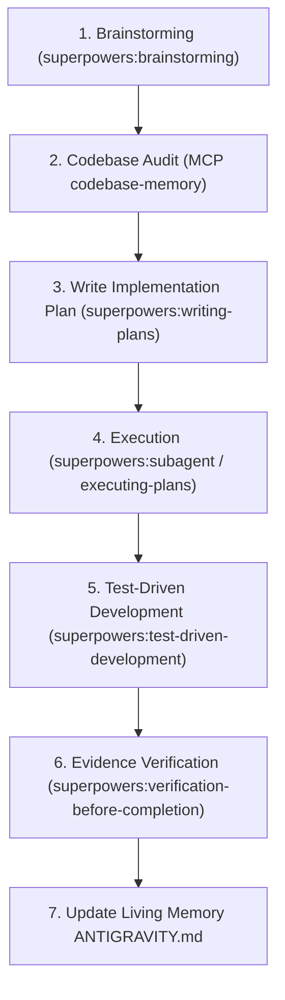
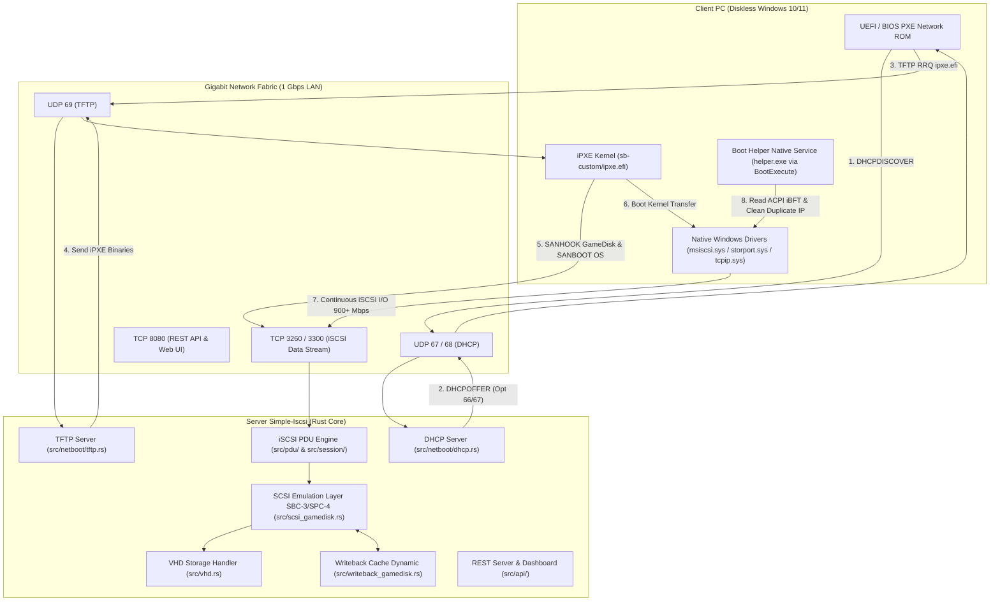
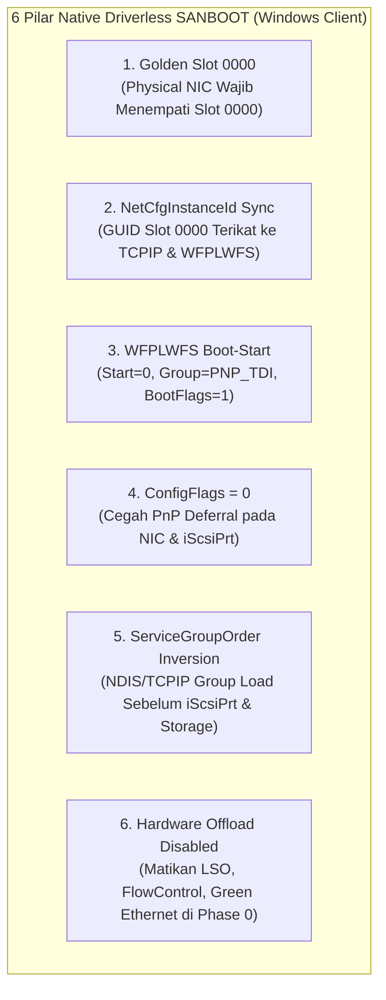

# ANTIGRAVITY.md — Simple-Iscsi Living Memory & AI Protocol

Dokumen ini adalah **Buku Catatan Hidup (Living Memory)**, pedoman kerja, dan protokol standar operasional (SOP) bagi setiap **AI Agent** maupun developer manusia yang berkontribusi pada proyek **Simple-Iscsi**.

> [!IMPORTANT]
> **Tujuan Dokumen:**
> 1. **Zero Hallucination & Token Efficient:** Memberikan ringkasan arsitektur instan sehingga AI Agent memahami seluruh konteks codebase tanpa perlu membaca puluhan file mentah secara berulang.
> 2. **Enforce MCP Codebase Memory:** Menjamin seluruh inspeksi, pemahaman kode, dan validasi dilakukan melalui penelusuran graf simbol yang akurat dengan sintaks perintah yang pasti.
> 3. **Enforce Plugin Superpowers:** Menjamin setiap perencanaan (*planning*) dan eksekusi mengikuti metodologi ketat `superpowers` (Brainstorming -> Writing Plans -> TDD -> Subagent/Executing Plans -> Verification).
> 4. **Living Continuity:** Setiap kali ada fitur baru, bugfix, atau perubahan arsitektur, catatan perubahan **WAJIB** diperbarui di dokumen ini sebelum sesi berakhir.

---

## 1. ATURAN WAJIB EKSEKUSI (MCP `codebase-memory`)

Setiap AI Agent yang bekerja di repositori ini **WAJIB** tunduk pada aturan operasional MCP `codebase-memory` berikut. Tidak ada pengecualian.

### 1.1 Prinsip Operasional Wajib
* **WAJIB menggunakan MCP `codebase-memory`.**
* **Jangan menebak** lokasi, isi, fungsi, atau relasi code.
* Cari dan baca code yang relevan menggunakan MCP sebelum melakukan perubahan.
* Jangan hanya mengandalkan nama file; telusuri symbol dan relasi fungsi.
* Pahami implementasi existing sebelum memodifikasi code.
* Jika perubahan menyentuh suatu function, cek caller/callee dan dependency-nya menggunakan `trace_path`.
* Jika index tidak tersedia atau tidak fresh, gunakan `index_repository`.
* Jika terdapat `parse_partial` atau `skipped`, jangan menganggap hasil graph lengkap. Gunakan fallback pencarian/read langsung pada bagian tersebut.
* Setelah implementasi selesai, gunakan MCP kembali untuk memeriksa perubahan, relasi, dan kemungkinan impact terhadap code lain.
* Eksekusi sesuai plan yang diberikan jika ini merupakan **eksekusi plan**.
* Jangan membuat perubahan di luar scope plan/task tanpa alasan teknis yang jelas.
* Jika menemukan masalah atau kebutuhan perubahan di luar scope yang dapat memengaruhi implementasi, jelaskan terlebih dahulu sebelum memperluas scope.

---

### 1.2 Daftar Lengkap Sintaks & Contoh Pemanggilan Tools MCP `codebase-memory`

Nama project default pada memory graph untuk repositori ini adalah:  
`"project": "C-Project-GIT-Simple-Iscsi"` (atau `"project_name": "C-Project-GIT-Simple-Iscsi"`).

#### 1. `index_status` — Cek Kesehatan & Status Coverage Index
Gunakan sebelum memulai task untuk memastikan graf up-to-date dan mengetahui file yang mengalami `parse_partial` atau `skipped`.
```json
{
  "ServerName": "codebase-memory",
  "ToolName": "index_status",
  "Arguments": {
    "project": "C-Project-GIT-Simple-Iscsi",
    "verbose": false
  }
}
```

#### 2. `index_repository` — Indexing / Re-indexing Repositori
Gunakan jika index belum dibuat atau jika ada perubahan file eksternal yang signifikan.
```json
{
  "ServerName": "codebase-memory",
  "ToolName": "index_repository",
  "Arguments": {
    "repo_path": "C:/Project GIT/Simple-Iscsi"
  }
}
```

#### 3. `get_architecture` — Pahami Struktur & Arsitektur Global
Melihat ringkasan komponen, boundary, hotspot beban, siklus dependensi, dan cluster logika.
```json
{
  "ServerName": "codebase-memory",
  "ToolName": "get_architecture",
  "Arguments": {
    "project": "C-Project-GIT-Simple-Iscsi",
    "aspects": ["all"]
  }
}
```
*Opsi aspects:* `["overview"]`, `["structure"]`, `["dependencies"]`, `["hotspots"]`, `["clusters"]`, `["cycles"]`, `["file_tree"]`.

#### 4. `search_graph` — Cari Simbol (Fungsi, Struct, Route, Enum)
Pencarian graf struktural. Mode: natural language query (BM25), regex pattern, atau vector semantic.
```json
// Contoh A: Natural Language Search (BM25)
{
  "ServerName": "codebase-memory",
  "ToolName": "search_graph",
  "Arguments": {
    "project": "C-Project-GIT-Simple-Iscsi",
    "query": "writeback cache client",
    "limit": 20
  }
}

// Contoh B: Exact Regex Name Pattern
{
  "ServerName": "codebase-memory",
  "ToolName": "search_graph",
  "Arguments": {
    "project": "C-Project-GIT-Simple-Iscsi",
    "name_pattern": ".*SessionContext.*",
    "format": "tree"
  }
}

// Contoh C: Vector Semantic Search
{
  "ServerName": "codebase-memory",
  "ToolName": "search_graph",
  "Arguments": {
    "project": "C-Project-GIT-Simple-Iscsi",
    "semantic_query": ["cache", "writeback", "flush"]
  }
}
```

#### 5. `search_code` — Pencarian Teks Teraugmentasi Graf
Pencarian pola teks / literal berbasis ripgrep yang diperkaya metadata node fungsi dan rangking struktur.
```json
{
  "ServerName": "codebase-memory",
  "ToolName": "search_code",
  "Arguments": {
    "project": "C-Project-GIT-Simple-Iscsi",
    "pattern": "CmdQue",
    "mode": "compact",
    "path_filter": "^src/",
    "limit": 10
  }
}
```
*Opsi mode:* `"compact"` (tanda tangan & metadata), `"full"` (60 baris source di sekitar match), `"files"` (daftar file saja).

#### 6. `get_code_snippet` — Baca Implementasi Simbol Secara Presisi
Gunakan setelah mendapatkan `qualified_name` dari `search_graph`. Ini adalah tool membaca kode berbasis node simbol tanpa mengotori context window.
```json
{
  "ServerName": "codebase-memory",
  "ToolName": "get_code_snippet",
  "Arguments": {
    "project": "C-Project-GIT-Simple-Iscsi",
    "qualified_name": "src.writeback_gamedisk.ClientCache.get_or_create",
    "include_neighbors": false
  }
}
```

#### 7. `trace_path` — Analisis Dampak (*Blast Radius*), Caller & Callee
Mendeteksi siapa yang memanggil fungsi target (*inbound/callers*), apa saja yang dipanggil fungsi target (*outbound/callees*), atau jalur data (*data_flow*).
```json
{
  "ServerName": "codebase-memory",
  "ToolName": "trace_path",
  "Arguments": {
    "project": "C-Project-GIT-Simple-Iscsi",
    "function_name": "handle_scsi_command",
    "direction": "both",
    "depth": 3,
    "mode": "calls",
    "risk_labels": true
  }
}
```
*Opsi direction:* `"inbound"` (siapa yang memanggil / dampak), `"outbound"` (dependensi ke bawah), `"both"` (dua arah).  
*Opsi mode:* `"calls"`, `"data_flow"`, `"cross_service"`.

#### 8. `query_graph` — Kueri Cypher Tingkat Lanjut & Analisis Bottleneck
Menjalankan kueri graf langsung, misalnya mencari fungsi dengan loop bersarang tinggi atau rekursi.
```json
{
  "ServerName": "codebase-memory",
  "ToolName": "query_graph",
  "Arguments": {
    "project": "C-Project-GIT-Simple-Iscsi",
    "query": "MATCH (f:Function) WHERE f.transitive_loop_depth >= 2 RETURN f.qualified_name, f.transitive_loop_depth ORDER BY f.transitive_loop_depth DESC LIMIT 20",
    "graph": "code"
  }
}
```

#### 9. `check_index_coverage` — Verifikasi File Tercover oleh Graf
Cek apakah file-file yang akan dimodifikasi sudah terindeks dengan benar tanpa ada konstruksi yang terlewat.
```json
{
  "ServerName": "codebase-memory",
  "ToolName": "check_index_coverage",
  "Arguments": {
    "project": "C-Project-GIT-Simple-Iscsi",
    "paths": ["src/session/mod.rs", "src/scsi_gamedisk.rs", "src/writeback_gamedisk.rs"]
  }
}
```

#### 10. `detect_changes` — Pemetaan Blast Radius Perubahan Git
Memetakan git diff ke himpunan dampak (*transitive impact set*) pemanggil secara otomatis sebelum commit.
```json
{
  "ServerName": "codebase-memory",
  "ToolName": "detect_changes",
  "Arguments": {
    "project": "C-Project-GIT-Simple-Iscsi",
    "scope": "impact",
    "direction": "inbound"
  }
}
```

---

## 2. CARA MEMBUAT PLANNING DENGAN PLUGIN `superpowers`

Setiap pekerjaan fitur baru, refactoring, atau modifikasi signifikan **WAJIB** direncanakan menggunakan metodologi plugin **`superpowers`** yang dikombinasikan dengan audit **MCP `codebase-memory`**.



### 2.1 Alur Planning Superpowers Langkah demi Langkah

#### Langkah 1: Brainstorming & Requirements (`superpowers:brainstorming`)
* Buka skill: [`SKILL.md`](file:///C:/Users/lannnn/.gemini/config/plugins/superpowers/skills/brainstorming/SKILL.md).
* Eksplorasi kebutuhan user secara mendalam, klarifikasi ambigu, tanyakan trade-offs arsitektural.
* Tentukan scope minimal (*YAGNI: You Aren't Gonna Need It*) dan pastikan tidak ada asumsi tersembunyi.

#### Langkah 2: Audit Codebase via MCP `codebase-memory`
Sebelum menyusun langkah di plan, lakukan audit terhadap basis kode yang disentuh:
1. Jalankan `index_status` untuk memastikan status index siap.
2. Jalankan `search_graph` untuk menemukan fungsi/struct terkait.
3. Jalankan `get_code_snippet` untuk membaca implementasi fungsi saat ini.
4. Jalankan `trace_path` (`direction: "inbound"`) untuk mengetahui siapa saja caller yang akan terkena efek perubahan.
5. Catat qualified name simbol, nomor baris, dan signature method asli.

#### Langkah 3: Penulisan Implementation Plan (`superpowers:writing-plans`)
* Buka skill: [`SKILL.md`](file:///C:/Users/lannnn/.gemini/config/plugins/superpowers/skills/writing-plans/SKILL.md).
* Buat file plan di: `docs/superpowers/plans/YYYY-MM-DD-<nama-fitur>.md` (atau simpan langsung jika task kecil).
* Rancang tugas dalam unit-unit kecil (*Bite-Sized Tasks*) berdurasi 2–5 menit per langkah.
* Setiap task harus memuat:
  * **Files:** Path file exact yang dibuat/dimodifikasi beserta barisnya.
  * **Interfaces Consumed & Produced:** Signature fungsi input dan output secara gamblang.
  * **TDD Steps:** Step 1 tulis failing test -> Step 2 jalankan tes (harus fail) -> Step 3 implementasi minimal -> Step 4 jalankan tes (harus pass) -> Step 5 commit.

#### Langkah 4: Eksekusi Plan (`superpowers:subagent-driven-development` / `superpowers:executing-plans`)
* Buka skill: [`SKILL.md`](file:///C:/Users/lannnn/.gemini/config/plugins/superpowers/skills/subagent-driven-development/SKILL.md) atau [`SKILL.md`](file:///C:/Users/lannnn/.gemini/config/plugins/superpowers/skills/executing-plans/SKILL.md).
* Eksekusi task satu per satu sesuai urutan checkbox `- [ ]`.
* Jangan melompat ke task berikutnya sebelum task aktif terverifikasi sepenuhnya.

#### Langkah 5: Verifikasi Sebelum Klaim Selesai (`superpowers:verification-before-completion`)
* Buka skill: [`SKILL.md`](file:///C:/Users/lannnn/.gemini/config/plugins/superpowers/skills/verification-before-completion/SKILL.md).
* **Prinsip Utama:** *Evidence before assertions*. Jangan pernah menyatakan sukses tanpa bukti empiris eksekusi tool.
* Jalankan `cargo check` atau `cargo test`.
* Jalankan `detect_changes` pada MCP untuk memeriksa apakah ada dampak yang terlewat.

#### Langkah 6: Wajib Catat ke Living Memory (`ANTIGRAVITY.md`)
* Setelah semua langkah terverifikasi, perbarui Bagian 7 ([Matriks Status Fitur](#7-matriks-status-fitur)) dan Bagian 8 ([Riwayat Pengerjaan & Change Log](#8-riwayat-pengerjaan--change-log)) di dokumen ini.

---

### 2.2 Template Dokumen Implementation Plan (Standar Superpowers)

Setiap file plan wajib menggunakan struktur berikut:

```markdown
# [Nama Fitur] Implementation Plan

> **For agentic workers:** REQUIRED SUB-SKILL: Use superpowers:subagent-driven-development (recommended) or superpowers:executing-plans to implement this plan task-by-task. Steps use checkbox (`- [ ]`) syntax for tracking.

**Goal:** [Satu kalimat lugas menjelaskan apa yang dibangun]

**Architecture:** [2-3 kalimat mengenai pendekatan teknis & integrasi modul]

**Tech Stack:** [Rust 2021, Tokio, Win32 C++, dll.]

**Codebase Audit (MCP):**
- Simbol diperiksa: `[Qualified Symbol Name dari search_graph]`
- Pemanggil / Blast Radius: `[Hasil trace_path]`
- Index Coverage: `[Hasil check_index_coverage]`

---

### Task 1: [Nama Komponen / Unit Pertama]

**Files:**
- Modify: `src/modul/target.rs:120-150`
- Test: `tests/test_target.rs`

**Interfaces:**
- Consumes: `pub fn existing_api(arg: &Type) -> Result<()>`
- Produces: `pub fn new_feature(client_ip: &str) -> Option<Output>`

- [ ] **Step 1: Buat failing unit test / assertion**
- [ ] **Step 2: Jalankan test untuk memverifikasi kegagalan awal** (`cargo test`)
- [ ] **Step 3: Implementasi logika minimal untuk meloloskan tes**
- [ ] **Step 4: Jalankan test kembali dan pastikan lulus** (`cargo test`)
- [ ] **Step 5: Validasi kompilasi global** (`cargo check`)

---

### Task 2: [Integrasi / Caller Update]
...

---

### Task N: Living Memory & Documentation Update
- [ ] **Step 1: Perbarui ANTIGRAVITY.md Change Log & Status Matriks**
- [ ] **Step 2: Jalankan codebase-memory index_repository jika ada file baru**
```

---

## 3. STANDAR OPERASIONAL PROSEDUR (SOP) KERJA LENGKAP AI AGENT

Ringkasan siklus kerja harian AI Agent:

```
[Menerima Task / Request]
        │
        ▼
[1. Baca ANTIGRAVITY.md] ──► Token Irit & Paham Arsitektur
        │
        ▼
[2. MCP index_status] ────► Pastikan Graf Siap
        │
        ▼
[3. superpowers:brainstorming + writing-plans]
        ├─ MCP search_graph / get_code_snippet
        └─ MCP trace_path (Blast Radius)
        │
        ▼
[4. Eksekusi Kode Berbasis Bukti]
        ├─ replace_file_content
        └─ Jaga integritas komentar/dokumentasi
        │
        ▼
[5. Validasi: cargo check / build / test] ──► superpowers:verification-before-completion
        │
        ▼
[6. Update ANTIGRAVITY.md] ───────────────► Living Memory Terjaga!
```

---

## 4. PETA ARSITEKTUR & TEKNOLOGI

Sistem **Simple-Iscsi** adalah target storage iSCSI dan infrastruktur network boot berkinerja tinggi (*high performance*) yang dibangun dengan **Rust** (runtime asinkronus Tokio) dan helper NT-native **C++**, yang dirancang khusus untuk lingkungan diskless (tanpa HDD/SSD lokal pada PC client).



### 4.1 Tech Stack Inti
* **Server Backend:** Rust (Edisi 2021), Tokio Async Runtime, DashMap, Parking Lot, Moka Cache, Serde/TOML, Socket2.
* **Client Boot Helper:** C++ (Win32 / Native NT API `ntdll.dll`), compiled with MSVC `cl.exe`.
* **Network & Storage Protocols:**
  * Network Booting: PXE, DHCP (RFC 2131 / 2132), TFTP (RFC 1350), iPXE scripting.
  * Block Storage: iSCSI (RFC 7143), SCSI SPC-4 & SBC-3 (Inquiry, Read/Write 10/16, Mode Sense, Synccache).
  * Storage Format: Virtual Hard Disk (VHD Fixed/Dynamic, Differencing), Raw Physical Disks (GameDisk).
* **Web UI Dashboard:** HTML5, Tailwind CSS, Vanilla JS, SSE/WebSocket for live I/O stats.

---

## 5. STRUKTUR DIREKTORI & INVENTARIS SIMBOL

Pemetaan modul untuk navigasi instan AI Agent:

```
c:\Project GIT\Simple-Iscsi\
├── Cargo.toml                  # Konfigurasi dependensi Rust
├── DOCUMENTATION.md            # Spesifikasi teknis protokol & BAB 9 Native Driverless
├── ANTIGRAVITY.md              # Living memory, SOP superpowers, & protokol MCP (Dokumen ini)
├── config.toml                 # Konfigurasi target iSCSI, path disk, & network binding
├── clients.toml                # Pemetaan IP client, MAC address, target VHD, & WB cache
├── src/
│   ├── main.rs                 # Server daemon entry point, CLI dispatcher, signal handling
│   ├── server.rs               # Listener TCP port 3260/3300, worker spawn loop
│   ├── server_api.rs           # Web server HTTP REST & WebSocket endpoint
│   ├── backend.rs              # Abstraksi storage backend (VHD + Raw Disk)
│   ├── config.rs               # Parser konfigurasi TOML & runtime validation
│   ├── config_manager.rs       # Sinkronisasi konfigurasi hot-reload
│   ├── vhd.rs                  # Parser header VHD, BAT (Block Allocation Table), dynamic sectors
│   ├── vhd_merge.rs            # Penggabungan differencing VHD ke base image
│   ├── scsi_gamedisk.rs        # SCSI command handler (SBC-3/SPC-4) untuk GameDisk raw
│   ├── scsi_imagedisk.rs       # SCSI command handler untuk VHD image OS
│   ├── writeback_gamedisk.rs   # Writeback cache terisolasi per-IP client (128 MB initial growth)
│   ├── writeback_imagedisk.rs  # Writeback cache layer untuk image OS
│   ├── writeback_super.rs      # Super-client writeback persistence engine
│   ├── read_ahead.rs           # Buffer prefetching asinkronus untuk sequential read
│   ├── stats.rs                # Penghitung throughput IOPS, bandwidth MB/s, & latency
│   ├── fs_utils.rs             # Utilitas file system & platform-specific storage call
│   ├── netboot/
│   │   ├── mod.rs              # Modul netboot orchestrator
│   │   ├── dhcp.rs             # Server DHCP UDP 67/68, opsi 66/67/17/168/169/170
│   │   ├── dhcp_packet.rs      # Struktur biner paket DHCP & parser opsi
│   │   └── tftp.rs             # Server TFTP UDP 69 untuk transfer file PXE/iPXE
│   ├── pdu/
│   │   ├── mod.rs              # Definisi opcodes & konstanta PDU RFC 7143
│   │   ├── builder.rs          # Serializer paket respon iSCSI
│   │   ├── parser.rs           # Deserializer paket request iSCSI dari stream TCP
│   │   └── imagedisk.rs        # Khusus pembungkus paket transfer image
│   ├── session/
│   │   ├── mod.rs              # State machine sesi & koneksi iSCSI
│   │   ├── login.rs            # Handshake login iSCSI, negosiasi parameter kawat
│   │   ├── pdu_io.rs           # Baca/tulis frame PDU asinkronus pada socket TCP
│   │   ├── scsi_handler.rs     # Dispatcher utama perintah SCSI
│   │   ├── scsi_handler_gamedisk.rs # Dispatcher khusus akses drive GameDisk
│   │   └── scsi_handler_imagedisk.rs# Dispatcher khusus akses drive OS
│   └── api/
│       ├── mod.rs              # Router REST API
│       ├── routes_client.rs    # Endpoint manajemen client (CRUD IP/MAC/Cache)
│       ├── routes_disk.rs      # Endpoint manajemen virtual disk & game drives
│       ├── routes_stats.rs     # Endpoint metrics throughput & status realtime
│       ├── routes_tftp.rs      # Endpoint upload/download file PXE
│       ├── routes_vhd.rs       # Endpoint inspeksi & manipulasi file VHD
│       └── static_files.rs     # Handler penyedia aset Web Dashboard UI
├── helper/
│   ├── helper.cpp              # C++ Native Boot Helper (ACPI iBFT parser & Deep IP Cleaner)
│   ├── compile.bat             # Skrip kompilasi MSVC cl.exe untuk helper.exe
│   └── install_client.bat      # Pemasang helper.exe ke BootExecute client Windows
├── pxe/ / sb-custom/           # Binary bootloader iPXE (ipxe-shim.efi, autoexec.ipxe)
└── ui/                         # Aset antarmuka web (HTML, CSS, JS dashboard)
```

---

## 6. PENGETAHUAN INTI NATIVE DRIVERLESS SANBOOT (BAB 9)

Salah satu terobosan fundamental repositori ini adalah keberhasilan Windows 10/11 client untuk booting secara **100% Native Driverless** tanpa driver pihak ketiga (`CCBootPNPX.sys` atau `iSharePnp.sys` telah dibuang sepenuhnya).

Setiap AI Agent yang menangani masalah boot, BSOD `0x0000007B` (*INACCESSIBLE_BOOT_DEVICE*), atau konfigurasi registri client **WAJIB** memahami 6 pilar berikut:



### 6.1 Penjelasan 6 Pilar Registri

1. **Aturan Emas Slot `0000` (`Control\Class\{4d36e972-e325-11ce-bfc1-08002be10318}\0000`):**
   * Loader network kernel Phase 0 Windows **hanya menginisialisasi slot `0000`**.
   * Jika driver kartu jaringan fisik (Realtek/Intel) berada di slot `0001` atau `0005`, adapter fisik tidak akan hidup saat boot storage berlangsung, menyebabkan kegagalan koneksi iSCSI dan BSOD `0x7B`.
   * Registri driver fisik harus disuntikkan secara tepat menggantikan/menempati slot `0000`.

2. **Sinkronisasi `NetCfgInstanceId`:**
   * Nilai string `NetCfgInstanceId` pada slot `0000` (contoh: `{79A1BBB6-D0AE-4171-BB0D-1B21EE54BA4C}`) **harus identik** dengan konfigurasi adapter pada service `TCPIP\Parameters\Interfaces\{GUID}` dan `Linkage` protokol.
   * Jika GUID tidak sinkron, Windows akan menganggap adapter tersebut belum dikonfigurasi dan menolak mengirim frame TCP iSCSI.

3. **Promosi Filter `WFPLWFS` ke Boot-Start:**
   * Lokasi: `HKLM\SYSTEM\CurrentControlSet\Services\WFPLWFS`
   * Pengaturan wajib:
     ```reg
     "Start"=dword:00000000
     "Type"=dword:00000001
     "Group"="PNP_TDI"
     "BootFlags"=dword:00000001
     ```
   * Driver NDIS filter WFP (Windows Filtering Platform) harus aktif di Phase 0 agar layer socket TCP/IP tidak diblokir saat iSCSI Miniport meminta koneksi jaringan.

4. **`ConfigFlags = 0` (Mencegah Deferral PnP):**
   * Lokasi: Entri PCI NIC di `Enum\PCI\...` dan perangkat iSCSI di `Enum\ROOT\ISCSIPRT\0000`.
   * Nilai `ConfigFlags` **wajib `0x00000000`** (bukan `0x20` atau `0x40`). Nilai `0x20`/`0x40` memberi tahu PnP Manager bahwa perangkat belum selesai dikonfigurasi sehingga inisialisasinya ditunda ke User Mode (yang menyebabkan BSOD instan karena storage belum tersedia).

5. **`ServiceGroupOrder` Driver Inversion:**
   * Di Windows standar, storage dimuat lebih dulu daripada network. Pada SANBOOT, urutan harus dibalik:
     * Posisi 6–9: Network Stack (`NDIS`, `PNP_TDI`).
     * Posisi 10: `SimpleISCSI` / `iScsiPrt` (Inisiator iSCSI software).
     * Posisi 11: `SCSI miniport` (Storage miniport controller).

6. **Offload Toggles pada Registri Driver NIC (Membasmi Lag 10 MB/s):**
   * Di slot `0000`, matikan fitur offload hemat daya yang merusak latensi iSCSI di Phase 0:
     * `*LsoV2IPv4 = "0"` (Nonaktifkan Large Send Offload)
     * `*FlowControl = "0"` (Nonaktifkan Flow Control yang memicu freeze)
     * `EnableGreenEthernet = "0"` (Matikan Green Ethernet)
     * `ASPM = "0"` (Matikan PCIe Active State Power Management)
   * Menghasilkan throughput stabil 900+ Mbps pada jaringan Gigabit LAN.

---

## 7. MATRIKS STATUS FITUR

Daftar status modul dan kapabilitas sistem Simple-Iscsi saat ini:

| Modul / Fitur | Lokasi Kode | Status | Keterangan & Catatan Teknis |
| :--- | :--- | :---: | :--- |
| **DHCP Server Engine** | [`src/netboot/dhcp.rs`](file:///c:/Project%20GIT/Simple-Iscsi/src/netboot/dhcp.rs) | **STABLE** | RFC 2131/2132, PXE Opt 66/67, iPXE Opt 17/168/169/170, binding multi-IP. |
| **TFTP File Server** | [`src/netboot/tftp.rs`](file:///c:/Project%20GIT/Simple-Iscsi/src/netboot/tftp.rs) | **STABLE** | UDP 69, transfer file binary bootloader (`ipxe.efi`, `autoexec.ipxe`). |
| **iSCSI PDU Parsing** | [`src/pdu/`](file:///c:/Project%20GIT/Simple-Iscsi/src/pdu/) | **STABLE** | RFC 7143 full header/data parsing, Login, SCSI Command/Response. |
| **Session State Machine** | [`src/session/`](file:///c:/Project%20GIT/Simple-Iscsi/src/session/) | **STABLE** | Multi-client connection tracking, negosiasi parameter throughput optimal. |
| **SCSI SBC-3 / SPC-4** | [`src/scsi_gamedisk.rs`](file:///c:/Project%20GIT/Simple-Iscsi/src/scsi_gamedisk.rs) | **STABLE** | Emulasi Inquiry, Read Capacity, Read/Write 10/16, Mode Sense, Synccache. |
| **Queue Depth & CmdQue** | [`src/scsi_gamedisk.rs`](file:///c:/Project%20GIT/Simple-Iscsi/src/scsi_gamedisk.rs) | **OPTIMIZED** | `CmdQue = 1`, Queue Depth 32-64, throughput tembus kawat LAN 900+ Mbps. |
| **Writeback Cache Engine** | [`src/writeback_gamedisk.rs`](file:///c:/Project%20GIT/Simple-Iscsi/src/writeback_gamedisk.rs) | **STABLE** | Initial allocation 128 MB per client dengan auto-expansion dinamis. |
| **VHD Engine** | [`src/vhd.rs`](file:///c:/Project%20GIT/Simple-Iscsi/src/vhd.rs) | **STABLE** | Fixed & Dynamic VHD parsing, BAT mapping, parent-child diffing. |
| **Boot Helper C++** | [`helper/helper.cpp`](file:///c:/Project%20GIT/Simple-Iscsi/helper/helper.cpp) | **STABLE** | `helper.exe` berjalan via `BootExecute`, parse ACPI iBFT, Deep IP Cleaner. |
| **Native Driverless Boot** | Registri & [`DOCUMENTATION.md`](file:///c:/Project%20GIT/Simple-Iscsi/DOCUMENTATION.md) (BAB 9) | **VERIFIED** | 100% Native Driverless (Slot 0000, `NetCfgInstanceId`, `WFPLWFS`, `ConfigFlags = 0`). |
| **Web UI Dashboard** | [`ui/`](file:///c:/Project%20GIT/Simple-Iscsi/ui/) & [`src/api/`](file:///c:/Project%20GIT/Simple-Iscsi/src/api/) | **STABLE** | Monitoring koneksi client, throughput real-time, manajemen VHD & TFTP. |

---

## 8. RIWAYAT PENGERJAAN & CHANGE LOG

Setiap tugas atau fitur yang diselesaikan **WAJIB** dicatat di bawah ini dengan menyertakan tanggal, ringkasan pekerjaan, modul terdampak, dan justifikasi teknisnya.

### Format Entri Log Baru:
```markdown
### [YYYY-MM-DD] - [Judul Tugas / Fitur]
- **Tujuan:** Ringkasan singkat tujuan task.
- **Modul Terdampak:** File dan fungsi yang dimodifikasi.
- **Rincian Perubahan:** Poin-poin spesifik apa saja yang diubah atau ditambahkan.
- **Hasil & Verifikasi:** Hasil pengujian, kompilasi, atau status graf index.
```

---

### [2026-10-04] - Integrasi Perencanaan Superpowers & Referensi Perintah MCP codebase-memory
- **Tujuan:** Memperkaya `ANTIGRAVITY.md` dengan protokol planning ketat menggunakan plugin `superpowers` dan daftar sintaks perintah lengkap 10 tools MCP `codebase-memory`.
- **Modul Terdampak:** [`ANTIGRAVITY.md`](file:///c:/Project%20GIT/Simple-Iscsi/ANTIGRAVITY.md).
- **Rincian Perubahan:**
  1. Menambahkan Section 1.2: Referensi lengkap sintaks JSON dan parameter executable untuk seluruh tools MCP (`index_status`, `index_repository`, `get_architecture`, `search_graph`, `search_code`, `get_code_snippet`, `trace_path`, `query_graph`, `check_index_coverage`, `detect_changes`).
  2. Menambahkan Section 2: Panduan lengkap alur planning berbasis plugin `superpowers` (Brainstorming, Writing Plans dengan TDD, Subagent Execution, Evidence-Based Verification).
  3. Menyediakan template resmi dokumen implementasi plan dengan integrasi audit MCP.
- **Hasil & Verifikasi:** Dokumen `ANTIGRAVITY.md` kini memiliki panduan operasional yang lengkap, presisi, dan siap dijadikan acuan tanpa risiko lupa perintah.

---

### [2026-10-04] - Pembuatan Living Memory `ANTIGRAVITY.md` & Protokol MCP
- **Tujuan:** Menyediakan living memory terpadu untuk AI Agent agar hemat token, bebas halusinasi, konsisten dalam arsitektur, dan mematuhi aturan ketat MCP `codebase-memory`.
- **Modul Terdampak:** [`ANTIGRAVITY.md`](file:///c:/Project%20GIT/Simple-Iscsi/ANTIGRAVITY.md).
- **Rincian Perubahan:**
  1. Merumuskan aturan wajib eksekusi menggunakan 9 tools MCP `codebase-memory`.
  2. Menyusun SOP 5 fase kerja AI Agent (Context Loading, Planning, Evidence-Based Execution, Verification, Living Memory Update).
  3. Mendokumentasikan peta arsitektur lengkap Rust, C++ Helper, dan Web Dashboard.
  4. Merangkum 6 pilar penemuan ilmiah Native Driverless SANBOOT (Aturan Emas Slot `0000`, `NetCfgInstanceId`, `WFPLWFS`, `ConfigFlags = 0`, `ServiceGroupOrder`, Offload Toggles).
  5. Menetapkan matriks fitur dan standarisasi pencatatan riwayat kerja berkelanjutan.
- **Hasil & Verifikasi:** Dokumen terbentuk rapi di root proyek, siap digunakan sebagai referensi utama setiap sesi AI.

---

### [2026-10-02] - Dokumentasi Arsitektur ServiceGroupOrder & Kustom Grup iScsiPrt (BAB 9.7)
- **Tujuan:** Mendokumentasikan mekanisme pembalikan urutan driver boot Windows dan opsi kustomisasi grup `iScsiPrt`.
- **Modul Terdampak:** [`DOCUMENTATION.md`](file:///c:/Project%20GIT/Simple-Iscsi/DOCUMENTATION.md).
- **Rincian Perubahan:**
  1. Menambahkan Sub-bab 9.7 pada dokumentasi teknis mengenai `ServiceGroupOrder`.
  2. Menjelaskan posisi driver `SimpleISCSI` di antara stack jaringan (`PNP_TDI`) dan storage miniport (`SCSI miniport`).
  3. Mendokumentasikan isolasi driver pihak ketiga dan penghapusan total dependensi `CCBootPNPX.sys`.
- **Hasil & Verifikasi:** Dokumentasi tersinkronisasi dan di-commit ke Git (`afd749a`).

---

### [2026-10-01] - Eliminasi Dependensi EXTF & Finalisasi Driverless Registry
- **Tujuan:** Membersihkan registri dari sisa konfigurasi EXTF lama yang sudah tidak dibutuhkan pada arsitektur native driverless.
- **Modul Terdampak:** Registri client, template konfigurasi, dan dokumentasi terkait.
- **Rincian Perubahan:**
  1. Menghapus referensi parameter EXTF dari alur booting client.
  2. Menyempurnakan skrip injeksi registri untuk menyasar langsung slot `0000` tanpa perantara layer filter tambahan.
  3. Memvalidasi kestabilan boot Windows 10/11 pada chip Realtek RTL8111/8168/8125 dan Intel I219/I225.
- **Hasil & Verifikasi:** Sistem client terbukti boot stabil tanpa driver pihak ketiga.
