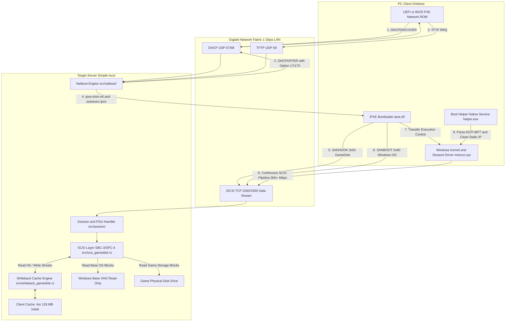
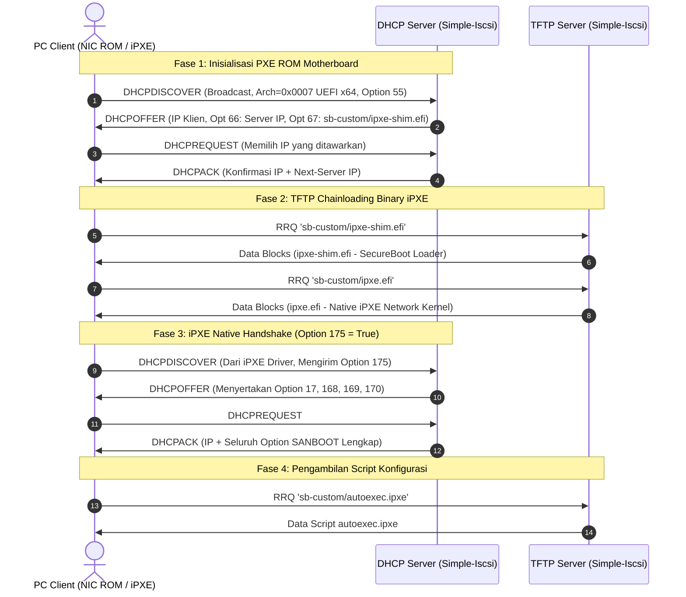
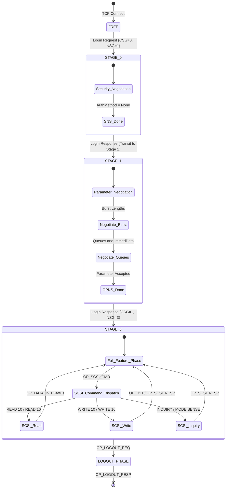
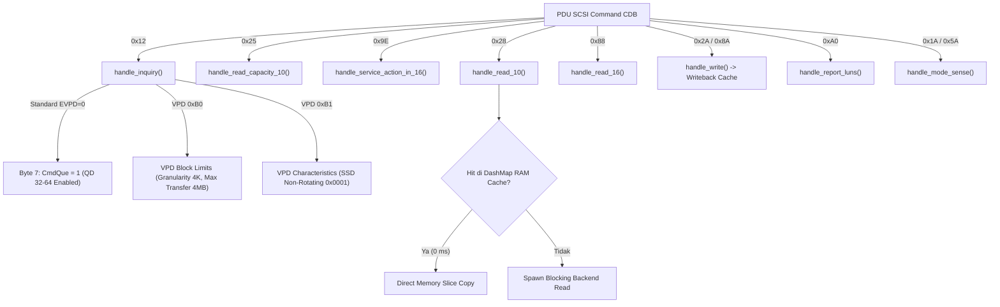
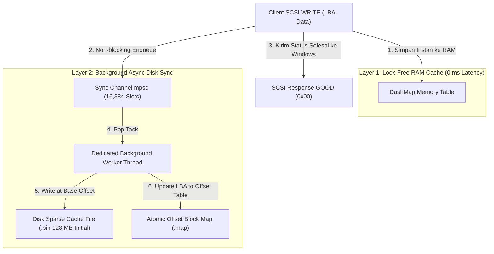
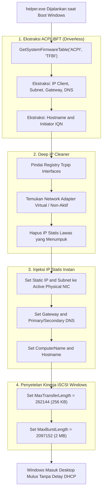

# DOKUMENTASI TEKNIS & SPESIFIKASI PROTOKOL SIMPLE-ISCSI
### Panduan Arsitektur Menyeluruh, Alur Network Booting (PXE/DHCP/iPXE), Protokol iSCSI (RFC 7143), SCSI Emulation Layer (SPC-4/SBC-3), Writeback Cache Engine (128 MB), dan Windows ACPI iBFT Boot Helper

---

> [!IMPORTANT]
> **Catatan Kompatibilitas Driver Client (Third-Party Drivers):**  
> Untuk saat ini, sistem operasi Windows pada image client masih menggunakan komponen driver PNP / virtual network filter pihak ketiga (**Third-Party Driver** dari **CCBoot** atau **iSharedisk** seperti `CCBootPnp.sys` / `iSharePnp.sys`) untuk binding awal NIC adapter hardware saat OS pertama kali menyala. Seluruh transfer I/O data iSCSI, koneksi SANBOOT, negosiasi PDU, SCSI command execution, dan writeback caching sepenuhnya ditangani secara independen oleh **Target Server Simple-Iscsi**. Integrasi boot helper (`helper.exe`) dan parser ACPI iBFT dibangun untuk menjembatani konfigurasi IP otomatis dan transisi bertahap menuju arsitektur *100% native driverless*.

---

## DAFTAR ISI
1. [BAB 1: Pengenalan & Arsitektur Global Sistem](#bab-1-pengenalan--arsitektur-global-sistem)
2. [BAB 2: Network Booting (PXE, DHCP Handshake, TFTP, & iPXE Scripting)](#bab-2-network-booting-pxe-dhcp-handshake-tftp--ipxe-scripting)
3. [BAB 3: Protokol iSCSI (RFC 7143) & Struktur Paket PDU](#bab-3-protokol-iscsi-rfc-7143--struktur-paket-pdu)
4. [BAB 4: Siklus Hidup Sesi & State Machine iSCSI](#bab-4-siklus-hidup-sesi--state-machine-iscsi)
5. [BAB 5: SCSI Emulation Layer (SPC-4 & SBC-3)](#bab-5-scsi-emulation-layer-spc-4--sbc-3)
6. [BAB 6: Storage Backend & Writeback Cache Engine (128 MB)](#bab-6-storage-backend--writeback-cache-engine-128-mb)
7. [BAB 7: Windows Client Boot Helper (ACPI iBFT Parser & Deep IP Cleaner)](#bab-7-windows-client-boot-helper-acpi-ibft-parser--deep-ip-cleaner)
8. [BAB 8: Analisis Kinerja, Audit Optimasi, & Matriks Troubleshooting (10 MB/s ke 900+ Mbps)](#bab-8-analisis-kinerja-audit-optimasi--matriks-troubleshooting-10-mbs-ke-900-mbps)

---

# BAB 1: PENGENALAN & ARSITEKTUR GLOBAL SISTEM

## 1.1 Konsep Diskless SANBOOT vs Local Storage
Sistem **Simple-Iscsi** adalah implementasi target storage iSCSI dan infrastruktur network boot berkinerja tinggi (*high performance*) yang dibangun menggunakan bahasa pemrograman **Rust** (asinkronus berbasis runtime Tokio). Sistem ini dirancang khusus untuk lingkungan diskless (tanpa media penyimpanan lokal pada PC client), seperti laboratorium komputer, warnet/iCafe, dan infrastruktur komputasi terpusat.

Pada sistem diskless SANBOOT:
* PC client tidak memerlukan HDD/SSD fisik internal.
* Seluruh citra sistem operasi Windows (Drive `C:`) dan penyimpanan game (Drive `D:`, `E:`, dll.) berada terpusat di server dalam bentuk file virtual disk (**VHD**) atau **Raw Physical Storage**.
* Motherboard client melakukan boot melalui jaringan (PXE / iPXE) dan memetakan target storage iSCSI server langsung ke layer storage driver Windows (`msiscsi.sys` / `storport.sys`).
* Operasi baca (*Read*) dialirkan langsung dari image induk server / RAM cache, sedangkan operasi tulis (*Write*) dialihkan ke file cache temporer terisolasi (**Writeback Cache**) yang unik untuk setiap IP client.



---

# BAB 2: NETWORK BOOTING (PXE, DHCP HANDSHAKE, TFTP, & iPXE SCRIPTING)

Inisialisasi sistem dari saat PC dinyalakan (*Cold Boot*) melewati 4 fase pertukaran data jaringan:

## 2.1 Alur Handshake DHCP (RFC 2131 / RFC 2132)
Server Simple-Iscsi menyertakan implementasi DHCP Server bawaan pada [`src/netboot/dhcp.rs`](file:///c:/Project%20GIT/Simple-Iscsi/src/netboot/dhcp.rs) yang mendengarkan paket broadcast pada UDP port `67` dan merespons ke UDP port `68`.



---

## 2.2 Rincian Lengkap DHCP Options

| DHCP Option | Nama Opsi | Deskripsi Teknis & Nilai | Implementasi Kode Sumber |
| :--- | :--- | :--- | :--- |
| **Option 1** | `Subnet Mask` | Menetapkan subnet mask jaringan (contoh: `255.255.255.0`). | [`src/netboot/dhcp.rs`](file:///c:/Project%20GIT/Simple-Iscsi/src/netboot/dhcp.rs#L363) |
| **Option 3** | `Router / Gateway` | Alamat default gateway client (contoh: `10.10.10.1`). | [`src/netboot/dhcp.rs`](file:///c:/Project%20GIT/Simple-Iscsi/src/netboot/dhcp.rs#L367) |
| **Option 6** | `Domain Name Server` | Alamat DNS resolver (contoh: `8.8.8.8`). | [`src/netboot/dhcp.rs`](file:///c:/Project%20GIT/Simple-Iscsi/src/netboot/dhcp.rs#L370) |
| **Option 17** | `Root-Path (RFC 4173)` | **URL iSCSI SANBOOT Standar**. Format: `iscsi:<Server_IP>::<Port>:0:<Target_IQN>` (contoh: `iscsi:10.10.10.253::3300:0:iqn.2024-01.com.tmdebug:vhd-win10`). | [`src/netboot/dhcp.rs`](file:///c:/Project%20GIT/Simple-Iscsi/src/netboot/dhcp.rs#L409-L411) |
| **Option 51** | `Lease Time` | Durasi sewa IP (86400 detik / 24 jam). | [`src/netboot/dhcp.rs`](file:///c:/Project%20GIT/Simple-Iscsi/src/netboot/dhcp.rs#L374) |
| **Option 66** | `TFTP Server Name` | Alamat IP server TFTP (Next Server IP). | [`src/netboot/dhcp.rs`](file:///c:/Project%20GIT/Simple-Iscsi/src/netboot/dhcp.rs#L384-L386) |
| **Option 67** | `Bootfile Name` | Nama file binary bootloader yang di-download (`sb-custom/ipxe-shim.efi` untuk UEFI, `sb-custom` untuk BIOS). | [`src/netboot/dhcp.rs`](file:///c:/Project%20GIT/Simple-Iscsi/src/netboot/dhcp.rs#L380-L382) |
| **Option 168** | `iSCSI Target IP` | Alamat IP Target Server iSCSI (dibaca oleh iPXE via `${168:string}`). | [`src/netboot/dhcp.rs`](file:///c:/Project%20GIT/Simple-Iscsi/src/netboot/dhcp.rs#L389) |
| **Option 169** | `iSCSI Boot Target IQN` | Target IQN OS Boot Disk Windows (dibaca via `${169:string}`). | [`src/netboot/dhcp.rs`](file:///c:/Project%20GIT/Simple-Iscsi/src/netboot/dhcp.rs#L406) |
| **Option 170** | `GameDisk Target URI` | **Target URI RFC 4173 untuk GameDisk sekunder**. Format: `iscsi:<Server_IP>::<Port>:0:<Game_IQN>` (dibaca via `${170:string}`). | [`src/netboot/dhcp.rs`](file:///c:/Project%20GIT/Simple-Iscsi/src/netboot/dhcp.rs#L414-L420) |
| **Option 175** | `iPXE Feature Flags` | Dikirim oleh iPXE ke DHCP Server untuk menandakan bahwa client sudah menjalankan native iPXE environment. | [`src/netboot/dhcp.rs`](file:///c:/Project%20GIT/Simple-Iscsi/src/netboot/dhcp.rs#L210-L215) |

---

## 2.3 Script `autoexec.ipxe` & Penguncian Slot Drive
Script [`pxe/sb-custom/autoexec.ipxe`](file:///c:/Project%20GIT/Simple-Iscsi/pxe/sb-custom/autoexec.ipxe) mengatur tata letak drive sebelum kernel OS dimuat:

```ipxe
#!ipxe
clear net0/gateway
clear gateway
isset ${170:string} && sanhook --drive 0x81 ${170:string} || isset ${168:string} && sanhook --drive 0x81 iscsi:${168:string}::3300:0:iqn.2024-01.com.tmdebug:gamedisks || isset ${168:string} && sanhook --drive 0x81 iscsi:${168:string}::3260:0:iqn.2024-01.com.tmdebug:gamedisks ||
isset ${root-path} && sanboot --drive 0x80 ${root-path} ||
isset ${169:string} && sanboot --drive 0x80 iscsi:${168:string}::3300:0:${169:string} ||
isset ${169:string} && sanboot --drive 0x80 iscsi:${168:string}::3260:0:${169:string} ||
isset ${169:string} && sanboot --drive 0x80 iscsi:${168:string}::::${169:string} ||
shell
```

### Mengapa Penguncian Slot Drive Eksplisit Wajib Dilakukan?
1. **`sanhook --drive 0x81 <URI>`:**
   * Memasang GameDisk ke slot **`0x81` (Disk 1 di Windows)** tanpa mem-boot-nya.
   * Jika `--drive 0x81` tidak disertakan, iPXE akan menempatkan GameDisk di slot pertama yang kosong (`0x80`).
2. **`sanboot --drive 0x80 <URI>`:**
   * Memasang Windows OS Boot Disk ke slot **`0x80` (Disk 0 / Drive C:)** dan segera mentransfer kontrol ke Windows Boot Manager (`bootmgfw.efi`).
   * Menetapkan slot drive secara eksplisit mencegah GameDisk merebut slot `0x80` yang menyebabkan error `Could not open SAN device` atau gagal boot.

---

# BAB 3: PROTOKOL iSCSI (RFC 7143) & STRUKTUR PAKET PDU

Protokol **iSCSI (Consolidated Standard RFC 7143)** membungkus SCSI Command Descriptor Blocks (CDB) ke dalam paket TCP port 3260 / 3300 melalui unit data standar yang disebut **PDU (Protocol Data Unit)**.

## 3.1 Struktur 48-Byte Basic Header Segment (BHS)
Setiap PDU iSCSI diawali dengan header wajib berukuran **48 byte**:

```text
Byte 0       Byte 1       Byte 2       Byte 3
+------------+------------+------------+------------+
| .I| Opcode |   Flags    |   Response / Reserved   |  (0 - 3)
+------------+------------+------------+------------+
| TotalAHSLen|           DataSegmentLength          |  (4 - 7)
+------------+------------+------------+------------+
|                     LUN (64-bit)                  |  (8 - 15)
+------------+------------+------------+------------+
|             Initiator Task Tag (ITT)              |  (16 - 19)
+------------+------------+------------+------------+
|      Target Transfer Tag (TTT) / Reserved         |  (20 - 23)  <-- WAJIB 0xFFFFFFFF pada OP_SCSI_RESP!
+------------+------------+------------+------------+
|              CmdSN / StatSN / ExpDataSN           |  (24 - 27)
+------------+------------+------------+------------+
|              ExpCmdSN / ExpStatSN                 |  (28 - 31)
+------------+------------+------------+------------+
|                    MaxCmdSN                       |  (32 - 35)
+------------+------------+------------+------------+
|               CDB (Bytes 0..3) / ExpDataSN        |  (36 - 39)
+------------+------------+------------+------------+
|               CDB (Bytes 4..7)                    |  (40 - 43)
+------------+------------+------------+------------+
|               CDB (Bytes 8..11)                   |  (44 - 47)
+------------+------------+------------+------------+
|               [Opsional: Header Digest 4-byte]    |
+---------------------------------------------------+
|               [Payload Data: Pad to 4-byte align] |
+---------------------------------------------------+
|               [Opsional: Data Digest 4-byte]      |
+---------------------------------------------------+
```

---

## 3.2 Matriks Lengkap OpCode iSCSI

| OpCode | Hex | Arah Transmisi | Nama Perintah | Fungsi Utama |
| :--- | :--- | :--- | :--- | :--- |
| `OP_NOP_OUT` | `0x00` | Initiator → Target | NOP-Out (Ping) | Verifikasi *keep-alive* koneksi atau memicu respons NOP-In target. |
| `OP_SCSI_CMD` | `0x01` | Initiator → Target | SCSI Command | Mengirim perintah SCSI (READ, WRITE, INQUIRY, dll.) via 16-byte CDB. |
| `OP_TMF_REQ` | `0x02` | Initiator → Target | Task Management Request | Manajemen antrean/reset SCSI (LUN Reset, Abort Task). |
| `OP_LOGIN_REQ` | `0x03` | Initiator → Target | Login Request | Memulai sesi iSCSI dan negosiasi parameter operasional. |
| `OP_TEXT_REQ` | `0x04` | Initiator → Target | Text Request | Penemuan target (*SendTargets discovery*) dan pertukaran teks. |
| `OP_DATA_OUT` | `0x05` | Initiator → Target | SCSI Data-Out | Mengirim data penulisan dari Initiator ke Target (Write payload). |
| `OP_LOGOUT_REQ` | `0x06` | Initiator → Target | Logout Request | Mengakhiri sesi iSCSI secara bersih (*clean teardown*). |
| `OP_NOP_IN` | `0x20` | Target → Initiator | NOP-In (Pong) | Membalas NOP-Out atau probe kesehatan koneksi dari target. |
| `OP_SCSI_RESP` | `0x21` | Target → Initiator | SCSI Response | Mengembalikan status penyelesaian SCSI (GOOD `0x00`, CHECK CONDITION `0x02`). |
| `OP_TMF_RESP` | `0x22` | Target → Initiator | Task Management Response | Mengembalikan status fungsi TMF. |
| `OP_LOGIN_RESP` | `0x23` | Target → Initiator | Login Response | Mengonfirmasi tahap login atau transisi ke Full Feature Phase. |
| `OP_TEXT_RESP` | `0x24` | Target → Initiator | Text Response | Membalas daftar target IQN yang tersedia. |
| `OP_DATA_IN` | `0x25` | Target → Initiator | SCSI Data-In | Mengirim payload pembacaan (Read data) dari target ke Initiator. |
| `OP_R2T` | `0x31` | Target → Initiator | Ready To Transfer (R2T) | Memberitahu Initiator bahwa Target siap menerima payload Data-Out berikutnya. |
| `OP_LOGOUT_RESP`| `0x26` | Target → Initiator | Logout Response | Mengonfirmasi penutupan sesi. |
| `OP_REJECT` | `0x3F` | Target → Initiator | Reject | Menolak PDU yang mengalami korupsi atau pelanggaran protokol. |

---

## 3.3 Sistem Penomoran & Sinkronisasi Aliran Data (RFC 7143)

1. **`CmdSN` (Command Sequence Number):** Dihitung oleh Initiator untuk setiap non-immediate command.
2. **`ExpCmdSN` (Expected Command Sequence Number):** Dihitung oleh Target, memberitahu Initiator `CmdSN` berikutnya yang diharapkan.
3. **`MaxCmdSN` (Maximum Command Sequence Number):** Menentukan batas atas *Sliding Window Credit* Initiator. Nilai `MaxCmdSN = ExpCmdSN + 64` membuka kran antrean paralel hingga **Queue Depth 64**.
4. **`StatSN` (Status Sequence Number):** Dihitung oleh Target untuk setiap PDU respon yang membawa status.
5. **`DataSN` & `ExpDataSN`:** Menghitung urutan segmen data saat transfer multi-PDU berlangsung.
6. **`TTT` (Target Transfer Tag) Rule:** Sesuai RFC 7143 §10.4.5 & §10.5.4, field TTT pada `OP_SCSI_RESP` (`0x21`) dan `OP_TMF_RESP` (`0x22`) **WAJIB diisi `0xFFFFFFFF`** (Reserved). Pengisian nilai `0x00000000` adalah pelanggaran protokol yang memicu *driver stall* pada Windows.

---

# BAB 4: SIKLUS HIDUP SESI & STATE MACHINE iSCSI

Sebuah sesi iSCSI melewati beberapa tahap (*Stages*) yang diatur oleh bit `CSG` (*Current Stage*) dan `NSG` (*Next Stage*) pada Login PDU:



### Parameter Operasional yang Dinegosiasikan pada Stage 1 (Operational Negotiation):

| Kunci Parameter | Nilai Server Simple-Iscsi | Dampak Kinerja & Efeknya ke Driver Windows |
| :--- | :--- | :--- |
| `MaxRecvDataSegmentLength` | **`4,194,304` (4 MB)** | Memungkinkan transfer payload SCSI berukuran hingga 4 MB per 1 PDU data tanpa fragmentasi mikro. |
| `FirstBurstLength` | **`2,097,152` (2 MB)** | Batas payload ImmediateData/Unsolicited Data-Out awal dari Windows. |
| `MaxBurstLength` | **`2,097,152` (2 MB)** | Ukuran transfer maksimal per rentetan siklus R2T. |
| `ImmediateData` | **`Yes`** | Mengizinkan Windows menyertakan data penulisan awal langsung di belakang paket `OP_SCSI_CMD` tanpa perlu menunggu R2T. |
| `InitialR2T` | **`No`** | Menonaktifkan R2T pada burst pertama sehingga menghemat 1 kali RTT (Round Trip Time) jaringan. |
| `MaxOutstandingR2T` | **`16`** | Server sanggup memproses hingga 16 antrean R2T paralel secara simultan. |
| `DataPDUInOrder` | **`Yes`** | PDU data dijamin terurut. |
| `DataSequenceInOrder` | **`Yes`** | Offset penulisan data dijamin berurutan. |
| `HeaderDigest` | **`None`** | Menonaktifkan CRC32 software digest untuk memaksimalkan throughput CPU (mengandalkan hardware offload TCP checksum). |
| `DataDigest` | **`None`** | Mencegah bottleneck hashing CPU pada saturasi bandwidth 900+ Mbps. |

---

# BAB 5: SCSI EMULATION LAYER (SPC-4 & SBC-3)

Target Simple-Iscsi bertindak sebagai virtual SCSI Controller yang mengemulasikan disk berstandar **SCSI Primary Commands (SPC-4)** dan **SCSI Block Commands (SBC-3)**.



---

## 5.1 Standard SCSI INQUIRY (`0x12`) — Kunci Queue Depth (QD) 32-64
Saat driver Windows Storport (`msiscsi.sys`) memuat disk target, Windows membaca Byte 7 Standard SCSI INQUIRY di [`src/scsi_gamedisk.rs` baris 134](file:///c:/Project%20GIT/Simple-Iscsi/src/scsi_gamedisk.rs#L134):

```rust
// Byte 0: 0x00 (Direct Access Block Device / Disk)
// Byte 2: 0x06 (SPC-4 Compliance)
// Byte 3: 0x02 (Response Data Format)
// Byte 4: 31 (Additional Length, Total 36 Bytes)
// Byte 7: 0x02 (CmdQue = 1: Tagged Command Queuing / NCQ Didukung!)
response_data.extend_from_slice(&[0x00, 0x00, 0x06, 0x02, 31, 0x00, 0x00, 0x02]);
```
* **Jika `CmdQue = 0`:** Windows mengunci antrean ke **Queue Depth (QD) = 1 (Stop-and-Wait)** → Throughput kabel LAN tercekik di ~10 MB/s.
* **Jika `CmdQue = 1` (`0x02`):** Windows membuka antrean pipa paralel **Queue Depth 32 hingga 64** → Throughput melesat ke **900+ Mbps**.

---

## 5.2 Vital Product Data (VPD) Page `0xB0` (Block Limits)
Diimplementasikan sesuai standar **SBC-3 §6.6.3** di [`src/scsi_gamedisk.rs` baris 95–115](file:///c:/Project%20GIT/Simple-Iscsi/src/scsi_gamedisk.rs#L95-L115):

```rust
0xB0 => {
    response_data.extend_from_slice(&[0x00, 0xB0, 0x00, 0x3C]);
    let mut page_b0 = [0u8; 60];
    
    // Offset 2..4: Optimal Transfer Granularity = 8 Blok (4 KB / NTFS Cluster)
    page_b0[2..4].copy_from_slice(&(8u16).to_be_bytes());
    
    // Offset 4..8: Maximum Transfer Length = 8192 Blok (4 MB)
    page_b0[4..8].copy_from_slice(&(8192u32).to_be_bytes());
    
    // Offset 8..12: Optimal Transfer Length = 2048 Blok (1 MB)
    page_b0[8..12].copy_from_slice(&(2048u32).to_be_bytes());
    
    // Offset 16..20: Maximum UNMAP (TRIM) LBA Count = 8192 Blok
    page_b0[16..20].copy_from_slice(&(8192u32).to_be_bytes());
    
    // Offset 24..28: Optimal UNMAP Granularity = 8 Blok (4 KB)
    page_b0[24..28].copy_from_slice(&(8u32).to_be_bytes());

    response_data.extend_from_slice(&page_b0);
}
```

---

## 5.3 Multi-LUN GameDisk Architecture via `REPORT LUNS` (`0xA0`)
Untuk mendukung banyak harddisk game (misal 10 Game Disk) tanpa perlu membuat 10 Target IQN terpisah, server menggunakan fungsi [`handle_report_luns`](file:///c:/Project%20GIT/Simple-Iscsi/src/scsi_gamedisk.rs#L238-L254):
* Server mendaftarkan `[[gamedisk]]` array dari `config.toml` sebagai **`LUN 0, LUN 1, ..., LUN 9`**.
* Saat iPXE melakukan 1 kali `sanhook` ke Target `iqn.2024-01.com.tmdebug:gamedisks`, Windows Initiator memanggil `REPORT LUNS`.
* Server mengembalikan seluruh LUN aktif, dan Windows Explorer otomatis memunculkan seluruh disk (D:, E:, F:, G:, dll.) secara simultan dalam 1 sesi TCP.

---

# BAB 6: STORAGE BACKEND & WRITEBACK CACHE ENGINE (128 MB)

## 6.1 Arsitektur Dual-Layer Writeback Cache
Untuk memproses penulisan data client diskless tanpa membebani storage induk (*base image*), server menggunakan sistem **Dual-Layer Caching** di [`src/writeback_gamedisk.rs`](file:///c:/Project%20GIT/Simple-Iscsi/src/writeback_gamedisk.rs):



---

## 6.2 Mengapa Pre-Alokasi Awal 128 MB Sangat Penting?
Di [`src/writeback_gamedisk.rs` baris 119](file:///c:/Project%20GIT/Simple-Iscsi/src/writeback_gamedisk.rs#L119):
```rust
let target_alloc = (128 * 1024 * 1024).min(max_cache_gb * 1024 * 1024 * 1024);
if let Ok(meta) = file_write_handle.metadata() {
    if meta.len() < target_alloc {
        let _ = file_write_handle.set_len(target_alloc); // 128 MB Pre-Allocation
    }
}
```

* **Jika 0 Byte:** Selama proses booting, Windows menulis ~50–100 MB file log/registry. Filesystem host server akan melakukan syscall *`ExtendFile`* puluhan ribu kali per detik yang menyebabkan fragmentasi file dan *I/O lock contention* (stuttering).
* **Jika 128 MB:** Seluruh burst data boot Windows langsung ditampung dalam 1 blok alokasi kontinu tanpa jeda alokasi.
* **Auto-Grow:** Jika pemakaian client melebihi 128 MB, file `.bin` otomatis mengembang dinamis hingga batas `max_cache_per_client_gb` di `config.toml`.
* **Isolasi Diskless:** Saat client logout/disconnect, seluruh file cache `.bin` dan `.map` milik client tersebut dihapus bersih secara otomatis.

---

# BAB 7: WINDOWS CLIENT BOOT HELPER (ACPI iBFT PARSER & DEEP IP CLEANER)

Program client [`helper/helper.cpp`](file:///c:/Project%20GIT/Simple-Iscsi/helper/helper.cpp) berjalan pada tahap awal boot Windows sebagai *Native Early-Boot Process* / *Windows Service*.



## 7.2 Status Integrasi Driver Client & Penggunaan Third-Party Driver (CCBoot & iSharedisk)

Dalam ekosistem diskless Windows saat ini, proses booting SANBOOT iSCSI melibatkan dua komponen utama pada sisi client:

1. **Inisialisasi NIC Adapter Hardware (PNP Driver Level):**
   * Saat Windows kernel (`ntoskrnl.exe`) dan NDIS (*Network Driver Interface Specification*) pertama kali memuat driver kartu jaringan (Intel/Realtek/Aquantia), adapter jaringan membutuhkan filter driver PNP agar koneksi socket TCP level kernel ke target server tidak terputus (*link drop*).
   * **Untuk saat ini, sistem masih menggunakan filter driver PNP pihak ketiga (*Third-Party Driver*) yaitu CCBoot (`CCBootPnp.sys`) atau iSharedisk (`iSharePnp.sys`) pada image Windows master client.** Driver ini bertugas menjaga *binding* kartu LAN agar tetap aktif saat transisi fase boot real-mode iPXE ke protected mode Windows.

2. **Peran Target Server Simple-Iscsi & `helper.exe`:**
   * Seluruh pertukaran data I/O block storage (VHD OS & GameDisk), pemrosesan paket iSCSI RFC 7143, state machine SCSI SPC-4/SBC-3, dan alokasi *Writeback Cache Engine 128 MB* ditangani **100% secara independen oleh Simple-Iscsi Target Server**.
   * Utilitas `helper.exe` mengambil alih konfigurasi jaringan runtime (IP, subnet, gateway, DNS, hostname) langsung dari tabel firmware ACPI iBFT dan membersihkan residu IP lama tanpa bergantung pada software client CCBoot/iSharedisk berbayar.
   * Arsitektur ini dirancang sebagai jembatan transisi yang stabil menuju pengembangan modul *native filter driver open-source* mandiri di masa depan.

---

# BAB 8: ANALISIS KINERJA, AUDIT OPTIMASI, & MATRIKS TROUBLESHOOTING (10 MB/s KE 900+ Mbps)

## 8.1 Ringkasan Perbandingan Teknis: Sebelum vs Sesudah Optimasi

| Parameter Teknis | Kondisi Lama (Mentok ~10 MB/s) | Kondisi Baru (Tembus **900+ Mbps**) |
| :--- | :--- | :--- |
| **SCSI INQUIRY Byte 7** | `0x00` (`CmdQue = 0`) → **Queue Depth dikunci ke 1** | **`0x02` (`CmdQue = 1`)** → **Queue Depth terbuka ke 32–64** |
| **PDU Target Transfer Tag** | `0x00000000` (Pelanggaran RFC 7143 §10.4.5) | **`0xFFFFFFFF`** (Standar Resmi RFC 7143) |
| **Write ExpDataSN** | Selalu `0` (Memicu *packet loss panic* di Windows) | **Sinkron terhitung** sesuai jumlah `DataSN` yang diterima |
| **VPD Page 0xB0** | Offset byte bergeser (Data dianggap korup oleh Windows) | **Optimal Granularity 4 KB & Max Transfer 4 MB** |
| **Alokasi Cache Awal** | 1 GB kaku atau 0 Byte dinamis | **128 MB Pre-Allocation + Auto-Grow dinamis** |
| **Script iPXE SANHOOK** | Menggunakan `--drive 0x81` tanpa fallback atau menimpa `0x80` | **GameDisk dikunci di `0x81`, Boot OS dikunci di `0x80`** |
| **Throughput LAN 1 Gbps** | ~10.6 MB/s (~85 Mbps) | **~112.5 MB/s (900+ Mbps)** |

---

## 8.2 Matriks Solusi Kendala Umum (Troubleshooting Matrix)

| Gejala Masalah | Kemungkinan Akar Masalah | Solusi & Tindakan |
| :--- | :--- | :--- |
| **BSOD `INACCESSIBLE_BOOT_DEVICE` (0x7B)** | Sektor disk diubah ke 4096-byte native (4Kn) atau tabel partisi BCD korup. | Pastikan VHD tetap menggunakan sektor logis **512-byte (512e)** dengan emulasi granularity 4K di VPD Page 0xB0. |
| **`Could not open SAN device` di iPXE** | Target GameDisk merebut slot boot drive `0x80` milik OS. | Pastikan `autoexec.ipxe` menggunakan `sanhook --drive 0x81` untuk GameDisk dan `sanboot --drive 0x80` untuk Boot Disk. |
| **Kecepatan Write Disk Stuttering / Freeze Saat Boot** | Server kehabisan resource alokasi file writeback (`ExtendFile` storm). | Pastikan `target_alloc` di `src/writeback_gamedisk.rs` minimal `128 MB`. |
| **Windows Startup Pause 30-60 Detik Sebelum Desktop** | Windows menunggu respon DHCP client lokal yang tidak terhubung. | Jalankan `helper.exe` pada image Windows untuk menginjeksi IP statis dari tabel ACPI iBFT secara instan. |
| **Game Disk Tidak Muncul di Windows Explorer** | Target GameDisk belum ter-hook atau `REPORT LUNS` tidak lengkap. | Periksa apakah DHCP Option 170 aktif dan pastikan `[[gamedisk]]` terdaftar di `config.toml`. |

---
*Dokumentasi ini disusun secara komprehensif berdasarkan basis kode resmi Simple-Iscsi (Rust & C++) untuk referensi pengembangan dan operasional.*
