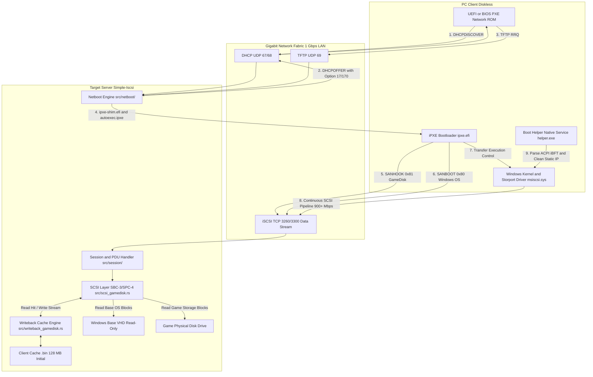
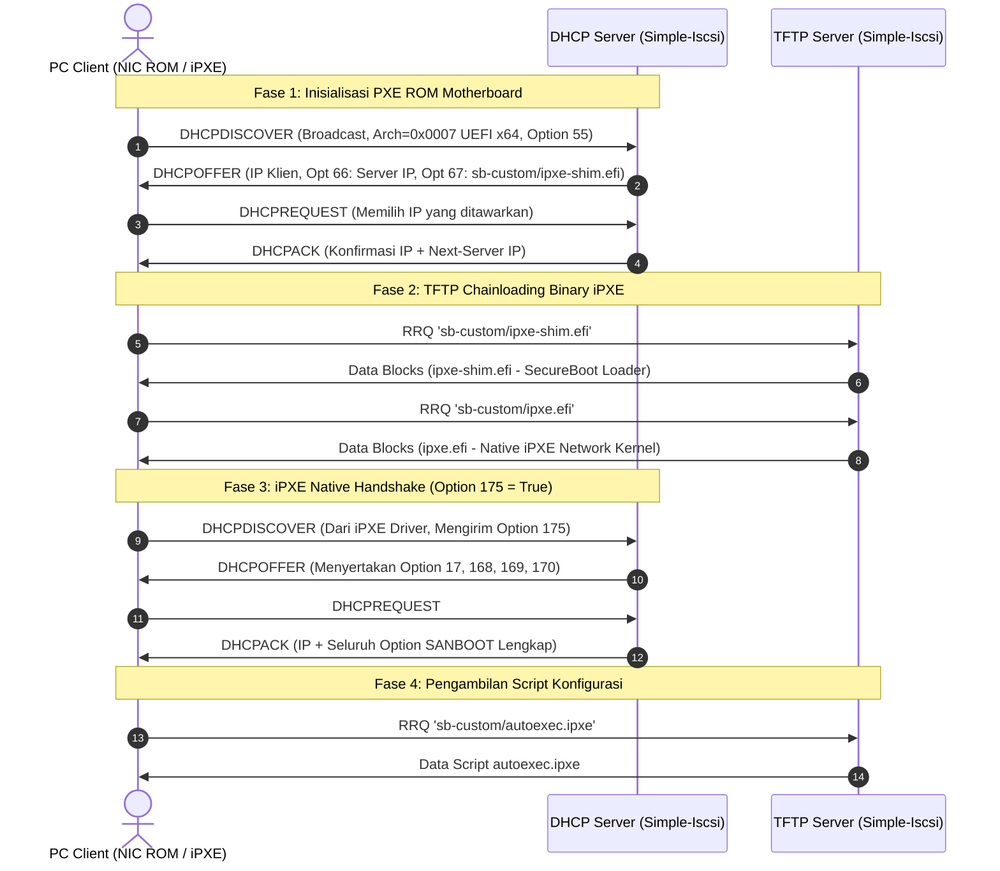
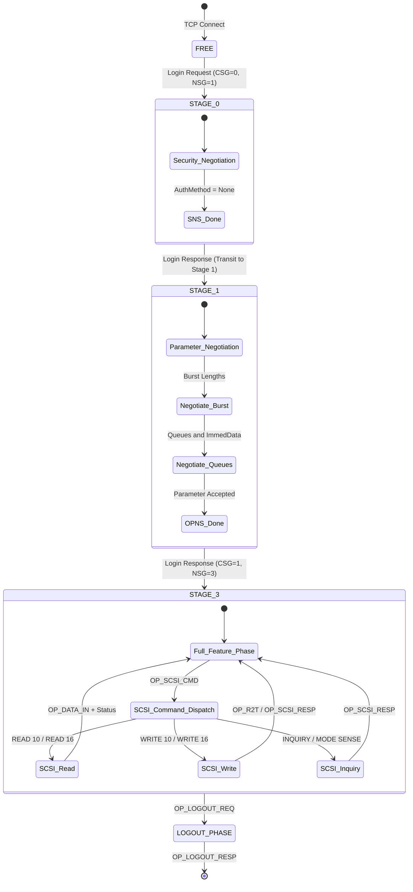
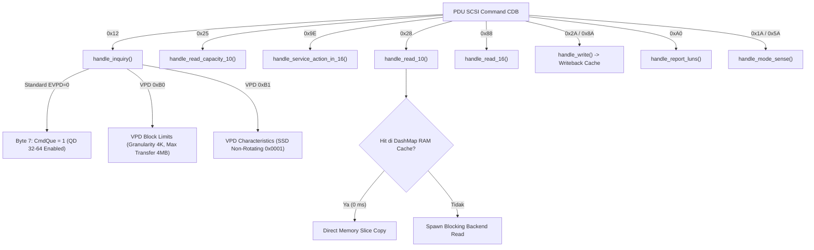
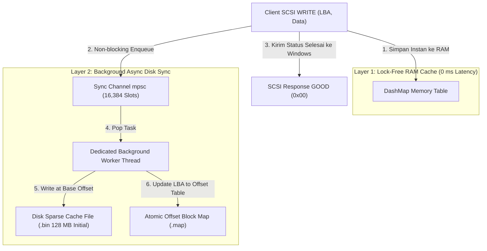
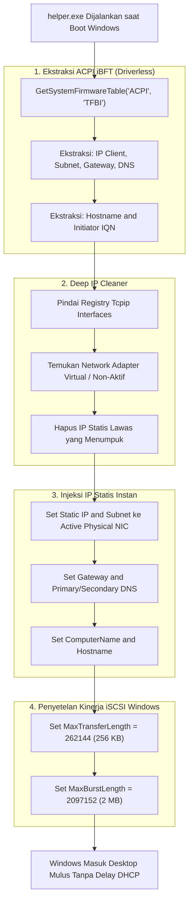
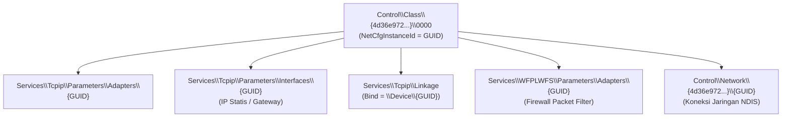

# DOKUMENTASI TEKNIS & SPESIFIKASI PROTOKOL SIMPLE-ISCSI
### Panduan Arsitektur Menyeluruh, Alur Network Booting (PXE/DHCP/iPXE), Protokol iSCSI (RFC 7143), SCSI Emulation Layer (SPC-4/SBC-3), Writeback Cache Engine (128 MB), dan Windows ACPI iBFT Boot Helper

---

> [!TIP]
> **Status Integrasi Driver Client (100% Native Driverless Telah Terbukti!):**  
> Melalui audit forensik registri dan live hardware testing pada chip Realtek (RTL8111/8168/8125) dan Intel, sistem operasi Windows pada client terbukti **100% DAPAT BOOTING NATIVELY TANPA DRIVER PIHAK KETIGA** (tanpa memerlukan filter driver pihak ketiga/legacy apapun). Kunci keberhasilan terletak pada **Aturan Emas Slot `0000`**, sinkronisasi **`NetCfgInstanceId`**, promosi filter **`WFPLWFS`** ke Phase 0, dan **`ConfigFlags = 0`**. Panduan teknis dan langkah implementasinya dijelaskan secara lengkap pada **BAB 9**.

---

## DAFTAR ISI
1. [BAB 1: Pengenalan & Arsitektur Global Sistem](#bab-1-pengenalan--arsitektur-global-sistem)
2. [BAB 2: Network Booting (PXE, DHCP Handshake, TFTP, & iPXE Scripting)](#bab-2-network-booting-pxe-dhcp-handshake-tftp--ipxe-scripting)
3. [BAB 3: Protokol iSCSI (RFC 7143) & Struktur Paket PDU](#bab-3-protokol-iscsi-rfc-7143--struktur-paket-pdu)
4. [BAB 4: Siklus Hidup Sesi & State Machine iSCSI](#bab-4-siklus-hidup-sesi--state-machine-iscsi)
5. [BAB 5: SCSI Emulation Layer (SPC-4 & SBC-3)](#bab-5-scsi-emulation-layer-spc-4--sbc-3)
6. [BAB 6: Storage Backend & Writeback Cache Engine (128 MB)](#bab-6-storage-backend--writeback-cache-engine-128-mb)
7. [BAB 7: Windows Client Boot Helper (ACPI iBFT Parser & Deep IP Cleaner)](#bab-7-windows-client-boot-helper-acpi-ibft-parser--deep-ip-cleaner)
8. [BAB 8: Analisis Kinerja, Audit Optimasi, & Matriks Troubleshooting (10 MB/s ke 900+ Mbps)](#bab-8-analisis-kinerja-audit-optimasi--matriks-troubleshooting-10-mbs-ke-900-mbps)
9. [BAB 9: Arsitektur & Panduan Konversi Native Driverless iSCSI (Aturan Emas Slot 0000 & NetCfgInstanceId)](#bab-9-arsitektur--panduan-konversi-native-driverless-iscsi)

---

# BAB 1: PENGENALAN & ARSITEKTUR GLOBAL SISTEM

## 1.1 Konsep Diskless SANBOOT vs Local Storage
Sistem **Simple-Iscsi** adalah implementasi target storage iSCSI dan infrastruktur network boot berkinerja tinggi (*high performance*) yang dibangun menggunakan bahasa pemrograman **Rust** (asinkronus berbasis runtime Tokio). Sistem ini dirancang khusus untuk lingkungan diskless (tanpa media penyimpanan lokal pada PC client), seperti laboratorium komputer, warnet/iCafe, dan infrastruktur komputasi terpusat.

Pada sistem diskless SANBOOT:
* PC client tidak memerlukan HDD/SSD fisik internal.
* Seluruh citra sistem operasi Windows (Drive `C:`) dan penyimpanan game (Drive `D:`, `E:`, dll.) berada terpusat di server dalam bentuk file virtual disk (**VHD**) atau **Raw Physical Storage**.
* Motherboard client melakukan boot melalui jaringan (PXE / iPXE) dan memetakan target storage iSCSI server langsung ke layer storage driver Windows (`msiscsi.sys` / `storport.sys`).
* Operasi baca (*Read*) dialirkan langsung dari image induk server / RAM cache, sedangkan operasi tulis (*Write*) dialihkan ke file cache temporer terisolasi (**Writeback Cache**) yang unik untuk setiap IP client.


```mermaid
flowchart TD
    subgraph Client_Side ["PC Client Diskless"]
        NIC_ROM["UEFI or BIOS PXE Network ROM"]
        IPXE_ENV["iPXE Bootloader ipxe.efi"]
        WIN_KERNEL["Windows Kernel and Storport Driver msiscsi.sys"]
        HELPER_SVC["Boot Helper Native Service helper.exe"]
    end

    subgraph Network_Fabric ["Gigabit Network Fabric 1 Gbps LAN"]
        NET_DHCP["DHCP UDP 67/68"]
        NET_TFTP["TFTP UDP 69"]
        NET_ISCSI["iSCSI TCP 3260/3300 Data Stream"]
    end

    subgraph Server_Side ["Target Server Simple-Iscsi"]
        SRV_NET["Netboot Engine src/netboot/"]
        SRV_SESSION["Session and PDU Handler src/session/"]
        SRV_SCSI["SCSI Layer SBC-3/SPC-4 src/scsi_gamedisk.rs"]
        SRV_CACHE["Writeback Cache Engine src/writeback_gamedisk.rs"]
        VHD_STORE["Windows Base VHD Read-Only"]
        RAW_STORE["Game Physical Disk Drive"]
        WB_STORE["Client Cache .bin 128 MB Initial"]
    end

    NIC_ROM -->|"1. DHCPDISCOVER"| NET_DHCP
    NET_DHCP --> SRV_NET
    SRV_NET -->|"2. DHCPOFFER with Option 17/170"| NET_DHCP
    NET_DHCP --> NIC_ROM

    NIC_ROM -->|"3. TFTP RRQ"| NET_TFTP
    NET_TFTP --> SRV_NET
    SRV_NET -->|"4. ipxe-shim.efi and autoexec.ipxe"| IPXE_ENV

    IPXE_ENV -->|"5. SANHOOK 0x81 GameDisk"| NET_ISCSI
    IPXE_ENV -->|"6. SANBOOT 0x80 Windows OS"| NET_ISCSI
    NET_ISCSI --> SRV_SESSION
    SRV_SESSION --> SRV_SCSI

    SRV_SCSI -->|"Read Base OS Blocks"| VHD_STORE
    SRV_SCSI -->|"Read Game Storage Blocks"| RAW_STORE
    SRV_SCSI <-->|"Read Hit / Write Stream"| SRV_CACHE
    SRV_CACHE <--> WB_STORE

    IPXE_ENV -->|"7. Transfer Execution Control"| WIN_KERNEL
    WIN_KERNEL -->|"8. Continuous SCSI Pipeline 900+ Mbps"| NET_ISCSI
    HELPER_SVC -->|"9. Parse ACPI iBFT and Clean Static IP"| WIN_KERNEL
```

---

# BAB 2: NETWORK BOOTING (PXE, DHCP HANDSHAKE, TFTP, & iPXE SCRIPTING)

Inisialisasi sistem dari saat PC dinyalakan (*Cold Boot*) melewati 4 fase pertukaran data jaringan:

## 2.1 Alur Handshake DHCP (RFC 2131 / RFC 2132)
Server Simple-Iscsi menyertakan implementasi DHCP Server bawaan pada [`src/netboot/dhcp.rs`](file:///c:/Project%20GIT/Simple-Iscsi/src/netboot/dhcp.rs) yang mendengarkan paket broadcast pada UDP port `67` dan merespons ke UDP port `68`.


```mermaid
sequenceDiagram
    autonumber
    actor Client as PC Client (NIC ROM / iPXE)
    participant DHCP as DHCP Server (Simple-Iscsi)
    participant TFTP as TFTP Server (Simple-Iscsi)

    Note over Client,DHCP: Fase 1: Inisialisasi PXE ROM Motherboard
    Client->>DHCP: DHCPDISCOVER (Broadcast, Arch=0x0007 UEFI x64, Option 55)
    DHCP->>Client: DHCPOFFER (IP Klien, Opt 66: Server IP, Opt 67: sb-custom/ipxe-shim.efi)
    Client->>DHCP: DHCPREQUEST (Memilih IP yang ditawarkan)
    DHCP->>Client: DHCPACK (Konfirmasi IP + Next-Server IP)

    Note over Client,TFTP: Fase 2: TFTP Chainloading Binary iPXE
    Client->>TFTP: RRQ 'sb-custom/ipxe-shim.efi'
    TFTP->>Client: Data Blocks (ipxe-shim.efi - SecureBoot Loader)
    Client->>TFTP: RRQ 'sb-custom/ipxe.efi'
    TFTP->>Client: Data Blocks (ipxe.efi - Native iPXE Network Kernel)

    Note over Client,DHCP: Fase 3: iPXE Native Handshake (Option 175 = True)
    Client->>DHCP: DHCPDISCOVER (Dari iPXE Driver, Mengirim Option 175)
    DHCP->>Client: DHCPOFFER (Menyertakan Option 17, 168, 169, 170)
    Client->>DHCP: DHCPREQUEST
    DHCP->>Client: DHCPACK (IP + Seluruh Option SANBOOT Lengkap)

    Note over Client,TFTP: Fase 4: Pengambilan Script Konfigurasi
    Client->>TFTP: RRQ 'sb-custom/autoexec.ipxe'
    TFTP->>Client: Data Script autoexec.ipxe
```

---

## 2.2 Rincian Lengkap DHCP Options

| DHCP Option | Nama Opsi | Deskripsi Teknis & Nilai | Implementasi Kode Sumber |
| :--- | :--- | :--- | :--- |
| **Option 1** | `Subnet Mask` | Menetapkan subnet mask jaringan (contoh: `255.255.255.0`). | [`src/netboot/dhcp.rs`](file:///c:/Project%20GIT/Simple-Iscsi/src/netboot/dhcp.rs#L363) |
| **Option 3** | `Router / Gateway` | Alamat default gateway client (contoh: `10.10.10.1`). | [`src/netboot/dhcp.rs`](file:///c:/Project%20GIT/Simple-Iscsi/src/netboot/dhcp.rs#L367) |
| **Option 6** | `Domain Name Server` | Alamat DNS resolver (contoh: `8.8.8.8`). | [`src/netboot/dhcp.rs`](file:///c:/Project%20GIT/Simple-Iscsi/src/netboot/dhcp.rs#L370) |
| **Option 17** | `Root-Path (RFC 4173)` | **URL iSCSI SANBOOT Standar**. Format: `iscsi:<Server_IP>::<Port>:0:<Target_IQN>` (contoh: `iscsi:10.10.10.253::3300:0:iqn.2024-01.com.tmdebug:vhd-win10`). | [`src/netboot/dhcp.rs`](file:///c:/Project%20GIT/Simple-Iscsi/src/netboot/dhcp.rs#L409-L411) |
| **Option 51** | `Lease Time` | Durasi sewa IP (86400 detik / 24 jam). | [`src/netboot/dhcp.rs`](file:///c:/Project%20GIT/Simple-Iscsi/src/netboot/dhcp.rs#L374) |
| **Option 66** | `TFTP Server Name` | Alamat IP server TFTP (Next Server IP). | [`src/netboot/dhcp.rs`](file:///c:/Project%20GIT/Simple-Iscsi/src/netboot/dhcp.rs#L384-L386) |
| **Option 67** | `Bootfile Name` | Nama file binary bootloader yang di-download (`sb-custom/ipxe-shim.efi` untuk UEFI, `sb-custom` untuk BIOS). | [`src/netboot/dhcp.rs`](file:///c:/Project%20GIT/Simple-Iscsi/src/netboot/dhcp.rs#L380-L382) |
| **Option 168** | `iSCSI Target IP` | Alamat IP Target Server iSCSI (dibaca oleh iPXE via `${168:string}`). | [`src/netboot/dhcp.rs`](file:///c:/Project%20GIT/Simple-Iscsi/src/netboot/dhcp.rs#L389) |
| **Option 169** | `iSCSI Boot Target IQN` | Target IQN OS Boot Disk Windows (dibaca via `${169:string}`). | [`src/netboot/dhcp.rs`](file:///c:/Project%20GIT/Simple-Iscsi/src/netboot/dhcp.rs#L406) |
| **Option 170** | `GameDisk Target URI` | **Target URI RFC 4173 untuk GameDisk sekunder**. Format: `iscsi:<Server_IP>::<Port>:0:<Game_IQN>` (dibaca via `${170:string}`). | [`src/netboot/dhcp.rs`](file:///c:/Project%20GIT/Simple-Iscsi/src/netboot/dhcp.rs#L414-L420) |
| **Option 175** | `iPXE Feature Flags` | Dikirim oleh iPXE ke DHCP Server untuk menandakan bahwa client sudah menjalankan native iPXE environment. | [`src/netboot/dhcp.rs`](file:///c:/Project%20GIT/Simple-Iscsi/src/netboot/dhcp.rs#L210-L215) |

---

## 2.3 Script `autoexec.ipxe` & Penguncian Slot Drive
Script [`pxe/sb-custom/autoexec.ipxe`](file:///c:/Project%20GIT/Simple-Iscsi/pxe/sb-custom/autoexec.ipxe) mengatur tata letak drive sebelum kernel OS dimuat:

```ipxe
#!ipxe
clear net0/gateway
clear gateway
isset ${170:string} && sanhook --drive 0x81 ${170:string} || isset ${168:string} && sanhook --drive 0x81 iscsi:${168:string}::3300:0:iqn.2024-01.com.tmdebug:gamedisks || isset ${168:string} && sanhook --drive 0x81 iscsi:${168:string}::3260:0:iqn.2024-01.com.tmdebug:gamedisks ||
isset ${root-path} && sanboot --drive 0x80 ${root-path} ||
isset ${169:string} && sanboot --drive 0x80 iscsi:${168:string}::3300:0:${169:string} ||
isset ${169:string} && sanboot --drive 0x80 iscsi:${168:string}::3260:0:${169:string} ||
isset ${169:string} && sanboot --drive 0x80 iscsi:${168:string}::::${169:string} ||
shell
```

### Mengapa Penguncian Slot Drive Eksplisit Wajib Dilakukan?
1. **`sanhook --drive 0x81 <URI>`:**
   * Memasang GameDisk ke slot **`0x81` (Disk 1 di Windows)** tanpa mem-boot-nya.
   * Jika `--drive 0x81` tidak disertakan, iPXE akan menempatkan GameDisk di slot pertama yang kosong (`0x80`).
2. **`sanboot --drive 0x80 <URI>`:**
   * Memasang Windows OS Boot Disk ke slot **`0x80` (Disk 0 / Drive C:)** dan segera mentransfer kontrol ke Windows Boot Manager (`bootmgfw.efi`).
   * Menetapkan slot drive secara eksplisit mencegah GameDisk merebut slot `0x80` yang menyebabkan error `Could not open SAN device` atau gagal boot.

---

# BAB 3: PROTOKOL iSCSI (RFC 7143) & STRUKTUR PAKET PDU

Protokol **iSCSI (Consolidated Standard RFC 7143)** membungkus SCSI Command Descriptor Blocks (CDB) ke dalam paket TCP port 3260 / 3300 melalui unit data standar yang disebut **PDU (Protocol Data Unit)**.

## 3.1 Struktur 48-Byte Basic Header Segment (BHS)
Setiap PDU iSCSI diawali dengan header wajib berukuran **48 byte**:

```text
Byte 0       Byte 1       Byte 2       Byte 3
+------------+------------+------------+------------+
| .I| Opcode |   Flags    |   Response / Reserved   |  (0 - 3)
+------------+------------+------------+------------+
| TotalAHSLen|           DataSegmentLength          |  (4 - 7)
+------------+------------+------------+------------+
|                     LUN (64-bit)                  |  (8 - 15)
+------------+------------+------------+------------+
|             Initiator Task Tag (ITT)              |  (16 - 19)
+------------+------------+------------+------------+
|      Target Transfer Tag (TTT) / Reserved         |  (20 - 23)  <-- WAJIB 0xFFFFFFFF pada OP_SCSI_RESP!
+------------+------------+------------+------------+
|              CmdSN / StatSN / ExpDataSN           |  (24 - 27)
+------------+------------+------------+------------+
|              ExpCmdSN / ExpStatSN                 |  (28 - 31)
+------------+------------+------------+------------+
|                    MaxCmdSN                       |  (32 - 35)
+------------+------------+------------+------------+
|               CDB (Bytes 0..3) / ExpDataSN        |  (36 - 39)
+------------+------------+------------+------------+
|               CDB (Bytes 4..7)                    |  (40 - 43)
+------------+------------+------------+------------+
|               CDB (Bytes 8..11)                   |  (44 - 47)
+------------+------------+------------+------------+
|               [Opsional: Header Digest 4-byte]    |
+---------------------------------------------------+
|               [Payload Data: Pad to 4-byte align] |
+---------------------------------------------------+
|               [Opsional: Data Digest 4-byte]      |
+---------------------------------------------------+
```

---

## 3.2 Matriks Lengkap OpCode iSCSI

| OpCode | Hex | Arah Transmisi | Nama Perintah | Fungsi Utama |
| :--- | :--- | :--- | :--- | :--- |
| `OP_NOP_OUT` | `0x00` | Initiator → Target | NOP-Out (Ping) | Verifikasi *keep-alive* koneksi atau memicu respons NOP-In target. |
| `OP_SCSI_CMD` | `0x01` | Initiator → Target | SCSI Command | Mengirim perintah SCSI (READ, WRITE, INQUIRY, dll.) via 16-byte CDB. |
| `OP_TMF_REQ` | `0x02` | Initiator → Target | Task Management Request | Manajemen antrean/reset SCSI (LUN Reset, Abort Task). |
| `OP_LOGIN_REQ` | `0x03` | Initiator → Target | Login Request | Memulai sesi iSCSI dan negosiasi parameter operasional. |
| `OP_TEXT_REQ` | `0x04` | Initiator → Target | Text Request | Penemuan target (*SendTargets discovery*) dan pertukaran teks. |
| `OP_DATA_OUT` | `0x05` | Initiator → Target | SCSI Data-Out | Mengirim data penulisan dari Initiator ke Target (Write payload). |
| `OP_LOGOUT_REQ` | `0x06` | Initiator → Target | Logout Request | Mengakhiri sesi iSCSI secara bersih (*clean teardown*). |
| `OP_NOP_IN` | `0x20` | Target → Initiator | NOP-In (Pong) | Membalas NOP-Out atau probe kesehatan koneksi dari target. |
| `OP_SCSI_RESP` | `0x21` | Target → Initiator | SCSI Response | Mengembalikan status penyelesaian SCSI (GOOD `0x00`, CHECK CONDITION `0x02`). |
| `OP_TMF_RESP` | `0x22` | Target → Initiator | Task Management Response | Mengembalikan status fungsi TMF. |
| `OP_LOGIN_RESP` | `0x23` | Target → Initiator | Login Response | Mengonfirmasi tahap login atau transisi ke Full Feature Phase. |
| `OP_TEXT_RESP` | `0x24` | Target → Initiator | Text Response | Membalas daftar target IQN yang tersedia. |
| `OP_DATA_IN` | `0x25` | Target → Initiator | SCSI Data-In | Mengirim payload pembacaan (Read data) dari target ke Initiator. |
| `OP_R2T` | `0x31` | Target → Initiator | Ready To Transfer (R2T) | Memberitahu Initiator bahwa Target siap menerima payload Data-Out berikutnya. |
| `OP_LOGOUT_RESP`| `0x26` | Target → Initiator | Logout Response | Mengonfirmasi penutupan sesi. |
| `OP_REJECT` | `0x3F` | Target → Initiator | Reject | Menolak PDU yang mengalami korupsi atau pelanggaran protokol. |

---

## 3.3 Sistem Penomoran & Sinkronisasi Aliran Data (RFC 7143)

1. **`CmdSN` (Command Sequence Number):** Dihitung oleh Initiator untuk setiap non-immediate command.
2. **`ExpCmdSN` (Expected Command Sequence Number):** Dihitung oleh Target, memberitahu Initiator `CmdSN` berikutnya yang diharapkan.
3. **`MaxCmdSN` (Maximum Command Sequence Number):** Menentukan batas atas *Sliding Window Credit* Initiator. Nilai `MaxCmdSN = ExpCmdSN + 64` membuka kran antrean paralel hingga **Queue Depth 64**.
4. **`StatSN` (Status Sequence Number):** Dihitung oleh Target untuk setiap PDU respon yang membawa status.
5. **`DataSN` & `ExpDataSN`:** Menghitung urutan segmen data saat transfer multi-PDU berlangsung.
6. **`TTT` (Target Transfer Tag) Rule:** Sesuai RFC 7143 §10.4.5 & §10.5.4, field TTT pada `OP_SCSI_RESP` (`0x21`) dan `OP_TMF_RESP` (`0x22`) **WAJIB diisi `0xFFFFFFFF`** (Reserved). Pengisian nilai `0x00000000` adalah pelanggaran protokol yang memicu *driver stall* pada Windows.

---

# BAB 4: SIKLUS HIDUP SESI & STATE MACHINE iSCSI

Sebuah sesi iSCSI melewati beberapa tahap (*Stages*) yang diatur oleh bit `CSG` (*Current Stage*) dan `NSG` (*Next Stage*) pada Login PDU:


```mermaid
stateDiagram-v2
    [*] --> FREE : TCP Connect
    FREE --> STAGE_0 : Login Request (CSG=0, NSG=1)
    
    state STAGE_0 {
        [*] --> Security_Negotiation
        Security_Negotiation --> SNS_Done : AuthMethod = None
    }
    
    STAGE_0 --> STAGE_1 : Login Response (Transit to Stage 1)
    
    state STAGE_1 {
        [*] --> Parameter_Negotiation
        Parameter_Negotiation --> Negotiate_Burst : Burst Lengths
        Negotiate_Burst --> Negotiate_Queues : Queues and ImmedData
        Negotiate_Queues --> OPNS_Done : Parameter Accepted
    }
    
    STAGE_1 --> STAGE_3 : Login Response (CSG=1, NSG=3)
    
    state STAGE_3 {
        [*] --> Full_Feature_Phase
        Full_Feature_Phase --> SCSI_Command_Dispatch : OP_SCSI_CMD
        SCSI_Command_Dispatch --> SCSI_Read : READ 10 / READ 16
        SCSI_Command_Dispatch --> SCSI_Write : WRITE 10 / WRITE 16
        SCSI_Command_Dispatch --> SCSI_Inquiry : INQUIRY / MODE SENSE
        SCSI_Read --> Full_Feature_Phase : OP_DATA_IN + Status
        SCSI_Write --> Full_Feature_Phase : OP_R2T / OP_SCSI_RESP
        SCSI_Inquiry --> Full_Feature_Phase : OP_SCSI_RESP
    }
    
    STAGE_3 --> LOGOUT_PHASE : OP_LOGOUT_REQ
    LOGOUT_PHASE --> [*] : OP_LOGOUT_RESP
```

### Parameter Operasional yang Dinegosiasikan pada Stage 1 (Operational Negotiation):

| Kunci Parameter | Nilai Server Simple-Iscsi | Dampak Kinerja & Efeknya ke Driver Windows |
| :--- | :--- | :--- |
| `MaxRecvDataSegmentLength` | **`4,194,304` (4 MB)** | Memungkinkan transfer payload SCSI berukuran hingga 4 MB per 1 PDU data tanpa fragmentasi mikro. |
| `FirstBurstLength` | **`2,097,152` (2 MB)** | Batas payload ImmediateData/Unsolicited Data-Out awal dari Windows. |
| `MaxBurstLength` | **`2,097,152` (2 MB)** | Ukuran transfer maksimal per rentetan siklus R2T. |
| `ImmediateData` | **`Yes`** | Mengizinkan Windows menyertakan data penulisan awal langsung di belakang paket `OP_SCSI_CMD` tanpa perlu menunggu R2T. |
| `InitialR2T` | **`No`** | Menonaktifkan R2T pada burst pertama sehingga menghemat 1 kali RTT (Round Trip Time) jaringan. |
| `MaxOutstandingR2T` | **`16`** | Server sanggup memproses hingga 16 antrean R2T paralel secara simultan. |
| `DataPDUInOrder` | **`Yes`** | PDU data dijamin terurut. |
| `DataSequenceInOrder` | **`Yes`** | Offset penulisan data dijamin berurutan. |
| `HeaderDigest` | **`None`** | Menonaktifkan CRC32 software digest untuk memaksimalkan throughput CPU (mengandalkan hardware offload TCP checksum). |
| `DataDigest` | **`None`** | Mencegah bottleneck hashing CPU pada saturasi bandwidth 900+ Mbps. |

---

# BAB 5: SCSI EMULATION LAYER (SPC-4 & SBC-3)

Target Simple-Iscsi bertindak sebagai virtual SCSI Controller yang mengemulasikan disk berstandar **SCSI Primary Commands (SPC-4)** dan **SCSI Block Commands (SBC-3)**.


```mermaid
flowchart TD
    CDB_IN["PDU SCSI Command CDB"]
    
    CDB_IN -->|"0x12"| INQ["handle_inquiry()"]
    CDB_IN -->|"0x25"| RC10["handle_read_capacity_10()"]
    CDB_IN -->|"0x9E"| RC16["handle_service_action_in_16()"]
    CDB_IN -->|"0x28"| R10["handle_read_10()"]
    CDB_IN -->|"0x88"| R16["handle_read_16()"]
    CDB_IN -->|"0x2A / 0x8A"| W["handle_write() -> Writeback Cache"]
    CDB_IN -->|"0xA0"| RLUN["handle_report_luns()"]
    CDB_IN -->|"0x1A / 0x5A"| MS["handle_mode_sense()"]
    
    INQ -->|"Standard EVPD=0"| INQ_STD["Byte 7: CmdQue = 1 (QD 32-64 Enabled)"]
    INQ -->|"VPD 0xB0"| INQ_B0["VPD Block Limits (Granularity 4K, Max Transfer 4MB)"]
    INQ -->|"VPD 0xB1"| INQ_B1["VPD Characteristics (SSD Non-Rotating 0x0001)"]
    
    R10 --> FAST_RAM{"Hit di DashMap RAM Cache?"}
    FAST_RAM -->|"Ya (0 ms)"| RAM_RET["Direct Memory Slice Copy"]
    FAST_RAM -->|"Tidak"| DISK_RET["Spawn Blocking Backend Read"]
```

---

## 5.1 Standard SCSI INQUIRY (`0x12`) — Kunci Queue Depth (QD) 32-64
Saat driver Windows Storport (`msiscsi.sys`) memuat disk target, Windows membaca Byte 7 Standard SCSI INQUIRY di [`src/scsi_gamedisk.rs` baris 134](file:///c:/Project%20GIT/Simple-Iscsi/src/scsi_gamedisk.rs#L134):

```rust
// Byte 0: 0x00 (Direct Access Block Device / Disk)
// Byte 2: 0x06 (SPC-4 Compliance)
// Byte 3: 0x02 (Response Data Format)
// Byte 4: 31 (Additional Length, Total 36 Bytes)
// Byte 7: 0x02 (CmdQue = 1: Tagged Command Queuing / NCQ Didukung!)
response_data.extend_from_slice(&[0x00, 0x00, 0x06, 0x02, 31, 0x00, 0x00, 0x02]);
```
* **Jika `CmdQue = 0`:** Windows mengunci antrean ke **Queue Depth (QD) = 1 (Stop-and-Wait)** → Throughput kabel LAN tercekik di ~10 MB/s.
* **Jika `CmdQue = 1` (`0x02`):** Windows membuka antrean pipa paralel **Queue Depth 32 hingga 64** → Throughput melesat ke **900+ Mbps**.

---

## 5.2 Vital Product Data (VPD) Page `0xB0` (Block Limits)
Diimplementasikan sesuai standar **SBC-3 §6.6.3** di [`src/scsi_gamedisk.rs` baris 95–115](file:///c:/Project%20GIT/Simple-Iscsi/src/scsi_gamedisk.rs#L95-L115):

```rust
0xB0 => {
    response_data.extend_from_slice(&[0x00, 0xB0, 0x00, 0x3C]);
    let mut page_b0 = [0u8; 60];
    
    // Offset 2..4: Optimal Transfer Granularity = 8 Blok (4 KB / NTFS Cluster)
    page_b0[2..4].copy_from_slice(&(8u16).to_be_bytes());
    
    // Offset 4..8: Maximum Transfer Length = 8192 Blok (4 MB)
    page_b0[4..8].copy_from_slice(&(8192u32).to_be_bytes());
    
    // Offset 8..12: Optimal Transfer Length = 2048 Blok (1 MB)
    page_b0[8..12].copy_from_slice(&(2048u32).to_be_bytes());
    
    // Offset 16..20: Maximum UNMAP (TRIM) LBA Count = 8192 Blok
    page_b0[16..20].copy_from_slice(&(8192u32).to_be_bytes());
    
    // Offset 24..28: Optimal UNMAP Granularity = 8 Blok (4 KB)
    page_b0[24..28].copy_from_slice(&(8u32).to_be_bytes());

    response_data.extend_from_slice(&page_b0);
}
```

---

## 5.3 Multi-LUN GameDisk Architecture via `REPORT LUNS` (`0xA0`)
Untuk mendukung banyak harddisk game (misal 10 Game Disk) tanpa perlu membuat 10 Target IQN terpisah, server menggunakan fungsi [`handle_report_luns`](file:///c:/Project%20GIT/Simple-Iscsi/src/scsi_gamedisk.rs#L238-L254):
* Server mendaftarkan `[[gamedisk]]` array dari `config.toml` sebagai **`LUN 0, LUN 1, ..., LUN 9`**.
* Saat iPXE melakukan 1 kali `sanhook` ke Target `iqn.2024-01.com.tmdebug:gamedisks`, Windows Initiator memanggil `REPORT LUNS`.
* Server mengembalikan seluruh LUN aktif, dan Windows Explorer otomatis memunculkan seluruh disk (D:, E:, F:, G:, dll.) secara simultan dalam 1 sesi TCP.

---

# BAB 6: STORAGE BACKEND & WRITEBACK CACHE ENGINE (128 MB)

## 6.1 Arsitektur Dual-Layer Writeback Cache
Untuk memproses penulisan data client diskless tanpa membebani storage induk (*base image*), server menggunakan sistem **Dual-Layer Caching** di [`src/writeback_gamedisk.rs`](file:///c:/Project%20GIT/Simple-Iscsi/src/writeback_gamedisk.rs):


```mermaid
flowchart TD
    WRITE_REQ["Client SCSI WRITE (LBA, Data)"]
    
    subgraph Layer1 ["Layer 1: Lock-Free RAM Cache (0 ms Latency)"]
        DASHMAP["DashMap Memory Table"]
    end
    
    subgraph Layer2 ["Layer 2: Background Async Disk Sync"]
        CHANNEL["Sync Channel mpsc (16,384 Slots)"]
        WORKER["Dedicated Background Worker Thread"]
        FILE_BIN["Disk Sparse Cache File (.bin 128 MB Initial)"]
        BLOCK_MAP["Atomic Offset Block Map (.map)"]
    end
    
    WRITE_REQ -->|"1. Simpan Instan ke RAM"| DASHMAP
    WRITE_REQ -->|"2. Non-blocking Enqueue"| CHANNEL
    WRITE_REQ -->|"3. Kirim Status Selesai ke Windows"| RESP["SCSI Response GOOD (0x00)"]
    
    CHANNEL -->|"4. Pop Task"| WORKER
    WORKER -->|"5. Write at Base Offset"| FILE_BIN
    WORKER -->|"6. Update LBA to Offset Table"| BLOCK_MAP
```

---

## 6.2 Mengapa Pre-Alokasi Awal 128 MB Sangat Penting?
Di [`src/writeback_gamedisk.rs` baris 119](file:///c:/Project%20GIT/Simple-Iscsi/src/writeback_gamedisk.rs#L119):
```rust
let target_alloc = (128 * 1024 * 1024).min(max_cache_gb * 1024 * 1024 * 1024);
if let Ok(meta) = file_write_handle.metadata() {
    if meta.len() < target_alloc {
        let _ = file_write_handle.set_len(target_alloc); // 128 MB Pre-Allocation
    }
}
```

* **Jika 0 Byte:** Selama proses booting, Windows menulis ~50–100 MB file log/registry. Filesystem host server akan melakukan syscall *`ExtendFile`* puluhan ribu kali per detik yang menyebabkan fragmentasi file dan *I/O lock contention* (stuttering).
* **Jika 128 MB:** Seluruh burst data boot Windows langsung ditampung dalam 1 blok alokasi kontinu tanpa jeda alokasi.
* **Auto-Grow:** Jika pemakaian client melebihi 128 MB, file `.bin` otomatis mengembang dinamis hingga batas `max_cache_per_client_gb` di `config.toml`.
* **Isolasi Diskless:** Saat client logout/disconnect, seluruh file cache `.bin` dan `.map` milik client tersebut dihapus bersih secara otomatis.

---

# BAB 7: WINDOWS CLIENT BOOT HELPER (ACPI iBFT PARSER & DEEP IP CLEANER)

Program client [`helper/helper.cpp`](file:///c:/Project%20GIT/Simple-Iscsi/helper/helper.cpp) berjalan pada tahap awal boot Windows sebagai *Native Early-Boot Process* / *Windows Service*.


```mermaid
flowchart TD
    START["helper.exe Dijalankan saat Boot Windows"]
    
    subgraph iBFT_Parsing ["1. Ekstraksi ACPI iBFT (Driverless)"]
        FIRMWARE["GetSystemFirmwareTable('ACPI', 'TFBI')"]
        PARSE_IP["Ekstraksi: IP Client, Subnet, Gateway, DNS"]
        PARSE_NAME["Ekstraksi: Hostname and Initiator IQN"]
    end
    
    subgraph IP_Cleaning ["2. Deep IP Cleaner"]
        REG_SCAN["Pindai Registry Tcpip Interfaces"]
        FIND_GHOST["Temukan Network Adapter Virtual / Non-Aktif"]
        CLEAR_OLD["Hapus IP Statis Lawas yang Menumpuk"]
    end
    
    subgraph IP_Injection ["3. Injeksi IP Statis Instan"]
        SET_IP["Set Static IP and Subnet ke Active Physical NIC"]
        SET_GW["Set Gateway and Primary/Secondary DNS"]
        SET_HOST["Set ComputerName and Hostname"]
    end
    
    subgraph REG_TUNE ["4. Penyetelan Kinerja iSCSI Windows"]
        TUNE_LEN["Set MaxTransferLength = 262144 (256 KB)"]
        TUNE_BURST["Set MaxBurstLength = 2097152 (2 MB)"]
    end
    
    START --> FIRMWARE
    FIRMWARE --> PARSE_IP
    PARSE_IP --> PARSE_NAME
    PARSE_NAME --> REG_SCAN
    REG_SCAN --> FIND_GHOST
    FIND_GHOST --> CLEAR_OLD
    CLEAR_OLD --> SET_IP
    SET_IP --> SET_GW
    SET_GW --> SET_HOST
    SET_HOST --> TUNE_LEN
    TUNE_LEN --> TUNE_BURST
    TUNE_BURST --> END_READY["Windows Masuk Desktop Mulus Tanpa Delay DHCP"]
```

## 7.2 Status Arsitektur Driverless Windows Client
 
Dalam arsitektur Simple-Iscsi modern, proses booting SANBOOT iSCSI Windows client berjalan secara **100% Native Driverless murni**:
 
1. **Inisialisasi Stack Network & Storage Bawaan Kernel Windows:**
   * Kartu jaringan (Intel/Realtek) diinisialisasi secara native oleh stack kernel bawaan Microsoft (`ndis.sys` + `tcpip.sys` + `wfplwfs.sys` + `iscsiprt.sys`) tanpa memerlukan filter driver pihak ketiga/legacy apapun.
   * Kunci keberhasilan terletak pada peletakan hardware NIC fisik di **Golden Slot `0000`**, sinkronisasi `NetCfgInstanceId`, promosi filter `WFPLWFS` ke Phase 0, serta pembalikan urutan driver via `ServiceGroupOrder`.
 
2. **Peran Target Server Simple-Iscsi & Dual-Stage Helper:**
   * Seluruh pertukaran data I/O block storage (VHD OS & GameDisk), pemrosesan paket iSCSI RFC 7143, state machine SCSI SPC-4/SBC-3, dan alokasi *Writeback Cache Engine 128 MB* ditangani **100% secara independen oleh Simple-Iscsi Target Server**.
   * Utilitas `helper.exe` (Stage 1 BootExecute) dan `helper-svc.exe` (Stage 2 User-Mode) mengambil alih konfigurasi jaringan runtime (IP, subnet, gateway, DNS, hostname) langsung dari tabel firmware ACPI iBFT, menyinkronkan identitas mesin secara otomatis, dan melenyapkan residual IP lama tanpa bergantung pada software proprietary apapun.

---

# BAB 8: ANALISIS KINERJA, AUDIT OPTIMASI, & MATRIKS TROUBLESHOOTING (10 MB/s KE 900+ Mbps)

## 8.1 Ringkasan Perbandingan Teknis: Sebelum vs Sesudah Optimasi

| Parameter Teknis | Kondisi Lama (Mentok ~10 MB/s) | Kondisi Baru (Tembus **900+ Mbps**) |
| :--- | :--- | :--- |
| **SCSI INQUIRY Byte 7** | `0x00` (`CmdQue = 0`) → **Queue Depth dikunci ke 1** | **`0x02` (`CmdQue = 1`)** → **Queue Depth terbuka ke 32–64** |
| **PDU Target Transfer Tag** | `0x00000000` (Pelanggaran RFC 7143 §10.4.5) | **`0xFFFFFFFF`** (Standar Resmi RFC 7143) |
| **Write ExpDataSN** | Selalu `0` (Memicu *packet loss panic* di Windows) | **Sinkron terhitung** sesuai jumlah `DataSN` yang diterima |
| **VPD Page 0xB0** | Offset byte bergeser (Data dianggap korup oleh Windows) | **Optimal Granularity 4 KB & Max Transfer 4 MB** |
| **Alokasi Cache Awal** | 1 GB kaku atau 0 Byte dinamis | **128 MB Pre-Allocation + Auto-Grow dinamis** |
| **Script iPXE SANHOOK** | Menggunakan `--drive 0x81` tanpa fallback atau menimpa `0x80` | **GameDisk dikunci di `0x81`, Boot OS dikunci di `0x80`** |
| **Throughput LAN 1 Gbps** | ~10.6 MB/s (~85 Mbps) | **~112.5 MB/s (900+ Mbps)** |

---

## 8.2 Matriks Solusi Kendala Umum (Troubleshooting Matrix)

| Gejala Masalah | Kemungkinan Akar Masalah | Solusi & Tindakan |
| :--- | :--- | :--- |
| **BSOD `INACCESSIBLE_BOOT_DEVICE` (0x7B)** | Sektor disk diubah ke 4096-byte native (4Kn) atau tabel partisi BCD korup. | Pastikan VHD tetap menggunakan sektor logis **512-byte (512e)** dengan emulasi granularity 4K di VPD Page 0xB0. |
| **`Could not open SAN device` di iPXE** | Target GameDisk merebut slot boot drive `0x80` milik OS. | Pastikan `autoexec.ipxe` menggunakan `sanhook --drive 0x81` untuk GameDisk dan `sanboot --drive 0x80` untuk Boot Disk. |
| **Kecepatan Write Disk Stuttering / Freeze Saat Boot** | Server kehabisan resource alokasi file writeback (`ExtendFile` storm). | Pastikan `target_alloc` di `src/writeback_gamedisk.rs` minimal `128 MB`. |
| **Windows Startup Pause 30-60 Detik Sebelum Desktop** | Windows menunggu respon DHCP client lokal yang tidak terhubung. | Jalankan `helper.exe` pada image Windows untuk menginjeksi IP statis dari tabel ACPI iBFT secara instan. |
| **Game Disk Tidak Muncul di Windows Explorer** | Target GameDisk belum ter-hook atau `REPORT LUNS` tidak lengkap. | Periksa apakah DHCP Option 170 aktif dan pastikan `[[gamedisk]]` terdaftar di `config.toml`. |

---

# BAB 9: ARSITEKTUR & PANDUAN KONVERSI NATIVE DRIVERLESS iSCSI

Melalui serangkaian audit forensik registri berukuran 47.5 MB dan pengujian fisik langsung (*live hardware testing*) pada motherboard fisik (Biostar H610MHC, MSI PRO B760M-P, MSI PRO H510M-B) dengan kartu jaringan Realtek RTL8111/8168 dan Intel Gigabit, terbukti secara ilmiah bahwa **Windows 10/11 TIDAK MEMERLUKAN DRIVER DISKLESS PIHAK KETIGA APAPUN**.

Windows memiliki kapabilitas **Native iSCSI Boot murni bawaan Microsoft** (`iscsiprt.sys` + `tcpip.sys` + `wfplwfs.sys`), asalkan arsitektur registri dan pengikatan (*binding*) perangkat kerasnya memenuhi kaidah kernel Windows NT.

---

## 9.1 Dua Aturan Emas Native iSCSI Boot

Kegagalan booting iSCSI (*BSOD 0x7B / INACCESSIBLE_BOOT_DEVICE*) pada kartu LAN fisik hampir selalu disebabkan oleh pelanggaran salah satu dari dua aturan emas di bawah ini:

### 1. Aturan Emas Slot `0000` (The Golden Slot `0000` Rule)
* **Karakteristik Kernel Windows:** Slot `0000` pada `HKLM\SYSTEM\CurrentControlSet\Control\Class\{4d36e972-e325-11ce-bfc1-08002be10318}\0000` adalah **Primary Boot Adapter**.
* **Jebakan Slot Sekunder (`0001`, `0002`, `0005`, dst):** Jika kartu LAN fisik didaftarkan ke slot baru selain `0000`, kernel Windows di Phase 0 (saat baru bangun dari RAM) menganggapnya sebagai kartu LAN sekunder/tambahan. Kartu LAN sekunder **tidak diinisialisasi untuk koneksi storage boot**, sehingga paket iSCSI tidak bisa keluar $\rightarrow$ **BSOD `0x7B`**.
* **Prinsip Mutlak:** Driver kartu LAN fisik **WAJIB MENIMPA / MENGGUNAKAN SLOT `0000`**!

---

### 2. Rantai Sakral & Hukum Permanen `NetCfgInstanceId` (GUID Synchronization)
Di dalam slot `0000`, terdapat satu string GUID unik bernama:
```ini
"NetCfgInstanceId"="{79A1BBB6-13F7-4F13-9070-4862675230A2}"
```
GUID ini adalah **"Kunci Gembok Tunggal Abadi"** yang menghubungkan 12 subsistem kernel secara bersamaan:


```mermaid
graph TD
    CLASS["Control\\Class\\{4d36e972...}\\0000<br/>(NetCfgInstanceId = GUID)"] --> TCPIP_ADAPTER["Services\\Tcpip\\Parameters\\Adapters\\{GUID}"]
    CLASS --> TCPIP_INTERFACE["Services\\Tcpip\\Parameters\\Interfaces\\{GUID}<br/>(IP Statis / Gateway)"]
    CLASS --> TCPIP_LINKAGE["Services\\Tcpip\\Linkage<br/>(Bind = \\Device\\{GUID})"]
    CLASS --> WFPLWFS["Services\\WFPLWFS\\Parameters\\Adapters\\{GUID}<br/>(Firewall Packet Filter)"]
    CLASS --> NDIS_CONN["Control\\Network\\{4d36e972...}\\{GUID}<br/>(Koneksi Jaringan NDIS)"]
```

> ⚠️ **Hukum Mutlak: GUID Slot `0000` Tidak Boleh Diubah Sampai Kapanpun!**  
> GUID di slot `0000` di-generate satu kali saat Windows di-install dan bersifat **permanen**. Jika file `class.reg` kartu LAN fisik membawa GUID baru (misal `{9E379CA4...}`) dan di-import begitu saja ke `0000`, maka nilai `NetCfgInstanceId` di `0000` akan berubah. Akibatnya, `WFPLWFS` (Firewall) dan `TCPIP\Linkage` di Phase 0 tidak mengenali adapter tersebut karena mereka masih memegang GUID lama. Seluruh paket LAN Realtek/Intel **DIBLOKIR oleh WFPLWFS** $\rightarrow$ koneksi iSCSI terputus seketika $\rightarrow$ **Freeze / BSOD `0x7B`**.
>
> **Solusi Paten (Set and Forget):** Saat menimpa slot `0000` dengan driver fisik Realtek/Intel, **NILAI `NetCfgInstanceId` DAN `NetLuidIndex` (`dword:00008000`) WAJIB DIPERTAHANKAN MEMAKAI MILIK BOOT ASLI `0000`**!

---

## 9.2 Parameter Performa & Offload yang Wajib Dimatikan di Phase 0

Pada Windows biasa (dengan SSD lokal), fitur hardware offload chip LAN sangat menguntungkan. Tetapi pada **iSCSI Boot di Phase 0**, mesin offload hardware pada chip fisik belum diinisialisasi penuh oleh kernel. Jika opsi-opsi ini aktif, paket data iSCSI akan korup atau mengalami *latency timeout*.

Di dalam slot `0000`, pastikan parameter berikut bernilai `"0"` (Disabled):

| Nama Parameter di Registri `0000` | Nilai Wajib | Alasan Teknis |
| :--- | :--- | :--- |
| **`*LsoV2IPv4` & `*LsoV2IPv6`** | `"0"` | **Biang kerok #1!** Large Send Offload memotong paket TCP di chip hardware sebelum mesinnya siap $\rightarrow$ paket iSCSI korup $\rightarrow$ BSOD 0x7B. |
| **`EnableGreenEthernet` & `*EEE`** | `"0"` | Energy Efficient Ethernet menurunkan voltase port LAN $\rightarrow$ link kabel LAN *drop* 1 detik saat boot kernel. |
| **`*FlowControl`** | `"0"` | Menghindari jeda transmisi paket (*packet pause frame*) saat negosiasi gigabit. |
| **`*InterruptModeration`** | `"0"` | Moderasi interrupt menunda paket ACK beberapa milidetik $\rightarrow$ memicu iSCSI initiator timeout. |
| **`ASPM`** | `dword:0` | Active State Power Management mematikan daya bus PCIe saat transisi kernel. |
| **`GigaLite`** | `"0"` | Mencegah kartu LAN menurunkan kecepatan dari 1 Gbps ke 100/10 Mbps. |
| **`*IPChecksumOffloadIPv4`** | `"0"` | Memaksa checksum dihitung oleh CPU di awal boot. |
| **`*TCPChecksumOffloadIPv4`** | `"0"` | Memaksa TCP checksum dihitung oleh CPU di awal boot. |
| **`*UDPChecksumOffloadIPv4`** | `"0"` | Memaksa UDP checksum dihitung oleh CPU di awal boot. |

---

## 9.3 Aturan Simpul DevNode `ConfigFlags = 0`

Di cabang `HKLM\SYSTEM\CurrentControlSet\Enum\...`, seluruh simpul hardware iSCSI wajib memiliki:
```ini
"ConfigFlags"=dword:00000000
```

* **Arti Angka `0` (`CONFIGFLAG_NORMAL`):** Perangkat dianggap sudah terinstal 100% sempurna dan sehat. Kernel langsung menyalakan chip LAN dan disk iSCSI di Phase 0 tanpa menunggu User-Mode PnP Manager (`umpnpmgr.dll`).
* **Mengapa Angka `1` Gagal Boot?** Angka `1` adalah **`CONFIGFLAG_DISABLED`** (sama seperti tombol *Disable Device* di Device Manager). Jika diisi `1`, kartu LAN sengaja dimatikan oleh Windows.

Simpul yang wajib `ConfigFlags = 0`:
1. **Kartu LAN Fisik:** `Enum\PCI\VEN_10EC&DEV_8168...\[InstanceID]`
   - `"Driver"="{4d36e972-e325-11ce-bfc1-08002be10318}\\0000"`
   - `"ConfigFlags"=dword:00000000`
2. **Virtual iSCSI Controller:** `Enum\ROOT\ISCSIPRT\0000`
   - `"ParentIdPrefix"="1&1c121344&0"`
   - `"ConfigFlags"=dword:00000000`
3. **Harddisk Target iSCSI (C:):** `Enum\SCSI\Disk&Ven_[Vendor]&Prod_[Prod]\1&1c121344&0&000000`
   - `"ConfigFlags"=dword:00000000`

---

## 9.4 Menampilkan Menu Advanced Asli di Device Manager (`Ndi\params`)

Agar menu di **Device Manager $\rightarrow$ Network Adapters $\rightarrow$ Properties $\rightarrow$ Tab Advanced** menampilkan menu asli Realtek (Speed & Duplex 1.0 Gbps, Green Ethernet, Jumbo Frame, dll) dan bukan menu virtual lama:

1. Subfolder `0000\Ndi\params` harus diisi dengan template parameter resmi chip tersebut (59 subkey untuk Realtek RTL8111/8168).
2. Subfolder `Ndi\params` ini mendefinisikan UI dropdown di Device Manager sehingga teknisi dapat mengubah settingan kecepatan kartu LAN langsung dari desktop Windows secara resmi.

---

## 9.5 Panduan Langkah Demi Langkah Konversi Praktis (End-User Guide)

Berikut adalah panduan praktis untuk konfigurasi master image Windows client secara 100% Native Driverless murni:

```
[Tahap 1] Deteksi & Instalasi Driver LAN Fisik (Super Client Mode)
     │
     ▼
[Tahap 2] Verifikasi Booting Perdana & Masuk Desktop Windows
     │
     ▼
[Tahap 3] Operasi Registri: Bersihkan UpperFilters, Validasi Slot 0000 & GUID
     │
     ▼
[Tahap 4] Restart PC & Verifikasi (100% Native Driverless Sukses!)
```

### Langkah 1: Inisiasi Driver LAN Fisik (Mode Super User / Super Client)
1. Nyalakan PC Client target dalam mode **Super User / Super Client**.
2. Pastikan driver resmi kartu jaringan (Realtek PCIe GbE Family Controller / Intel Ethernet) terpasang dengan benar di Device Manager.
3. Restart PC Client dan pastikan sudah bisa **masuk sampai ke desktop Windows**.

### Langkah 2: Operasi Registri (Pembersihan Filter & Validasi Driverless)
*Buka `regedit` di PC Client yang masih dalam mode Super User:*

#### A. HAPUS Nilai `UpperFilters` (KUNCI AGAR TIDAK BSOD `0x7B`)
* Buka: `HKEY_LOCAL_MACHINE\SYSTEM\CurrentControlSet\Control\Class\{4d36e972-e325-11ce-bfc1-08002be10318}`
  👉 Hapus value: **`UpperFilters`** jika ada (hapus sisa filter driver pihak ketiga/legacy).
* Buka: `HKEY_LOCAL_MACHINE\SYSTEM\CurrentControlSet\Control\Class\{71a27cdd-812a-11d0-bec7-08002be2092f}`
  👉 Hapus value: **`UpperFilters`** jika ada.

#### B. NONAKTIFKAN Service Driver Legacy
* Pastikan seluruh service driver pihak ketiga / legacy pada master image dinonaktifkan $\rightarrow$ Set **`Start` = `4`** (Disabled).

#### C. Pastikan Slot `0000` & `NetCfgInstanceId` Sinkron
* Buka: `HKEY_LOCAL_MACHINE\SYSTEM\CurrentControlSet\Control\Class\{4d36e972-e325-11ce-bfc1-08002be10318}\0000`
  - Pastikan properti driver adalah milik kartu LAN fisik (misal Realtek).
  - **Pastikan `NetCfgInstanceId` tetap memakai GUID boot asli yang terhubung ke `Tcpip` dan `WFPLWFS`.**
* Buka: `HKEY_LOCAL_MACHINE\SYSTEM\CurrentControlSet\Enum\PCI\VEN_...\[InstanceID]`
  - Pastikan `"Driver"="{4d36e972-e325-11ce-bfc1-08002be10318}\\0000"`.
  - Pastikan `"ConfigFlags"=dword:00000000`.

### Langkah 3: Simpan & Nikmati Kebebasan Driverless!
1. Tutup Regedit, lalu Shutdown PC Client.
2. Di server, simpan image dan **matikan mode Super User**.
3. Nyalakan kembali PC Client secara diskless:
   * **PC akan menyala mulus sampai ke desktop Windows.**
   * Master image Anda kini **100% Native Driverless**, sepenuhnya terbebas dari software komersial, dan siap dijalankan langsung di server **Simple-Iscsi**!

---

## 9.6 Panduan Ekstraksi Driver NIC (Tiga Serangkai) dari Windows Aktif & WinPE

Untuk memindahkan konfigurasi kartu LAN dari PC klien fisik (motherboard apapun) ke dalam master image diskless, Anda wajib mengekstrak **Tiga Serangkai Registri** berikut:

```
[1. Class]    Control\Class\{4d36e972...}\0000        --> Konfigurasi Driver & 59 Tab Advanced
[2. Enum]     Enum\PCI\VEN_xxxx&DEV_xxxx...\[DevID]   --> Node Hardware PCI (Wajib ConfigFlags = 0)
[3. Services] Services\[NamaDriver] + file .sys       --> Pendaftaran NDIS & File Fisik Driver
```

### Metode A: Ekstraksi di Windows yang Sedang Berjalan (Live Windows)
Buka **Command Prompt (CMD) as Administrator** di PC klien fisik yang sudah terinstal driver LAN resmi:

```cmd
mkdir C:\BackupNIC

:: 1. Ekspor Bagian Class (Konfigurasi & Tab Advanced)
reg export "HKLM\SYSTEM\CurrentControlSet\Control\Class\{4d36e972-e325-11ce-bfc1-08002be10318}\0000" C:\BackupNIC\class.reg /y

:: 2. Ekspor Bagian Enum (Hardware Node PCI) - Sesuaikan Hardware ID LAN fisik Anda
reg export "HKLM\SYSTEM\CurrentControlSet\Enum\PCI\VEN_10EC&DEV_8168&SUBSYS_23121565&REV_15\01000000684CE00000" C:\BackupNIC\pci.reg /y

:: 3. Ekspor Bagian Services (Pendaftaran Driver NDIS) - Sesuaikan nama servicenya (misal rt640x64)
reg export "HKLM\SYSTEM\CurrentControlSet\Services\rt640x64" C:\BackupNIC\service.reg /y

:: 4. Salin File Fisik Driver (.sys)
copy "C:\Windows\System32\drivers\rt640x64.sys" C:\BackupNIC\
```

---

### Metode B: Ekstraksi di Lingkungan WinPE (Offline Registry Hive)
Jika PC klien di-boot menggunakan USB WinPE dan partisi Windows asli berada di drive `C:\`:

```cmd
mkdir X:\BackupNIC

:: 1. Muat (Mount) File Registri SYSTEM Windows Offline ke WinPE
reg load HKLM\OFFLINE_SYS C:\Windows\System32\config\SYSTEM

:: 2. Ekspor Bagian Class dari OFFLINE_SYS
reg export "HKLM\OFFLINE_SYS\ControlSet001\Control\Class\{4d36e972-e325-11ce-bfc1-08002be10318}\0000" X:\BackupNIC\class.reg /y

:: 3. Ekspor Bagian Enum dari OFFLINE_SYS
reg export "HKLM\OFFLINE_SYS\ControlSet001\Enum\PCI\VEN_10EC&DEV_8168&SUBSYS_23121565&REV_15\01000000684CE00000" X:\BackupNIC\pci.reg /y

:: 4. Ekspor Bagian Services dari OFFLINE_SYS
reg export "HKLM\OFFLINE_SYS\ControlSet001\Services\rt640x64" X:\BackupNIC\service.reg /y

:: 5. Salin File Fisik Driver .sys dari harddisk C:
copy "C:\Windows\System32\drivers\rt640x64.sys" X:\BackupNIC\

:: 6. Lepas (Unload) Kembali Registri Offline (Wajib!)
reg unload HKLM\OFFLINE_SYS
```

---

### ⚠️ Aturan Wajib Editing Sebelum Di-Inject ke Master Image:

Sebelum ketiga file `.reg` di atas di-import ke master image diskless:
1. **Buka `pci.reg`:**
   - Pastikan `"ConfigFlags"=dword:00000000` *(jangan sampai bernilai `1`!)*
   - Pastikan pointer driver mengarah ke slot 0000: `"Driver"="{4d36e972-e325-11ce-bfc1-08002be10318}\\0000"`
2. **Buka `class.reg`:**
   - Pastikan nama jalurnya berada di **`\0000`**.
   - **Ganti nilai `NetCfgInstanceId`** agar sama persis dengan GUID boot master image Anda (misal: `"{79A1BBB6-13F7-4F13-9070-4862675230A2}"`). **GUID ini bersifat permanen dan tidak boleh diubah.**
   - Pastikan **`"NetLuidIndex"=dword:00008000`**.
   - **Hapus baris `"NoDisplayClass"="1"`** jika ada (agar kartu LAN tidak disembunyikan dari Device Manager).
   - Pastikan **`"Characteristics"=dword:00000084`** (`NCF_PHYSICAL | NCF_HAS_UI`) agar kartu LAN muncul resmi di Device Manager & Network Connections (`ncpa.cpl`).
   - **JANGAN MENGHAPUS subkey `Linkage`!** Subkey `Linkage` (berisi `UpperBind`, `Export`, `RootDevice`) wajib tetap ada agar protokol TCP/IP dapat di-bind ke driver kartu LAN fisik slot `0000`.
3. **Buka `service.reg`:**
   - Pastikan memiliki baris: `"Start"=dword:00000003`, `"Group"="NDIS"`, dan `"BootFlags"=dword:00000001`.

---

## 9.7 Arsitektur Urutan Pemuatan Kernel: ServiceGroupOrder & Kustom Grup `iScsiPrt`

Salah satu penemuan paling mendalam pada sistem iSCSI boot adalah **pembalikan urutan pemuatan driver kernel (*Driver Load Inversion*)** di dalam registri:
`HKEY_LOCAL_MACHINE\SYSTEM\CurrentControlSet\Control\ServiceGroupOrder` pada nilai **`List`** (REG_MULTI_SZ).

### Perbedaan Ekstrem: Windows Normal vs iSCSI Boot

```
[Windows Normal / Local SSD]                 [Windows Diskless iSCSI Boot]
Posisi  6: SCSI miniport (Storage Dulu!)    Posisi  6: NDIS Wrapper  ▲ (Jaringan Ditarik ke Atas!)
Posisi  7: Port                             Posisi  7: NDIS          ▲
Posisi  8: Primary Disk                     Posisi  8: Base          ▲
...                                         Posisi  9: PNP_TDI       ▲ (TCP/IP & Firewall Aktif!)
Posisi 45: NDIS Wrapper (Jaringan Nanti)    Posisi 10: SimpleISCSI / CCiSCSI (iScsiPrt Aktif!)
Posisi 55: PNP_TDI      (TCP/IP Terlambat)  Posisi 11: SCSI miniport (Storage Terhubung via LAN)
Posisi 56: NDIS         (Kartu LAN Belakangan)
```

> **Logika Kernel:**  
> Pada PC lokal biasa, Windows membaca file sistem dari SSD SATA/NVMe terlebih dahulu, baru menyalakan kartu jaringan di posisi 45–56.  
> Namun pada **iSCSI Boot**, harddisk `C:` berada di ujung kabel LAN! Jika `iScsiPrt` berjalan di posisi normal (posisi 6) saat TCP/IP belum menyala, `iscsiprt.sys` tidak bisa menghubungi target iSCSI $\rightarrow$ **BSOD `0x7B`**.
>
> Oleh karena itu, **grup jaringan (`NDIS Wrapper`, `NDIS`, dan `PNP_TDI`) WAJIB DITARIK KE ATAS** mendahului storage!

---

### Konsep Kustom Grup Bebas untuk `iScsiPrt`

Pada `HKLM\SYSTEM\CurrentControlSet\Services\iScsiPrt`, terdapat nilai:
```ini
"Group"="SimpleISCSI"
```

* **Nama Grup Bebas Dipilih:**
  Nama grup ini fleksibel dan bebas Anda tentukan, misalnya:
  - `"Group"="SimpleISCSI"`
  - `"Group"="iSCSI_Boot"`
  - `"Group"="SANBOOT"`
* **Aturan Posisi Mutlak:**
  Nama grup yang Anda pilih tersebut **WAJIB DISISIPKAN ke dalam daftar `ServiceGroupOrder\List` pada posisi:**
  $$\text{Setelah } \mathbf{PNP\_TDI} \text{ (Posisi 9)} \quad \longrightarrow \quad \text{Sebelum / Sejajar } \mathbf{SCSI\text{ miniport}} \text{ (Posisi 11)}$$
* **Tujuan Penempatan Ini:**
  Menjamin bahwa pada detik `iscsiprt.sys` mulai memanggil fungsi socket kernel, driver kartu LAN (`NDIS`) dan tumpukan protokol TCP/IP (`PNP_TDI` + `WFPLWFS`) sudah berstatus *Running* dan siap mengalirkan paket data block storage!

---
*Dokumentasi ini disusun secara komprehensif berdasarkan basis kode resmi Simple-Iscsi (Rust & C++) untuk referensi pengembangan dan operasional.*
